# Projects and dependencies analysis

This document provides a comprehensive overview of the projects and their dependencies in the context of upgrading to .NETCoreApp,Version=v10.0.

## Table of Contents

- [Executive Summary](#executive-Summary)
  - [Highlevel Metrics](#highlevel-metrics)
  - [Projects Compatibility](#projects-compatibility)
  - [Package Compatibility](#package-compatibility)
  - [API Compatibility](#api-compatibility)
- [Aggregate NuGet packages details](#aggregate-nuget-packages-details)
- [Top API Migration Challenges](#top-api-migration-challenges)
  - [Technologies and Features](#technologies-and-features)
  - [Most Frequent API Issues](#most-frequent-api-issues)
- [Projects Relationship Graph](#projects-relationship-graph)
- [Project Details](#project-details)

  - [FuseCP.Build\FuseCP.Build.csproj](#fusecpbuildfusecpbuildcsproj)
  - [FuseCP.Providers.Base\FuseCP.Providers.Base.csproj](#fusecpprovidersbasefusecpprovidersbasecsproj)
  - [FuseCP.Providers.Database.MariaDB\FuseCP.Providers.Database.MariaDB.csproj](#fusecpprovidersdatabasemariadbfusecpprovidersdatabasemariadbcsproj)
  - [FuseCP.Providers.Database.MySQL\FuseCP.Providers.Database.MySQL.csproj](#fusecpprovidersdatabasemysqlfusecpprovidersdatabasemysqlcsproj)
  - [FuseCP.Providers.Database.SqlServer\FuseCP.Providers.Database.SqlServer.csproj](#fusecpprovidersdatabasesqlserverfusecpprovidersdatabasesqlservercsproj)
  - [FuseCP.Providers.DNS.Bind\FuseCP.Providers.DNS.Bind.csproj](#fusecpprovidersdnsbindfusecpprovidersdnsbindcsproj)
  - [FuseCP.Providers.DNS.MsDNS\FuseCP.Providers.DNS.MsDNS.csproj](#fusecpprovidersdnsmsdnsfusecpprovidersdnsmsdnscsproj)
  - [FuseCP.Providers.DNS.MsDNS2012\FuseCP.Providers.DNS.MsDNS2012.csproj](#fusecpprovidersdnsmsdns2012fusecpprovidersdnsmsdns2012csproj)
  - [FuseCP.Providers.DNS.MsDNS2016\FuseCP.Providers.DNS.MsDNS2016.csproj](#fusecpprovidersdnsmsdns2016fusecpprovidersdnsmsdns2016csproj)
  - [FuseCP.Providers.DNS.Nettica\FuseCP.Providers.DNS.Nettica.csproj](#fusecpprovidersdnsnetticafusecpprovidersdnsnetticacsproj)
  - [FuseCP.Providers.DNS.PowerDNS\FuseCP.Providers.DNS.PowerDNS.csproj](#fusecpprovidersdnspowerdnsfusecpprovidersdnspowerdnscsproj)
  - [FuseCP.Providers.DNS.SimpleDNS\FuseCP.Providers.DNS.SimpleDNS.csproj](#fusecpprovidersdnssimplednsfusecpprovidersdnssimplednscsproj)
  - [FuseCP.Providers.DNS.SimpleDNS50\FuseCP.Providers.DNS.SimpleDNS50.csproj](#fusecpprovidersdnssimpledns50fusecpprovidersdnssimpledns50csproj)
  - [FuseCP.Providers.DNS.SimpleDNS60\FuseCP.Providers.DNS.SimpleDNS60.csproj](#fusecpprovidersdnssimpledns60fusecpprovidersdnssimpledns60csproj)
  - [FuseCP.Providers.DNS.SimpleDNS80\FuseCP.Providers.DNS.SimpleDNS80.csproj](#fusecpprovidersdnssimpledns80fusecpprovidersdnssimpledns80csproj)
  - [FuseCP.Providers.DNS.SimpleDNS90\FuseCP.Providers.DNS.SimpleDNS90.csproj](#fusecpprovidersdnssimpledns90fusecpprovidersdnssimpledns90csproj)
  - [FuseCP.Providers.EnterpriseStorage.Windows2016\FuseCP.Providers.EnterpriseStorage.Windows2016.csproj](#fusecpprovidersenterprisestoragewindows2016fusecpprovidersenterprisestoragewindows2016csproj)
  - [FuseCP.Providers.Filters.MailCleaner\FuseCP.Providers.Filters.MailCleaner.csproj](#fusecpprovidersfiltersmailcleanerfusecpprovidersfiltersmailcleanercsproj)
  - [FuseCP.Providers.Filters.SpamExperts\FuseCP.Providers.Filters.SpamExperts.csproj](#fusecpprovidersfiltersspamexpertsfusecpprovidersfiltersspamexpertscsproj)
  - [FuseCP.Providers.FTP.CerberusFTP6\FuseCP.Providers.FTP.CerberusFTP6.csproj](#fusecpprovidersftpcerberusftp6fusecpprovidersftpcerberusftp6csproj)
  - [FuseCP.Providers.FTP.FileZilla\FuseCP.Providers.FTP.FileZilla.csproj](#fusecpprovidersftpfilezillafusecpprovidersftpfilezillacsproj)
  - [FuseCP.Providers.FTP.Gene6\FuseCP.Providers.FTP.Gene6.csproj](#fusecpprovidersftpgene6fusecpprovidersftpgene6csproj)
  - [FuseCP.Providers.FTP.IIs100\FuseCP.Providers.FTP.IIs100.csproj](#fusecpprovidersftpiis100fusecpprovidersftpiis100csproj)
  - [FuseCP.Providers.FTP.ServU\FuseCP.Providers.FTP.ServU.csproj](#fusecpprovidersftpservufusecpprovidersftpservucsproj)
  - [FuseCP.Providers.FTP.VsFtp\FuseCP.Providers.FTP.VsFtp.csproj](#fusecpprovidersftpvsftpfusecpprovidersftpvsftpcsproj)
  - [FuseCP.Providers.HostedSolution.Crm2011\FuseCP.Providers.HostedSolution.Crm2011.csproj](#fusecpprovidershostedsolutioncrm2011fusecpprovidershostedsolutioncrm2011csproj)
  - [FuseCP.Providers.HostedSolution.Crm2013\FuseCP.Providers.HostedSolution.Crm2013.csproj](#fusecpprovidershostedsolutioncrm2013fusecpprovidershostedsolutioncrm2013csproj)
  - [FuseCP.Providers.HostedSolution.Crm2015\FuseCP.Providers.HostedSolution.Crm2015.csproj](#fusecpprovidershostedsolutioncrm2015fusecpprovidershostedsolutioncrm2015csproj)
  - [FuseCP.Providers.HostedSolution.Crm2016\FuseCP.Providers.HostedSolution.Crm2016.csproj](#fusecpprovidershostedsolutioncrm2016fusecpprovidershostedsolutioncrm2016csproj)
  - [FuseCP.Providers.HostedSolution.Exchange2013\FuseCP.Providers.HostedSolution.Exchange2013.csproj](#fusecpprovidershostedsolutionexchange2013fusecpprovidershostedsolutionexchange2013csproj)
  - [FuseCP.Providers.HostedSolution.Exchange2016\FuseCP.Providers.HostedSolution.Exchange2016.csproj](#fusecpprovidershostedsolutionexchange2016fusecpprovidershostedsolutionexchange2016csproj)
  - [FuseCP.Providers.HostedSolution.Exchange2019\FuseCP.Providers.HostedSolution.Exchange2019.csproj](#fusecpprovidershostedsolutionexchange2019fusecpprovidershostedsolutionexchange2019csproj)
  - [FuseCP.Providers.HostedSolution.Lync2013\FuseCP.Providers.HostedSolution.Lync2013.csproj](#fusecpprovidershostedsolutionlync2013fusecpprovidershostedsolutionlync2013csproj)
  - [FuseCP.Providers.HostedSolution.Lync2013HP\FuseCP.Providers.HostedSolution.Lync2013HP.csproj](#fusecpprovidershostedsolutionlync2013hpfusecpprovidershostedsolutionlync2013hpcsproj)
  - [FuseCP.Providers.HostedSolution.SfB2015\FuseCP.Providers.HostedSolution.SfB2015.csproj](#fusecpprovidershostedsolutionsfb2015fusecpprovidershostedsolutionsfb2015csproj)
  - [FuseCP.Providers.HostedSolution.SfB2019\FuseCP.Providers.HostedSolution.SfB2019.csproj](#fusecpprovidershostedsolutionsfb2019fusecpprovidershostedsolutionsfb2019csproj)
  - [FuseCP.Providers.HostedSolution.SharePoint2013\FuseCP.Providers.HostedSolution.SharePoint2013.csproj](#fusecpprovidershostedsolutionsharepoint2013fusecpprovidershostedsolutionsharepoint2013csproj)
  - [FuseCP.Providers.HostedSolution.SharePoint2013Ent\FuseCP.Providers.HostedSolution.SharePoint2013Ent.csproj](#fusecpprovidershostedsolutionsharepoint2013entfusecpprovidershostedsolutionsharepoint2013entcsproj)
  - [FuseCP.Providers.HostedSolution.SharePoint2016\FuseCP.Providers.HostedSolution.SharePoint2016.csproj](#fusecpprovidershostedsolutionsharepoint2016fusecpprovidershostedsolutionsharepoint2016csproj)
  - [FuseCP.Providers.HostedSolution.SharePoint2016Ent\FuseCP.Providers.HostedSolution.SharePoint2016Ent.csproj](#fusecpprovidershostedsolutionsharepoint2016entfusecpprovidershostedsolutionsharepoint2016entcsproj)
  - [FuseCP.Providers.HostedSolution.SharePoint2019\FuseCP.Providers.HostedSolution.SharePoint2019.csproj](#fusecpprovidershostedsolutionsharepoint2019fusecpprovidershostedsolutionsharepoint2019csproj)
  - [FuseCP.Providers.HostedSolution\FuseCP.Providers.HostedSolution.csproj](#fusecpprovidershostedsolutionfusecpprovidershostedsolutioncsproj)
  - [FuseCP.Providers.Mail.AbilityMailServer\FuseCP.Providers.Mail.AbilityMailServer.csproj](#fusecpprovidersmailabilitymailserverfusecpprovidersmailabilitymailservercsproj)
  - [FuseCP.Providers.Mail.ArgoMail\FuseCP.Providers.Mail.ArgoMail.vbproj](#fusecpprovidersmailargomailfusecpprovidersmailargomailvbproj)
  - [FuseCP.Providers.Mail.hMail5\FuseCP.Providers.Mail.hMailServer5.vbproj](#fusecpprovidersmailhmail5fusecpprovidersmailhmailserver5vbproj)
  - [FuseCP.Providers.Mail.hMailServer\FuseCP.Providers.Mail.hMailServer.vbproj](#fusecpprovidersmailhmailserverfusecpprovidersmailhmailservervbproj)
  - [FuseCP.Providers.Mail.hMailServer43\FuseCP.Providers.Mail.hMailServer43.vbproj](#fusecpprovidersmailhmailserver43fusecpprovidersmailhmailserver43vbproj)
  - [FuseCP.Providers.Mail.IceWarp\FuseCP.Providers.Mail.IceWarp.csproj](#fusecpprovidersmailicewarpfusecpprovidersmailicewarpcsproj)
  - [FuseCP.Providers.Mail.MailEnable\FuseCP.Providers.Mail.MailEnable.vbproj](#fusecpprovidersmailmailenablefusecpprovidersmailmailenablevbproj)
  - [FuseCP.Providers.Mail.MDaemon\FuseCP.Providers.Mail.MDaemon.vbproj](#fusecpprovidersmailmdaemonfusecpprovidersmailmdaemonvbproj)
  - [FuseCP.Providers.Mail.Merak\FuseCP.Providers.Mail.Merak.vbproj](#fusecpprovidersmailmerakfusecpprovidersmailmerakvbproj)
  - [FuseCP.Providers.Mail.Merak10\FuseCP.Providers.Mail.Merak10.vbproj](#fusecpprovidersmailmerak10fusecpprovidersmailmerak10vbproj)
  - [FuseCP.Providers.Mail.SmarterMail10\FuseCP.Providers.Mail.SmarterMail10.csproj](#fusecpprovidersmailsmartermail10fusecpprovidersmailsmartermail10csproj)
  - [FuseCP.Providers.Mail.SmarterMail100\FuseCP.Providers.Mail.SmarterMail100.csproj](#fusecpprovidersmailsmartermail100fusecpprovidersmailsmartermail100csproj)
  - [FuseCP.Providers.Mail.SmarterMail2\FuseCP.Providers.Mail.SmarterMail2.csproj](#fusecpprovidersmailsmartermail2fusecpprovidersmailsmartermail2csproj)
  - [FuseCP.Providers.Mail.SmarterMail3\FuseCP.Providers.Mail.SmarterMail3.csproj](#fusecpprovidersmailsmartermail3fusecpprovidersmailsmartermail3csproj)
  - [FuseCP.Providers.Mail.SmarterMail5\FuseCP.Providers.Mail.SmarterMail5.csproj](#fusecpprovidersmailsmartermail5fusecpprovidersmailsmartermail5csproj)
  - [FuseCP.Providers.Mail.SmarterMail6\FuseCP.Providers.Mail.SmarterMail6.csproj](#fusecpprovidersmailsmartermail6fusecpprovidersmailsmartermail6csproj)
  - [FuseCP.Providers.Mail.SmarterMail7\FuseCP.Providers.Mail.SmarterMail7.csproj](#fusecpprovidersmailsmartermail7fusecpprovidersmailsmartermail7csproj)
  - [FuseCP.Providers.Mail.SmarterMail9\FuseCP.Providers.Mail.SmarterMail9.csproj](#fusecpprovidersmailsmartermail9fusecpprovidersmailsmartermail9csproj)
  - [FuseCP.Providers.OS.Unix\FuseCP.Providers.OS.Unix.csproj](#fusecpprovidersosunixfusecpprovidersosunixcsproj)
  - [FuseCP.Providers.OS.Windows2016\FuseCP.Providers.OS.Windows2016.csproj](#fusecpprovidersoswindows2016fusecpprovidersoswindows2016csproj)
  - [FuseCP.Providers.OS.Windows2019\FuseCP.Providers.OS.Windows2019.csproj](#fusecpprovidersoswindows2019fusecpprovidersoswindows2019csproj)
  - [FuseCP.Providers.OS.Windows2022\FuseCP.Providers.OS.Windows2022.csproj](#fusecpprovidersoswindows2022fusecpprovidersoswindows2022csproj)
  - [FuseCP.Providers.OS.Windows2025\FuseCP.Providers.OS.Windows2025.csproj](#fusecpprovidersoswindows2025fusecpprovidersoswindows2025csproj)
  - [FuseCP.Providers.Statistics.AWStats\FuseCP.Providers.Statistics.AWStats.csproj](#fusecpprovidersstatisticsawstatsfusecpprovidersstatisticsawstatscsproj)
  - [FuseCP.Providers.Statistics.SmarterStats\FuseCP.Providers.Statistics.SmarterStats.csproj](#fusecpprovidersstatisticssmarterstatsfusecpprovidersstatisticssmarterstatscsproj)
  - [FuseCP.Providers.StorageSpaces.Windows2016\FuseCP.Providers.StorageSpaces.Windows2016.csproj](#fusecpprovidersstoragespaceswindows2016fusecpprovidersstoragespaceswindows2016csproj)
  - [FuseCP.Providers.TerminalServices.Windows2012\FuseCP.Providers.RemoteDesktopServices.Windows2012.csproj](#fusecpprovidersterminalserviceswindows2012fusecpprovidersremotedesktopserviceswindows2012csproj)
  - [FuseCP.Providers.TerminalServices.Windows2016\FuseCP.Providers.RemoteDesktopServices.Windows2016.csproj](#fusecpprovidersterminalserviceswindows2016fusecpprovidersremotedesktopserviceswindows2016csproj)
  - [FuseCP.Providers.TerminalServices.Windows2019\FuseCP.Providers.RemoteDesktopServices.Windows2019.csproj](#fusecpprovidersterminalserviceswindows2019fusecpprovidersremotedesktopserviceswindows2019csproj)
  - [FuseCP.Providers.TerminalServices.Windows2022\FuseCP.Providers.RemoteDesktopServices.Windows2022.csproj](#fusecpprovidersterminalserviceswindows2022fusecpprovidersremotedesktopserviceswindows2022csproj)
  - [FuseCP.Providers.TerminalServices.Windows2025\FuseCP.Providers.RemoteDesktopServices.Windows2025.csproj](#fusecpprovidersterminalserviceswindows2025fusecpprovidersremotedesktopserviceswindows2025csproj)
  - [FuseCP.Providers.Virtualization.HyperV\FuseCP.Providers.Virtualization.HyperV.csproj](#fusecpprovidersvirtualizationhypervfusecpprovidersvirtualizationhypervcsproj)
  - [FuseCP.Providers.Virtualization.HyperV-2012R2\FuseCP.Providers.Virtualization.HyperV2012R2.csproj](#fusecpprovidersvirtualizationhyperv-2012r2fusecpprovidersvirtualizationhyperv2012r2csproj)
  - [FuseCP.Providers.Virtualization.HyperV-2016\FuseCP.Providers.Virtualization.HyperV2016.csproj](#fusecpprovidersvirtualizationhyperv-2016fusecpprovidersvirtualizationhyperv2016csproj)
  - [FuseCP.Providers.Virtualization.HyperV-2019\FuseCP.Providers.Virtualization.HyperV2019.csproj](#fusecpprovidersvirtualizationhyperv-2019fusecpprovidersvirtualizationhyperv2019csproj)
  - [FuseCP.Providers.Virtualization.HyperV-2022\FuseCP.Providers.Virtualization.HyperV2022.csproj](#fusecpprovidersvirtualizationhyperv-2022fusecpprovidersvirtualizationhyperv2022csproj)
  - [FuseCP.Providers.Virtualization.HyperV-2025\FuseCP.Providers.Virtualization.HyperV2025.csproj](#fusecpprovidersvirtualizationhyperv-2025fusecpprovidersvirtualizationhyperv2025csproj)
  - [FuseCP.Providers.Virtualization.HyperV-vmm\FuseCP.Providers.Virtualization.HyperVvmm.csproj](#fusecpprovidersvirtualizationhyperv-vmmfusecpprovidersvirtualizationhypervvmmcsproj)
  - [FuseCP.Providers.Virtualization.Proxmox\FuseCP.Providers.Virtualization.Proxmox.csproj](#fusecpprovidersvirtualizationproxmoxfusecpprovidersvirtualizationproxmoxcsproj)
  - [FuseCP.Providers.Web.Apache\FuseCP.Providers.Web.Apache.csproj](#fusecpproviderswebapachefusecpproviderswebapachecsproj)
  - [FuseCP.Providers.Web.IIs100\FuseCP.Providers.Web.IIs100.csproj](#fusecpproviderswebiis100fusecpproviderswebiis100csproj)
  - [FuseCP.Providers.Web.IIs60\FuseCP.Providers.Web.IIs60.csproj](#fusecpproviderswebiis60fusecpproviderswebiis60csproj)
  - [FuseCP.Providers.Web.IIS70\FuseCP.Providers.Web.IIs70.csproj](#fusecpproviderswebiis70fusecpproviderswebiis70csproj)
  - [FuseCP.Providers.Web.IIs80\FuseCP.Providers.Web.IIs80.csproj](#fusecpproviderswebiis80fusecpproviderswebiis80csproj)
  - [FuseCP.Providers.Web.LetsEncrypt\FuseCP.Providers.Web.LetsEncrypt.csproj](#fusecpproviderswebletsencryptfusecpproviderswebletsencryptcsproj)
  - [FuseCP.Providers.Web.WebDav\FuseCP.Providers.Web.WebDav.csproj](#fusecpproviderswebwebdavfusecpproviderswebwebdavcsproj)
  - [FuseCP.Server.Utils\FuseCP.Server.Utils.csproj](#fusecpserverutilsfusecpserverutilscsproj)
  - [FuseCP.Server\FuseCP.Server.csproj](#fusecpserverfusecpservercsproj)
  - [FuseCP.Server\WebServices\FuseCP.Build\FuseCP.Server.Client.csproj](#fusecpserverwebservicesfusecpbuildfusecpserverclientcsproj)
  - [FuseCP.Web.Clients\FuseCP.Web.Clients.csproj](#fusecpwebclientsfusecpwebclientscsproj)
  - [FuseCP.Web.Services\FuseCP.Web.Services.csproj](#fusecpwebservicesfusecpwebservicescsproj)


## Executive Summary

### Highlevel Metrics

| Metric | Count | Status |
| :--- | :---: | :--- |
| Total Projects | 93 | 89 require upgrade |
| Total NuGet Packages | 55 | 15 need upgrade |
| Total Code Files | 1165 |  |
| Total Code Files with Incidents | 251 |  |
| Total Lines of Code | 1248607 |  |
| Total Number of Issues | 14307 |  |
| Estimated LOC to modify | 14157+ | at least 1.1% of codebase |

### Projects Compatibility

| Project | Target Framework | Difficulty | Package Issues | API Issues | Est. LOC Impact | Description |
| :--- | :---: | :---: | :---: | :---: | :---: | :--- |
| [FuseCP.Build\FuseCP.Build.csproj](#fusecpbuildfusecpbuildcsproj) | netstandard2.0 | ✅ None | 0 | 0 |  | ClassLibrary, Sdk Style = True |
| [FuseCP.Providers.Base\FuseCP.Providers.Base.csproj](#fusecpprovidersbasefusecpprovidersbasecsproj) | netstandard2.0 | 🟢 Low | 3 | 437 | 437+ | ClassLibrary, Sdk Style = True |
| [FuseCP.Providers.Database.MariaDB\FuseCP.Providers.Database.MariaDB.csproj](#fusecpprovidersdatabasemariadbfusecpprovidersdatabasemariadbcsproj) | netstandard2.0 | 🟢 Low | 2 | 0 |  | ClassLibrary, Sdk Style = True |
| [FuseCP.Providers.Database.MySQL\FuseCP.Providers.Database.MySQL.csproj](#fusecpprovidersdatabasemysqlfusecpprovidersdatabasemysqlcsproj) | netstandard2.0 | 🟢 Low | 1 | 0 |  | ClassLibrary, Sdk Style = True |
| [FuseCP.Providers.Database.SqlServer\FuseCP.Providers.Database.SqlServer.csproj](#fusecpprovidersdatabasesqlserverfusecpprovidersdatabasesqlservercsproj) | netstandard2.0 | 🟢 Low | 0 | 43 | 43+ | ClassLibrary, Sdk Style = True |
| [FuseCP.Providers.DNS.Bind\FuseCP.Providers.DNS.Bind.csproj](#fusecpprovidersdnsbindfusecpprovidersdnsbindcsproj) | netstandard2.0 | 🟢 Low | 1 | 0 |  | ClassLibrary, Sdk Style = True |
| [FuseCP.Providers.DNS.MsDNS\FuseCP.Providers.DNS.MsDNS.csproj](#fusecpprovidersdnsmsdnsfusecpprovidersdnsmsdnscsproj) | net48 | 🟢 Low | 0 | 323 | 323+ | ClassLibrary, Sdk Style = True |
| [FuseCP.Providers.DNS.MsDNS2012\FuseCP.Providers.DNS.MsDNS2012.csproj](#fusecpprovidersdnsmsdns2012fusecpprovidersdnsmsdns2012csproj) | net48 | 🟢 Low | 0 | 0 |  | ClassLibrary, Sdk Style = True |
| [FuseCP.Providers.DNS.MsDNS2016\FuseCP.Providers.DNS.MsDNS2016.csproj](#fusecpprovidersdnsmsdns2016fusecpprovidersdnsmsdns2016csproj) | net48 | 🟢 Low | 0 | 9 | 9+ | ClassLibrary, Sdk Style = True |
| [FuseCP.Providers.DNS.Nettica\FuseCP.Providers.DNS.Nettica.csproj](#fusecpprovidersdnsnetticafusecpprovidersdnsnetticacsproj) | net48 | 🟡 Medium | 0 | 62 | 62+ | ClassLibrary, Sdk Style = True |
| [FuseCP.Providers.DNS.PowerDNS\FuseCP.Providers.DNS.PowerDNS.csproj](#fusecpprovidersdnspowerdnsfusecpprovidersdnspowerdnscsproj) | netstandard2.0 | 🟢 Low | 1 | 0 |  | ClassLibrary, Sdk Style = True |
| [FuseCP.Providers.DNS.SimpleDNS\FuseCP.Providers.DNS.SimpleDNS.csproj](#fusecpprovidersdnssimplednsfusecpprovidersdnssimplednscsproj) | net48 | 🟢 Low | 0 | 3 | 3+ | ClassLibrary, Sdk Style = True |
| [FuseCP.Providers.DNS.SimpleDNS50\FuseCP.Providers.DNS.SimpleDNS50.csproj](#fusecpprovidersdnssimpledns50fusecpprovidersdnssimpledns50csproj) | net48 | 🟢 Low | 0 | 2 | 2+ | ClassLibrary, Sdk Style = True |
| [FuseCP.Providers.DNS.SimpleDNS60\FuseCP.Providers.DNS.SimpleDNS60.csproj](#fusecpprovidersdnssimpledns60fusecpprovidersdnssimpledns60csproj) | net48 | 🟢 Low | 0 | 2 | 2+ | ClassLibrary, Sdk Style = True |
| [FuseCP.Providers.DNS.SimpleDNS80\FuseCP.Providers.DNS.SimpleDNS80.csproj](#fusecpprovidersdnssimpledns80fusecpprovidersdnssimpledns80csproj) | net48 | 🟢 Low | 0 | 12 | 12+ | ClassLibrary, Sdk Style = True |
| [FuseCP.Providers.DNS.SimpleDNS90\FuseCP.Providers.DNS.SimpleDNS90.csproj](#fusecpprovidersdnssimpledns90fusecpprovidersdnssimpledns90csproj) | net48 | 🟢 Low | 0 | 12 | 12+ | ClassLibrary, Sdk Style = True |
| [FuseCP.Providers.EnterpriseStorage.Windows2016\FuseCP.Providers.EnterpriseStorage.Windows2016.csproj](#fusecpprovidersenterprisestoragewindows2016fusecpprovidersenterprisestoragewindows2016csproj) | net48 | 🟢 Low | 0 | 26 | 26+ | ClassLibrary, Sdk Style = True |
| [FuseCP.Providers.Filters.MailCleaner\FuseCP.Providers.Filters.MailCleaner.csproj](#fusecpprovidersfiltersmailcleanerfusecpprovidersfiltersmailcleanercsproj) | net48 | 🟢 Low | 0 | 0 |  | ClassLibrary, Sdk Style = True |
| [FuseCP.Providers.Filters.SpamExperts\FuseCP.Providers.Filters.SpamExperts.csproj](#fusecpprovidersfiltersspamexpertsfusecpprovidersfiltersspamexpertscsproj) | net48 | 🟢 Low | 0 | 2 | 2+ | ClassLibrary, Sdk Style = True |
| [FuseCP.Providers.FTP.CerberusFTP6\FuseCP.Providers.FTP.CerberusFTP6.csproj](#fusecpprovidersftpcerberusftp6fusecpprovidersftpcerberusftp6csproj) | net48 | 🟡 Medium | 1 | 362 | 362+ | ClassLibrary, Sdk Style = True |
| [FuseCP.Providers.FTP.FileZilla\FuseCP.Providers.FTP.FileZilla.csproj](#fusecpprovidersftpfilezillafusecpprovidersftpfilezillacsproj) | net48 | 🟢 Low | 0 | 1 | 1+ | ClassLibrary, Sdk Style = True |
| [FuseCP.Providers.FTP.Gene6\FuseCP.Providers.FTP.Gene6.csproj](#fusecpprovidersftpgene6fusecpprovidersftpgene6csproj) | net48 | 🟢 Low | 0 | 1 | 1+ | ClassLibrary, Sdk Style = True |
| [FuseCP.Providers.FTP.IIs100\FuseCP.Providers.FTP.IIs100.csproj](#fusecpprovidersftpiis100fusecpprovidersftpiis100csproj) | net48 | 🟢 Low | 0 | 19 | 19+ | ClassLibrary, Sdk Style = True |
| [FuseCP.Providers.FTP.ServU\FuseCP.Providers.FTP.ServU.csproj](#fusecpprovidersftpservufusecpprovidersftpservucsproj) | net48 | 🟢 Low | 0 | 1 | 1+ | ClassLibrary, Sdk Style = True |
| [FuseCP.Providers.FTP.VsFtp\FuseCP.Providers.FTP.VsFtp.csproj](#fusecpprovidersftpvsftpfusecpprovidersftpvsftpcsproj) | netstandard2.1 | ✅ None | 0 | 0 |  | ClassLibrary, Sdk Style = True |
| [FuseCP.Providers.HostedSolution.Crm2011\FuseCP.Providers.HostedSolution.Crm2011.csproj](#fusecpprovidershostedsolutioncrm2011fusecpprovidershostedsolutioncrm2011csproj) | net48 | 🟢 Low | 1 | 82 | 82+ | ClassLibrary, Sdk Style = True |
| [FuseCP.Providers.HostedSolution.Crm2013\FuseCP.Providers.HostedSolution.Crm2013.csproj](#fusecpprovidershostedsolutioncrm2013fusecpprovidershostedsolutioncrm2013csproj) | net48 | 🟢 Low | 1 | 89 | 89+ | ClassLibrary, Sdk Style = True |
| [FuseCP.Providers.HostedSolution.Crm2015\FuseCP.Providers.HostedSolution.Crm2015.csproj](#fusecpprovidershostedsolutioncrm2015fusecpprovidershostedsolutioncrm2015csproj) | net48 | 🟢 Low | 1 | 89 | 89+ | ClassLibrary, Sdk Style = True |
| [FuseCP.Providers.HostedSolution.Crm2016\FuseCP.Providers.HostedSolution.Crm2016.csproj](#fusecpprovidershostedsolutioncrm2016fusecpprovidershostedsolutioncrm2016csproj) | net48 | 🟢 Low | 1 | 89 | 89+ | ClassLibrary, Sdk Style = True |
| [FuseCP.Providers.HostedSolution.Exchange2013\FuseCP.Providers.HostedSolution.Exchange2013.csproj](#fusecpprovidershostedsolutionexchange2013fusecpprovidershostedsolutionexchange2013csproj) | net48 | 🟢 Low | 0 | 148 | 148+ | ClassLibrary, Sdk Style = True |
| [FuseCP.Providers.HostedSolution.Exchange2016\FuseCP.Providers.HostedSolution.Exchange2016.csproj](#fusecpprovidershostedsolutionexchange2016fusecpprovidershostedsolutionexchange2016csproj) | net48 | 🟢 Low | 0 | 148 | 148+ | ClassLibrary, Sdk Style = True |
| [FuseCP.Providers.HostedSolution.Exchange2019\FuseCP.Providers.HostedSolution.Exchange2019.csproj](#fusecpprovidershostedsolutionexchange2019fusecpprovidershostedsolutionexchange2019csproj) | net48 | 🟢 Low | 0 | 148 | 148+ | ClassLibrary, Sdk Style = True |
| [FuseCP.Providers.HostedSolution.Lync2013\FuseCP.Providers.HostedSolution.Lync2013.csproj](#fusecpprovidershostedsolutionlync2013fusecpprovidershostedsolutionlync2013csproj) | net48 | 🟢 Low | 0 | 9 | 9+ | ClassLibrary, Sdk Style = True |
| [FuseCP.Providers.HostedSolution.Lync2013HP\FuseCP.Providers.HostedSolution.Lync2013HP.csproj](#fusecpprovidershostedsolutionlync2013hpfusecpprovidershostedsolutionlync2013hpcsproj) | net48 | 🟢 Low | 0 | 14 | 14+ | ClassLibrary, Sdk Style = True |
| [FuseCP.Providers.HostedSolution.SfB2015\FuseCP.Providers.HostedSolution.SfB2015.csproj](#fusecpprovidershostedsolutionsfb2015fusecpprovidershostedsolutionsfb2015csproj) | net48 | 🟢 Low | 0 | 9 | 9+ | ClassLibrary, Sdk Style = True |
| [FuseCP.Providers.HostedSolution.SfB2019\FuseCP.Providers.HostedSolution.SfB2019.csproj](#fusecpprovidershostedsolutionsfb2019fusecpprovidershostedsolutionsfb2019csproj) | net48 | 🟢 Low | 0 | 9 | 9+ | ClassLibrary, Sdk Style = True |
| [FuseCP.Providers.HostedSolution.SharePoint2013\FuseCP.Providers.HostedSolution.SharePoint2013.csproj](#fusecpprovidershostedsolutionsharepoint2013fusecpprovidershostedsolutionsharepoint2013csproj) | net48 | 🟢 Low | 0 | 43 | 43+ | ClassLibrary, Sdk Style = True |
| [FuseCP.Providers.HostedSolution.SharePoint2013Ent\FuseCP.Providers.HostedSolution.SharePoint2013Ent.csproj](#fusecpprovidershostedsolutionsharepoint2013entfusecpprovidershostedsolutionsharepoint2013entcsproj) | net48 | 🟢 Low | 0 | 43 | 43+ | ClassLibrary, Sdk Style = True |
| [FuseCP.Providers.HostedSolution.SharePoint2016\FuseCP.Providers.HostedSolution.SharePoint2016.csproj](#fusecpprovidershostedsolutionsharepoint2016fusecpprovidershostedsolutionsharepoint2016csproj) | net48 | 🟢 Low | 0 | 43 | 43+ | ClassLibrary, Sdk Style = True |
| [FuseCP.Providers.HostedSolution.SharePoint2016Ent\FuseCP.Providers.HostedSolution.SharePoint2016Ent.csproj](#fusecpprovidershostedsolutionsharepoint2016entfusecpprovidershostedsolutionsharepoint2016entcsproj) | net48 | 🟢 Low | 0 | 43 | 43+ | ClassLibrary, Sdk Style = True |
| [FuseCP.Providers.HostedSolution.SharePoint2019\FuseCP.Providers.HostedSolution.SharePoint2019.csproj](#fusecpprovidershostedsolutionsharepoint2019fusecpprovidershostedsolutionsharepoint2019csproj) | net48 | 🟢 Low | 0 | 43 | 43+ | ClassLibrary, Sdk Style = True |
| [FuseCP.Providers.HostedSolution\FuseCP.Providers.HostedSolution.csproj](#fusecpprovidershostedsolutionfusecpprovidershostedsolutioncsproj) | net48 | 🟡 Medium | 2 | 674 | 674+ | ClassLibrary, Sdk Style = True |
| [FuseCP.Providers.Mail.AbilityMailServer\FuseCP.Providers.Mail.AbilityMailServer.csproj](#fusecpprovidersmailabilitymailserverfusecpprovidersmailabilitymailservercsproj) | net48 | 🟢 Low | 0 | 0 |  | ClassLibrary, Sdk Style = True |
| [FuseCP.Providers.Mail.ArgoMail\FuseCP.Providers.Mail.ArgoMail.vbproj](#fusecpprovidersmailargomailfusecpprovidersmailargomailvbproj) | net48 | 🟢 Low | 0 | 0 |  | ClassLibrary, Sdk Style = True |
| [FuseCP.Providers.Mail.hMail5\FuseCP.Providers.Mail.hMailServer5.vbproj](#fusecpprovidersmailhmail5fusecpprovidersmailhmailserver5vbproj) | net48 | 🟢 Low | 0 | 0 |  | ClassLibrary, Sdk Style = True |
| [FuseCP.Providers.Mail.hMailServer\FuseCP.Providers.Mail.hMailServer.vbproj](#fusecpprovidersmailhmailserverfusecpprovidersmailhmailservervbproj) | net48 | 🟢 Low | 0 | 0 |  | ClassLibrary, Sdk Style = True |
| [FuseCP.Providers.Mail.hMailServer43\FuseCP.Providers.Mail.hMailServer43.vbproj](#fusecpprovidersmailhmailserver43fusecpprovidersmailhmailserver43vbproj) | net48 | 🟢 Low | 0 | 0 |  | ClassLibrary, Sdk Style = True |
| [FuseCP.Providers.Mail.IceWarp\FuseCP.Providers.Mail.IceWarp.csproj](#fusecpprovidersmailicewarpfusecpprovidersmailicewarpcsproj) | net48 | 🟢 Low | 0 | 2 | 2+ | ClassLibrary, Sdk Style = True |
| [FuseCP.Providers.Mail.MailEnable\FuseCP.Providers.Mail.MailEnable.vbproj](#fusecpprovidersmailmailenablefusecpprovidersmailmailenablevbproj) | net48 | 🟢 Low | 0 | 0 |  | ClassLibrary, Sdk Style = True |
| [FuseCP.Providers.Mail.MDaemon\FuseCP.Providers.Mail.MDaemon.vbproj](#fusecpprovidersmailmdaemonfusecpprovidersmailmdaemonvbproj) | net48 | 🟢 Low | 0 | 0 |  | ClassLibrary, Sdk Style = True |
| [FuseCP.Providers.Mail.Merak\FuseCP.Providers.Mail.Merak.vbproj](#fusecpprovidersmailmerakfusecpprovidersmailmerakvbproj) | net48 | 🟢 Low | 0 | 0 |  | ClassLibrary, Sdk Style = True |
| [FuseCP.Providers.Mail.Merak10\FuseCP.Providers.Mail.Merak10.vbproj](#fusecpprovidersmailmerak10fusecpprovidersmailmerak10vbproj) | net48 | 🟢 Low | 0 | 0 |  | ClassLibrary, Sdk Style = True |
| [FuseCP.Providers.Mail.SmarterMail10\FuseCP.Providers.Mail.SmarterMail10.csproj](#fusecpprovidersmailsmartermail10fusecpprovidersmailsmartermail10csproj) | net48 | 🟡 Medium | 0 | 870 | 870+ | ClassLibrary, Sdk Style = True |
| [FuseCP.Providers.Mail.SmarterMail100\FuseCP.Providers.Mail.SmarterMail100.csproj](#fusecpprovidersmailsmartermail100fusecpprovidersmailsmartermail100csproj) | netstandard2.0 | 🟢 Low | 0 | 28 | 28+ | ClassLibrary, Sdk Style = True |
| [FuseCP.Providers.Mail.SmarterMail2\FuseCP.Providers.Mail.SmarterMail2.csproj](#fusecpprovidersmailsmartermail2fusecpprovidersmailsmartermail2csproj) | net48 | 🟡 Medium | 0 | 467 | 467+ | ClassLibrary, Sdk Style = True |
| [FuseCP.Providers.Mail.SmarterMail3\FuseCP.Providers.Mail.SmarterMail3.csproj](#fusecpprovidersmailsmartermail3fusecpprovidersmailsmartermail3csproj) | net48 | 🟢 Low | 0 | 0 |  | ClassLibrary, Sdk Style = True |
| [FuseCP.Providers.Mail.SmarterMail5\FuseCP.Providers.Mail.SmarterMail5.csproj](#fusecpprovidersmailsmartermail5fusecpprovidersmailsmartermail5csproj) | net48 | 🟡 Medium | 0 | 450 | 450+ | ClassLibrary, Sdk Style = True |
| [FuseCP.Providers.Mail.SmarterMail6\FuseCP.Providers.Mail.SmarterMail6.csproj](#fusecpprovidersmailsmartermail6fusecpprovidersmailsmartermail6csproj) | net48 | 🟡 Medium | 0 | 560 | 560+ | ClassLibrary, Sdk Style = True |
| [FuseCP.Providers.Mail.SmarterMail7\FuseCP.Providers.Mail.SmarterMail7.csproj](#fusecpprovidersmailsmartermail7fusecpprovidersmailsmartermail7csproj) | net48 | 🟡 Medium | 0 | 570 | 570+ | ClassLibrary, Sdk Style = True |
| [FuseCP.Providers.Mail.SmarterMail9\FuseCP.Providers.Mail.SmarterMail9.csproj](#fusecpprovidersmailsmartermail9fusecpprovidersmailsmartermail9csproj) | net48 | 🟡 Medium | 0 | 570 | 570+ | ClassLibrary, Sdk Style = True |
| [FuseCP.Providers.OS.Unix\FuseCP.Providers.OS.Unix.csproj](#fusecpprovidersosunixfusecpprovidersosunixcsproj) | netstandard2.0 | ✅ None | 0 | 0 |  | ClassLibrary, Sdk Style = True |
| [FuseCP.Providers.OS.Windows2016\FuseCP.Providers.OS.Windows2016.csproj](#fusecpprovidersoswindows2016fusecpprovidersoswindows2016csproj) | net48 | 🟢 Low | 1 | 97 | 97+ | ClassLibrary, Sdk Style = True |
| [FuseCP.Providers.OS.Windows2019\FuseCP.Providers.OS.Windows2019.csproj](#fusecpprovidersoswindows2019fusecpprovidersoswindows2019csproj) | net48 | 🟢 Low | 0 | 0 |  | ClassLibrary, Sdk Style = True |
| [FuseCP.Providers.OS.Windows2022\FuseCP.Providers.OS.Windows2022.csproj](#fusecpprovidersoswindows2022fusecpprovidersoswindows2022csproj) | net48 | 🟢 Low | 0 | 0 |  | ClassLibrary, Sdk Style = True |
| [FuseCP.Providers.OS.Windows2025\FuseCP.Providers.OS.Windows2025.csproj](#fusecpprovidersoswindows2025fusecpprovidersoswindows2025csproj) | net48 | 🟢 Low | 0 | 0 |  | ClassLibrary, Sdk Style = True |
| [FuseCP.Providers.Statistics.AWStats\FuseCP.Providers.Statistics.AWStats.csproj](#fusecpprovidersstatisticsawstatsfusecpprovidersstatisticsawstatscsproj) | net48 | 🟢 Low | 0 | 0 |  | ClassLibrary, Sdk Style = True |
| [FuseCP.Providers.Statistics.SmarterStats\FuseCP.Providers.Statistics.SmarterStats.csproj](#fusecpprovidersstatisticssmarterstatsfusecpprovidersstatisticssmarterstatscsproj) | net48 | 🟡 Medium | 0 | 137 | 137+ | ClassLibrary, Sdk Style = True |
| [FuseCP.Providers.StorageSpaces.Windows2016\FuseCP.Providers.StorageSpaces.Windows2016.csproj](#fusecpprovidersstoragespaceswindows2016fusecpprovidersstoragespaceswindows2016csproj) | net48 | 🟢 Low | 0 | 24 | 24+ | ClassLibrary, Sdk Style = True |
| [FuseCP.Providers.TerminalServices.Windows2012\FuseCP.Providers.RemoteDesktopServices.Windows2012.csproj](#fusecpprovidersterminalserviceswindows2012fusecpprovidersremotedesktopserviceswindows2012csproj) | net48 | 🟢 Low | 1 | 172 | 172+ | ClassLibrary, Sdk Style = True |
| [FuseCP.Providers.TerminalServices.Windows2016\FuseCP.Providers.RemoteDesktopServices.Windows2016.csproj](#fusecpprovidersterminalserviceswindows2016fusecpprovidersremotedesktopserviceswindows2016csproj) | net48 | 🟢 Low | 0 | 0 |  | ClassLibrary, Sdk Style = True |
| [FuseCP.Providers.TerminalServices.Windows2019\FuseCP.Providers.RemoteDesktopServices.Windows2019.csproj](#fusecpprovidersterminalserviceswindows2019fusecpprovidersremotedesktopserviceswindows2019csproj) | net48 | 🟢 Low | 0 | 0 |  | ClassLibrary, Sdk Style = True |
| [FuseCP.Providers.TerminalServices.Windows2022\FuseCP.Providers.RemoteDesktopServices.Windows2022.csproj](#fusecpprovidersterminalserviceswindows2022fusecpprovidersremotedesktopserviceswindows2022csproj) | net48 | 🟢 Low | 0 | 0 |  | ClassLibrary, Sdk Style = True |
| [FuseCP.Providers.TerminalServices.Windows2025\FuseCP.Providers.RemoteDesktopServices.Windows2025.csproj](#fusecpprovidersterminalserviceswindows2025fusecpprovidersremotedesktopserviceswindows2025csproj) | net48 | 🟢 Low | 0 | 0 |  | ClassLibrary, Sdk Style = True |
| [FuseCP.Providers.Virtualization.HyperV\FuseCP.Providers.Virtualization.HyperV.csproj](#fusecpprovidersvirtualizationhypervfusecpprovidersvirtualizationhypervcsproj) | net48 | 🟢 Low | 0 | 693 | 693+ | ClassLibrary, Sdk Style = True |
| [FuseCP.Providers.Virtualization.HyperV-2012R2\FuseCP.Providers.Virtualization.HyperV2012R2.csproj](#fusecpprovidersvirtualizationhyperv-2012r2fusecpprovidersvirtualizationhyperv2012r2csproj) | net48 | 🟢 Low | 0 | 99 | 99+ | ClassLibrary, Sdk Style = True |
| [FuseCP.Providers.Virtualization.HyperV-2016\FuseCP.Providers.Virtualization.HyperV2016.csproj](#fusecpprovidersvirtualizationhyperv-2016fusecpprovidersvirtualizationhyperv2016csproj) | net48 | 🟢 Low | 0 | 68 | 68+ | ClassLibrary, Sdk Style = True |
| [FuseCP.Providers.Virtualization.HyperV-2019\FuseCP.Providers.Virtualization.HyperV2019.csproj](#fusecpprovidersvirtualizationhyperv-2019fusecpprovidersvirtualizationhyperv2019csproj) | net48 | 🟢 Low | 0 | 68 | 68+ | ClassLibrary, Sdk Style = True |
| [FuseCP.Providers.Virtualization.HyperV-2022\FuseCP.Providers.Virtualization.HyperV2022.csproj](#fusecpprovidersvirtualizationhyperv-2022fusecpprovidersvirtualizationhyperv2022csproj) | net48 | 🟢 Low | 0 | 68 | 68+ | ClassLibrary, Sdk Style = True |
| [FuseCP.Providers.Virtualization.HyperV-2025\FuseCP.Providers.Virtualization.HyperV2025.csproj](#fusecpprovidersvirtualizationhyperv-2025fusecpprovidersvirtualizationhyperv2025csproj) | net48 | 🟢 Low | 0 | 68 | 68+ | ClassLibrary, Sdk Style = True |
| [FuseCP.Providers.Virtualization.HyperV-vmm\FuseCP.Providers.Virtualization.HyperVvmm.csproj](#fusecpprovidersvirtualizationhyperv-vmmfusecpprovidersvirtualizationhypervvmmcsproj) | net48 | 🟢 Low | 0 | 253 | 253+ | ClassLibrary, Sdk Style = True |
| [FuseCP.Providers.Virtualization.Proxmox\FuseCP.Providers.Virtualization.Proxmox.csproj](#fusecpprovidersvirtualizationproxmoxfusecpprovidersvirtualizationproxmoxcsproj) | netstandard2.0 | 🟢 Low | 10 | 57 | 57+ | ClassLibrary, Sdk Style = True |
| [FuseCP.Providers.Web.Apache\FuseCP.Providers.Web.Apache.csproj](#fusecpproviderswebapachefusecpproviderswebapachecsproj) | netstandard2.0 | ✅ None | 0 | 0 |  | ClassLibrary, Sdk Style = True |
| [FuseCP.Providers.Web.IIs100\FuseCP.Providers.Web.IIs100.csproj](#fusecpproviderswebiis100fusecpproviderswebiis100csproj) | net48 | 🟢 Low | 0 | 7 | 7+ | ClassLibrary, Sdk Style = True |
| [FuseCP.Providers.Web.IIs60\FuseCP.Providers.Web.IIs60.csproj](#fusecpproviderswebiis60fusecpproviderswebiis60csproj) | net48 | 🟢 Low | 0 | 1061 | 1061+ | ClassLibrary, Sdk Style = True |
| [FuseCP.Providers.Web.IIS70\FuseCP.Providers.Web.IIs70.csproj](#fusecpproviderswebiis70fusecpproviderswebiis70csproj) | net48 | 🟢 Low | 0 | 34 | 34+ | ClassLibrary, Sdk Style = True |
| [FuseCP.Providers.Web.IIs80\FuseCP.Providers.Web.IIs80.csproj](#fusecpproviderswebiis80fusecpproviderswebiis80csproj) | net48 | 🟢 Low | 0 | 6 | 6+ | ClassLibrary, Sdk Style = True |
| [FuseCP.Providers.Web.LetsEncrypt\FuseCP.Providers.Web.LetsEncrypt.csproj](#fusecpproviderswebletsencryptfusecpproviderswebletsencryptcsproj) | net48 | 🟢 Low | 0 | 0 |  | DotNetCoreApp, Sdk Style = True |
| [FuseCP.Providers.Web.WebDav\FuseCP.Providers.Web.WebDav.csproj](#fusecpproviderswebwebdavfusecpproviderswebwebdavcsproj) | net48 | 🟢 Low | 0 | 0 |  | ClassLibrary, Sdk Style = True |
| [FuseCP.Server.Utils\FuseCP.Server.Utils.csproj](#fusecpserverutilsfusecpserverutilscsproj) | netstandard2.0 | 🟢 Low | 5 | 556 | 556+ | ClassLibrary, Sdk Style = True |
| [FuseCP.Server\FuseCP.Server.csproj](#fusecpserverfusecpservercsproj) | net10.0;net48 | 🟢 Low | 3 | 5 | 5+ | AspNetCore, Sdk Style = True |
| [FuseCP.Server\WebServices\FuseCP.Build\FuseCP.Server.Client.csproj](#fusecpserverwebservicesfusecpbuildfusecpserverclientcsproj) | net48;net10.0 | 🟢 Low | 0 | 3370 | 3370+ | ClassLibrary, Sdk Style = True |
| [FuseCP.Web.Clients\FuseCP.Web.Clients.csproj](#fusecpwebclientsfusecpwebclientscsproj) | net48;net10.0 | 🟢 Low | 1 | 247 | 247+ | ClassLibrary, Sdk Style = True |
| [FuseCP.Web.Services\FuseCP.Web.Services.csproj](#fusecpwebservicesfusecpwebservicescsproj) | net48;net10.0 | 🟡 Medium | 0 | 510 | 510+ | ClassLibrary, Sdk Style = True |

### Package Compatibility

| Status | Count | Percentage |
| :--- | :---: | :---: |
| ✅ Compatible | 40 | 72.7% |
| ⚠️ Incompatible | 2 | 3.6% |
| 🔄 Upgrade Recommended | 13 | 23.6% |
| ***Total NuGet Packages*** | ***55*** | ***100%*** |

### API Compatibility

| Category | Count | Impact |
| :--- | :---: | :--- |
| 🔴 Binary Incompatible | 4395 | High - Require code changes |
| 🟡 Source Incompatible | 9355 | Medium - Needs re-compilation and potential conflicting API error fixing |
| 🔵 Behavioral change | 407 | Low - Behavioral changes that may require testing at runtime |
| ✅ Compatible | 663122 |  |
| ***Total APIs Analyzed*** | ***677279*** |  |

## Aggregate NuGet packages details

| Package | Current Version | Suggested Version | Projects | Description |
| :--- | :---: | :---: | :--- | :--- |
| AntiXSS | 4.3.0 |  | [FuseCP.Providers.HostedSolution.Crm2011.csproj](#fusecpprovidershostedsolutioncrm2011fusecpprovidershostedsolutioncrm2011csproj)<br/>[FuseCP.Providers.HostedSolution.Crm2013.csproj](#fusecpprovidershostedsolutioncrm2013fusecpprovidershostedsolutioncrm2013csproj)<br/>[FuseCP.Providers.HostedSolution.Crm2015.csproj](#fusecpprovidershostedsolutioncrm2015fusecpprovidershostedsolutioncrm2015csproj)<br/>[FuseCP.Providers.HostedSolution.Crm2016.csproj](#fusecpprovidershostedsolutioncrm2016fusecpprovidershostedsolutioncrm2016csproj)<br/>[FuseCP.Providers.HostedSolution.csproj](#fusecpprovidershostedsolutionfusecpprovidershostedsolutioncsproj) | ⚠️NuGet package is incompatible |
| CoreWCF.Primitives | 1.8.0 |  | [FuseCP.Server.csproj](#fusecpserverfusecpservercsproj) | ✅Compatible |
| CoreWCF.WebHttp | 1.8.0 |  | [FuseCP.Server.csproj](#fusecpserverfusecpservercsproj) | ✅Compatible |
| Corsinvest.ProxmoxVE.Api | 8.4.1 |  | [FuseCP.Providers.Virtualization.Proxmox.csproj](#fusecpprovidersvirtualizationproxmoxfusecpprovidersvirtualizationproxmoxcsproj) | ✅Compatible |
| Corsinvest.ProxmoxVE.Api.Shared | 8.4.1 |  | [FuseCP.Providers.Virtualization.Proxmox.csproj](#fusecpprovidersvirtualizationproxmoxfusecpprovidersvirtualizationproxmoxcsproj) | ✅Compatible |
| Microsoft.Bcl.AsyncInterfaces | 10.0.0 | 10.0.5 | [FuseCP.Providers.Virtualization.Proxmox.csproj](#fusecpprovidersvirtualizationproxmoxfusecpprovidersvirtualizationproxmoxcsproj) | NuGet package upgrade is recommended |
| Microsoft.CodeAnalysis.Analyzers | 3.11 |  | [FuseCP.Build.csproj](#fusecpbuildfusecpbuildcsproj) | ✅Compatible |
| Microsoft.CodeAnalysis.Common | 4.12 |  | [FuseCP.Build.csproj](#fusecpbuildfusecpbuildcsproj) | ✅Compatible |
| Microsoft.CodeAnalysis.CSharp | 4.12 |  | [FuseCP.Build.csproj](#fusecpbuildfusecpbuildcsproj) | ✅Compatible |
| Microsoft.CSharp | 4.7.0 |  | [FuseCP.Providers.Mail.SmarterMail100.csproj](#fusecpprovidersmailsmartermail100fusecpprovidersmailsmartermail100csproj)<br/>[FuseCP.Providers.Virtualization.Proxmox.csproj](#fusecpprovidersvirtualizationproxmoxfusecpprovidersvirtualizationproxmoxcsproj) | ✅Compatible |
| Microsoft.Data.SqlClient | 6.1.3 |  | [FuseCP.Providers.Database.SqlServer.csproj](#fusecpprovidersdatabasesqlserverfusecpprovidersdatabasesqlservercsproj) | ✅Compatible |
| Microsoft.Management.Infrastructure | 1.0.0 |  | [FuseCP.Providers.Virtualization.HyperV2012R2.csproj](#fusecpprovidersvirtualizationhyperv-2012r2fusecpprovidersvirtualizationhyperv2012r2csproj) | ✅Compatible |
| Microsoft.Management.Infrastructure | 3.0.0 |  | [FuseCP.Providers.DNS.MsDNS2012.csproj](#fusecpprovidersdnsmsdns2012fusecpprovidersdnsmsdns2012csproj) | ✅Compatible |
| Microsoft.Web.Services3 | 3.0.0 |  | [FuseCP.Providers.FTP.CerberusFTP6.csproj](#fusecpprovidersftpcerberusftp6fusecpprovidersftpcerberusftp6csproj) | ⚠️NuGet package is incompatible |
| Microsoft.Win32.Registry | 5.0.0 |  | [FuseCP.Providers.Base.csproj](#fusecpprovidersbasefusecpprovidersbasecsproj) | NuGet package functionality is included with framework reference |
| Mono.Posix | 7.1.0-final.1.21458.1 |  | [FuseCP.Providers.FTP.VsFtp.csproj](#fusecpprovidersftpvsftpfusecpprovidersftpvsftpcsproj)<br/>[FuseCP.Providers.OS.Unix.csproj](#fusecpprovidersosunixfusecpprovidersosunixcsproj)<br/>[FuseCP.Server.Utils.csproj](#fusecpserverutilsfusecpserverutilscsproj) | ✅Compatible |
| Mono.Unix | 7.1.0-final.1.21458.1 |  | [FuseCP.Providers.OS.Unix.csproj](#fusecpprovidersosunixfusecpprovidersosunixcsproj)<br/>[FuseCP.Server.Utils.csproj](#fusecpserverutilsfusecpserverutilscsproj) | ✅Compatible |
| MySql.Data | 9.4.0 |  | [FuseCP.Providers.Database.MariaDB.csproj](#fusecpprovidersdatabasemariadbfusecpprovidersdatabasemariadbcsproj)<br/>[FuseCP.Providers.Database.MySQL.csproj](#fusecpprovidersdatabasemysqlfusecpprovidersdatabasemysqlcsproj)<br/>[FuseCP.Providers.DNS.PowerDNS.csproj](#fusecpprovidersdnspowerdnsfusecpprovidersdnspowerdnscsproj) | ✅Compatible |
| NETStandard.Library | 2.0.3 |  | [FuseCP.Build.csproj](#fusecpbuildfusecpbuildcsproj)<br/>[FuseCP.Providers.Base.csproj](#fusecpprovidersbasefusecpprovidersbasecsproj)<br/>[FuseCP.Providers.Database.MariaDB.csproj](#fusecpprovidersdatabasemariadbfusecpprovidersdatabasemariadbcsproj)<br/>[FuseCP.Providers.Database.MySQL.csproj](#fusecpprovidersdatabasemysqlfusecpprovidersdatabasemysqlcsproj)<br/>[FuseCP.Providers.Database.SqlServer.csproj](#fusecpprovidersdatabasesqlserverfusecpprovidersdatabasesqlservercsproj)<br/>[FuseCP.Providers.DNS.Bind.csproj](#fusecpprovidersdnsbindfusecpprovidersdnsbindcsproj)<br/>[FuseCP.Providers.DNS.PowerDNS.csproj](#fusecpprovidersdnspowerdnsfusecpprovidersdnspowerdnscsproj)<br/>[FuseCP.Providers.Mail.SmarterMail100.csproj](#fusecpprovidersmailsmartermail100fusecpprovidersmailsmartermail100csproj)<br/>[FuseCP.Providers.OS.Unix.csproj](#fusecpprovidersosunixfusecpprovidersosunixcsproj)<br/>[FuseCP.Providers.Virtualization.Proxmox.csproj](#fusecpprovidersvirtualizationproxmoxfusecpprovidersvirtualizationproxmoxcsproj)<br/>[FuseCP.Providers.Web.Apache.csproj](#fusecpproviderswebapachefusecpproviderswebapachecsproj)<br/>[FuseCP.Server.Utils.csproj](#fusecpserverutilsfusecpserverutilscsproj) | ✅Compatible |
| Newtonsoft.Json | 13.0.4 |  | [FuseCP.Providers.DNS.SimpleDNS80.csproj](#fusecpprovidersdnssimpledns80fusecpprovidersdnssimpledns80csproj)<br/>[FuseCP.Providers.DNS.SimpleDNS90.csproj](#fusecpprovidersdnssimpledns90fusecpprovidersdnssimpledns90csproj)<br/>[FuseCP.Providers.Mail.SmarterMail100.csproj](#fusecpprovidersmailsmartermail100fusecpprovidersmailsmartermail100csproj)<br/>[FuseCP.Providers.Virtualization.Proxmox.csproj](#fusecpprovidersvirtualizationproxmoxfusecpprovidersvirtualizationproxmoxcsproj)<br/>[FuseCP.Server.csproj](#fusecpserverfusecpservercsproj)<br/>[FuseCP.Server.Utils.csproj](#fusecpserverutilsfusecpserverutilscsproj)<br/>[FuseCP.Web.Services.csproj](#fusecpwebservicesfusecpwebservicescsproj) | ✅Compatible |
| plist-cil | 2.2.0 |  | [FuseCP.Providers.OS.Unix.csproj](#fusecpprovidersosunixfusecpprovidersosunixcsproj) | ✅Compatible |
| RazorBlade | 0.10.0 |  | [FuseCP.Build.csproj](#fusecpbuildfusecpbuildcsproj) | ✅Compatible |
| RestSharp | 112.1.0 |  | [FuseCP.Providers.Virtualization.Proxmox.csproj](#fusecpprovidersvirtualizationproxmoxfusecpprovidersvirtualizationproxmoxcsproj) | ✅Compatible |
| SkiaSharp | 3.119.0 |  | [FuseCP.Providers.Virtualization.Proxmox.csproj](#fusecpprovidersvirtualizationproxmoxfusecpprovidersvirtualizationproxmoxcsproj) | ✅Compatible |
| SkiaSharp.NativeAssets.Linux | 3.119.0 |  | [FuseCP.Providers.Virtualization.Proxmox.csproj](#fusecpprovidersvirtualizationproxmoxfusecpprovidersvirtualizationproxmoxcsproj) | ✅Compatible |
| SkiaSharp.NativeAssets.macOS | 3.119.0 |  | [FuseCP.Providers.Virtualization.Proxmox.csproj](#fusecpprovidersvirtualizationproxmoxfusecpprovidersvirtualizationproxmoxcsproj) | ✅Compatible |
| SkiaSharp.NativeAssets.Win32 | 3.119.0 |  | [FuseCP.Providers.Virtualization.Proxmox.csproj](#fusecpprovidersvirtualizationproxmoxfusecpprovidersvirtualizationproxmoxcsproj) | ✅Compatible |
| SSH.NET | 2025.0.0 |  | [FuseCP.Providers.Base.csproj](#fusecpprovidersbasefusecpprovidersbasecsproj)<br/>[FuseCP.Providers.Virtualization.Proxmox.csproj](#fusecpprovidersvirtualizationproxmoxfusecpprovidersvirtualizationproxmoxcsproj)<br/>[FuseCP.Web.Clients.csproj](#fusecpwebclientsfusecpwebclientscsproj) | ✅Compatible |
| SyslogNet.ClientStandard | 0.3.4 |  | [FuseCP.Providers.OS.Unix.csproj](#fusecpprovidersosunixfusecpprovidersosunixcsproj) | ✅Compatible |
| System.Buffers | 4.6.1 |  | [FuseCP.Providers.Virtualization.Proxmox.csproj](#fusecpprovidersvirtualizationproxmoxfusecpprovidersvirtualizationproxmoxcsproj) | NuGet package functionality is included with framework reference |
| System.Collections.Immutable | 10.0.0 | 10.0.5 | [FuseCP.Providers.Base.csproj](#fusecpprovidersbasefusecpprovidersbasecsproj) | NuGet package upgrade is recommended |
| System.Configuration.ConfigurationManager | 9.0.4 | 10.0.5 | [FuseCP.Server.csproj](#fusecpserverfusecpservercsproj) | NuGet package upgrade is recommended |
| System.Data.DataSetExtensions | 4.5.0 |  | [FuseCP.Providers.Database.MariaDB.csproj](#fusecpprovidersdatabasemariadbfusecpprovidersdatabasemariadbcsproj) | NuGet package functionality is included with framework reference |
| System.Data.SqlClient | 4.9.0 |  | [FuseCP.Providers.Database.SqlServer.csproj](#fusecpprovidersdatabasesqlserverfusecpprovidersdatabasesqlservercsproj) | ✅Compatible |
| System.Diagnostics.EventLog | 10.0.0 | 10.0.5 | [FuseCP.Server.Utils.csproj](#fusecpserverutilsfusecpserverutilscsproj) | NuGet package upgrade is recommended |
| System.DirectoryServices | 10.0.0 | 10.0.5 | [FuseCP.Providers.Base.csproj](#fusecpprovidersbasefusecpprovidersbasecsproj)<br/>[FuseCP.Server.Utils.csproj](#fusecpserverutilsfusecpserverutilscsproj) | NuGet package upgrade is recommended |
| System.IO.Pipelines | 10.0.0 | 10.0.5 | [FuseCP.Providers.Virtualization.Proxmox.csproj](#fusecpprovidersvirtualizationproxmoxfusecpprovidersvirtualizationproxmoxcsproj) | NuGet package upgrade is recommended |
| System.Management | 10.0.0 | 10.0.5 | [FuseCP.Server.Utils.csproj](#fusecpserverutilsfusecpserverutilscsproj) | NuGet package upgrade is recommended |
| System.Memory | 4.6.3 |  | [FuseCP.Providers.Virtualization.Proxmox.csproj](#fusecpprovidersvirtualizationproxmoxfusecpprovidersvirtualizationproxmoxcsproj) | NuGet package functionality is included with framework reference |
| System.Net.Http | 4.3.4 |  | [FuseCP.Providers.Database.MariaDB.csproj](#fusecpprovidersdatabasemariadbfusecpprovidersdatabasemariadbcsproj) | NuGet package functionality is included with framework reference |
| System.Net.Primitives | 4.3.1 |  | [FuseCP.Providers.Virtualization.Proxmox.csproj](#fusecpprovidersvirtualizationproxmoxfusecpprovidersvirtualizationproxmoxcsproj) | NuGet package functionality is included with framework reference |
| System.Numerics.Vectors | 4.6.1 |  | [FuseCP.Providers.Virtualization.Proxmox.csproj](#fusecpprovidersvirtualizationproxmoxfusecpprovidersvirtualizationproxmoxcsproj) | NuGet package functionality is included with framework reference |
| System.Runtime.CompilerServices.Unsafe | 6.1.2 |  | [FuseCP.Providers.Virtualization.Proxmox.csproj](#fusecpprovidersvirtualizationproxmoxfusecpprovidersvirtualizationproxmoxcsproj) | ✅Compatible |
| System.Runtime.InteropServices | 4.3.0 |  | [FuseCP.Providers.Virtualization.Proxmox.csproj](#fusecpprovidersvirtualizationproxmoxfusecpprovidersvirtualizationproxmoxcsproj) | NuGet package functionality is included with framework reference |
| System.Runtime.Loader | 4.3.0 |  | [FuseCP.Providers.Database.MySQL.csproj](#fusecpprovidersdatabasemysqlfusecpprovidersdatabasemysqlcsproj) | ✅Compatible |
| System.Security.AccessControl | 6.0.1 |  | [FuseCP.Providers.RemoteDesktopServices.Windows2012.csproj](#fusecpprovidersterminalserviceswindows2012fusecpprovidersremotedesktopserviceswindows2012csproj) | ✅Compatible |
| System.Security.Cryptography.Pkcs | 10.0.0 | 10.0.5 | [FuseCP.Web.Clients.csproj](#fusecpwebclientsfusecpwebclientscsproj) | NuGet package upgrade is recommended |
| System.Security.Permissions | 10.0.0 | 10.0.5 | [FuseCP.Providers.Database.MySQL.csproj](#fusecpprovidersdatabasemysqlfusecpprovidersdatabasemysqlcsproj)<br/>[FuseCP.Providers.DNS.PowerDNS.csproj](#fusecpprovidersdnspowerdnsfusecpprovidersdnspowerdnscsproj) | NuGet package upgrade is recommended |
| System.Security.Principal.Windows | 5.0.0 |  | [FuseCP.Providers.HostedSolution.csproj](#fusecpprovidershostedsolutionfusecpprovidershostedsolutioncsproj)<br/>[FuseCP.Providers.RemoteDesktopServices.Windows2012.csproj](#fusecpprovidersterminalserviceswindows2012fusecpprovidersremotedesktopserviceswindows2012csproj)<br/>[FuseCP.Server.Utils.csproj](#fusecpserverutilsfusecpserverutilscsproj) | NuGet package functionality is included with framework reference |
| System.ServiceProcess.ServiceController | 10.0.0 | 10.0.5 | [FuseCP.Providers.DNS.Bind.csproj](#fusecpprovidersdnsbindfusecpprovidersdnsbindcsproj)<br/>[FuseCP.Providers.OS.Windows2016.csproj](#fusecpprovidersoswindows2016fusecpprovidersoswindows2016csproj)<br/>[FuseCP.Server.csproj](#fusecpserverfusecpservercsproj) | NuGet package upgrade is recommended |
| System.Text.Encoding.CodePages | 10.0.0 | 10.0.5 | [FuseCP.Server.Utils.csproj](#fusecpserverutilsfusecpserverutilscsproj) | NuGet package upgrade is recommended |
| System.Text.Encodings.Web | 10.0.0 | 10.0.5 | [FuseCP.Providers.Virtualization.Proxmox.csproj](#fusecpprovidersvirtualizationproxmoxfusecpprovidersvirtualizationproxmoxcsproj) | NuGet package upgrade is recommended |
| System.Text.Json | 10.0.0 | 10.0.5 | [FuseCP.Server.csproj](#fusecpserverfusecpservercsproj) | NuGet package upgrade is recommended |
| System.Threading.Tasks.Extensions | 4.6.3 |  | [FuseCP.Providers.Virtualization.Proxmox.csproj](#fusecpprovidersvirtualizationproxmoxfusecpprovidersvirtualizationproxmoxcsproj) | NuGet package functionality is included with framework reference |
| System.ValueTuple | 4.6.1 |  | [FuseCP.Providers.Virtualization.Proxmox.csproj](#fusecpprovidersvirtualizationproxmoxfusecpprovidersvirtualizationproxmoxcsproj) | NuGet package functionality is included with framework reference |

## Top API Migration Challenges

### Technologies and Features

| Technology | Issues | Percentage | Migration Path |
| :--- | :---: | :---: | :--- |
| ASP.NET Framework (System.Web) | 4169 | 29.4% | Legacy ASP.NET Framework APIs for web applications (System.Web.*) that don't exist in ASP.NET Core due to architectural differences. ASP.NET Core represents a complete redesign of the web framework. Migrate to ASP.NET Core equivalents or consider System.Web.Adapters package for compatibility. |
| WCF Client APIs | 3939 | 27.8% | WCF client-side APIs for building service clients that communicate with WCF services. These APIs are available as exact equivalents via NuGet packages - add System.ServiceModel.* NuGet packages (System.ServiceModel.Http, System.ServiceModel.Primitives, System.ServiceModel.NetTcp, etc.) |
| System Management (WMI) | 2741 | 19.4% | Windows Management Instrumentation (WMI) APIs for system administration and monitoring that are available via NuGet package System.Management. These APIs provide access to Windows system information but are Windows-only; consider cross-platform alternatives for new code. |
| Directory Services (LDAP/Active Directory) | 2055 | 14.5% | APIs for interacting with directory services like Active Directory and LDAP that are available via NuGet packages. The core functionality has been moved to separate packages. Install System.DirectoryServices (AD/LDAP), System.DirectoryServices.AccountManagement (user/group management), System.DirectoryServices.Protocols (LDAP protocol). |
| GDI+ / System.Drawing | 69 | 0.5% | System.Drawing APIs for 2D graphics, imaging, and printing that are available via NuGet package System.Drawing.Common. Note: Not recommended for server scenarios due to Windows dependencies; consider cross-platform alternatives like SkiaSharp or ImageSharp for new code. |
| Legacy Configuration System | 31 | 0.2% | Legacy XML-based configuration system (app.config/web.config) that has been replaced by a more flexible configuration model in .NET Core. The old system was rigid and XML-based. Migrate to Microsoft.Extensions.Configuration with JSON/environment variables; use System.Configuration.ConfigurationManager NuGet package as interim bridge if needed. |
| AppDomain APIs | 24 | 0.2% | AppDomain-related APIs that are unsupported in .NET Core due to architectural changes. AppDomains were used for isolation but have been replaced by AssemblyLoadContext API for loading assemblies. Most AppDomain scenarios are not supported; redesign application isolation approach. |
| Legacy Cryptography | 18 | 0.1% | Obsolete or insecure cryptographic algorithms that have been deprecated for security reasons. These algorithms are no longer considered secure by modern standards. Migrate to modern cryptographic APIs using secure algorithms. |
| IdentityModel & Claims-based Security | 11 | 0.1% | Windows Identity Foundation (WIF), SAML, and claims-based authentication APIs that have been replaced by modern identity libraries. WIF was the original identity framework for .NET Framework. Migrate to Microsoft.IdentityModel.* packages (modern identity stack). |

### Most Frequent API Issues

| API | Count | Percentage | Category |
| :--- | :---: | :---: | :--- |
| M:System.ServiceModel.OperationContractAttribute.#ctor | 1624 | 11.5% | Source Incompatible |
| T:System.ServiceModel.OperationContractAttribute | 1624 | 11.5% | Source Incompatible |
| M:System.Web.Services.Protocols.SoapHttpClientProtocol.InvokeAsync(System.String,System.Object[],System.Threading.SendOrPostCallback,System.Object) | 757 | 5.3% | Binary Incompatible |
| M:System.Web.Services.Protocols.SoapHttpClientProtocol.EndInvoke(System.IAsyncResult) | 757 | 5.3% | Binary Incompatible |
| M:System.Web.Services.Protocols.SoapHttpClientProtocol.BeginInvoke(System.String,System.Object[],System.AsyncCallback,System.Object) | 757 | 5.3% | Binary Incompatible |
| M:System.Web.Services.Protocols.SoapHttpClientProtocol.Invoke(System.String,System.Object[]) | 757 | 5.3% | Binary Incompatible |
| P:System.Web.Services.Protocols.InvokeCompletedEventArgs.Results | 754 | 5.3% | Binary Incompatible |
| T:System.DirectoryServices.DirectoryEntry | 398 | 2.8% | Source Incompatible |
| T:System.Management.ManagementObject | 319 | 2.3% | Source Incompatible |
| P:System.Management.ManagementBaseObject.Item(System.String) | 283 | 2.0% | Source Incompatible |
| T:System.Uri | 268 | 1.9% | Behavioral Change |
| P:System.Management.PropertyData.Value | 227 | 1.6% | Source Incompatible |
| T:System.Management.PropertyDataCollection | 225 | 1.6% | Source Incompatible |
| P:System.Management.ManagementBaseObject.Properties | 225 | 1.6% | Source Incompatible |
| T:System.Management.PropertyData | 206 | 1.5% | Source Incompatible |
| P:System.Management.PropertyDataCollection.Item(System.String) | 206 | 1.5% | Source Incompatible |
| T:System.Management.ManagementBaseObject | 145 | 1.0% | Source Incompatible |
| T:System.Management.ManagementObjectCollection | 126 | 0.9% | Source Incompatible |
| T:System.DirectoryServices.PropertyCollection | 123 | 0.9% | Source Incompatible |
| P:System.DirectoryServices.DirectoryEntry.Properties | 123 | 0.9% | Source Incompatible |
| M:System.DirectoryServices.DirectoryEntry.CommitChanges | 111 | 0.8% | Source Incompatible |
| P:System.Web.Services.Protocols.WebClientProtocol.Url | 110 | 0.8% | Binary Incompatible |
| T:System.DirectoryServices.PropertyValueCollection | 108 | 0.8% | Source Incompatible |
| P:System.DirectoryServices.PropertyCollection.Item(System.String) | 108 | 0.8% | Source Incompatible |
| T:System.Management.ManagementScope | 107 | 0.8% | Source Incompatible |
| M:System.Web.Services.Protocols.SoapHttpClientProtocol.#ctor | 86 | 0.6% | Binary Incompatible |
| M:System.Uri.#ctor(System.String) | 78 | 0.6% | Behavioral Change |
| T:System.Management.ManagementPath | 68 | 0.5% | Source Incompatible |
| M:System.DirectoryServices.DirectoryEntry.#ctor(System.String) | 66 | 0.5% | Source Incompatible |
| T:System.Management.ManagementClass | 60 | 0.4% | Source Incompatible |
| M:System.DirectoryServices.DirectoryEntry.Close | 59 | 0.4% | Source Incompatible |
| T:System.DirectoryServices.ActiveDirectoryRights | 53 | 0.4% | Source Incompatible |
| T:System.Web.Services.Protocols.SoapHttpClientProtocol | 50 | 0.4% | Binary Incompatible |
| T:System.DirectoryServices.SearchScope | 46 | 0.3% | Source Incompatible |
| M:System.Web.Services.Protocols.HttpWebClientProtocol.CancelAsync(System.Object) | 44 | 0.3% | Binary Incompatible |
| M:System.Management.ManagementObject.InvokeMethod(System.String,System.Management.ManagementBaseObject,System.Management.InvokeMethodOptions) | 41 | 0.3% | Source Incompatible |
| M:System.Management.ManagementObject.GetMethodParameters(System.String) | 41 | 0.3% | Source Incompatible |
| P:System.DirectoryServices.PropertyValueCollection.Value | 36 | 0.3% | Source Incompatible |
| T:System.DirectoryServices.DirectoryEntries | 36 | 0.3% | Source Incompatible |
| P:System.DirectoryServices.DirectoryEntry.Children | 36 | 0.3% | Source Incompatible |
| T:System.Data.SqlClient.SqlConnection | 36 | 0.3% | Source Incompatible |
| T:System.ServiceModel.ServiceContractAttribute | 35 | 0.2% | Source Incompatible |
| M:System.Data.SqlClient.SqlConnection.Open | 34 | 0.2% | Source Incompatible |
| M:System.Management.ManagementObject.Put | 33 | 0.2% | Source Incompatible |
| M:System.DirectoryServices.DirectoryEntry.Invoke(System.String,System.Object[]) | 30 | 0.2% | Source Incompatible |
| P:System.Data.SqlClient.SqlConnection.ConnectionString | 30 | 0.2% | Source Incompatible |
| M:System.Data.SqlClient.SqlConnection.#ctor | 30 | 0.2% | Source Incompatible |
| T:System.ServiceProcess.ServiceControllerStatus | 30 | 0.2% | Source Incompatible |
| M:System.ServiceModel.ServiceContractAttribute.#ctor | 30 | 0.2% | Source Incompatible |
| M:System.ServiceModel.ServiceKnownTypeAttribute.#ctor(System.String,System.Type) | 30 | 0.2% | Source Incompatible |

## Projects Relationship Graph

Legend:
📦 SDK-style project
⚙️ Classic project

```mermaid
flowchart LR
    P1["<b>📦&nbsp;FuseCP.Server.csproj</b><br/><small>net10.0;net48</small>"]
    P2["<b>📦&nbsp;FuseCP.Providers.Base.csproj</b><br/><small>netstandard2.0</small>"]
    P3["<b>📦&nbsp;FuseCP.Server.Utils.csproj</b><br/><small>netstandard2.0</small>"]
    P4["<b>📦&nbsp;FuseCP.Providers.Database.SqlServer.csproj</b><br/><small>netstandard2.0</small>"]
    P5["<b>📦&nbsp;FuseCP.Providers.Database.MySQL.csproj</b><br/><small>netstandard2.0</small>"]
    P6["<b>📦&nbsp;FuseCP.Providers.FTP.Gene6.csproj</b><br/><small>net48</small>"]
    P7["<b>📦&nbsp;FuseCP.Providers.Web.IIs60.csproj</b><br/><small>net48</small>"]
    P8["<b>📦&nbsp;FuseCP.Providers.DNS.MsDNS.csproj</b><br/><small>net48</small>"]
    P9["<b>📦&nbsp;FuseCP.Providers.DNS.SimpleDNS.csproj</b><br/><small>net48</small>"]
    P10["<b>📦&nbsp;FuseCP.Providers.Mail.SmarterMail2.csproj</b><br/><small>net48</small>"]
    P11["<b>📦&nbsp;FuseCP.Providers.Mail.SmarterMail3.csproj</b><br/><small>net48</small>"]
    P12["<b>📦&nbsp;FuseCP.Providers.Statistics.AWStats.csproj</b><br/><small>net48</small>"]
    P13["<b>📦&nbsp;FuseCP.Providers.Statistics.SmarterStats.csproj</b><br/><small>net48</small>"]
    P14["<b>📦&nbsp;FuseCP.Providers.Mail.MailEnable.vbproj</b><br/><small>net48</small>"]
    P15["<b>📦&nbsp;FuseCP.Providers.Mail.Merak.vbproj</b><br/><small>net48</small>"]
    P16["<b>📦&nbsp;FuseCP.Providers.Mail.AbilityMailServer.csproj</b><br/><small>net48</small>"]
    P17["<b>📦&nbsp;FuseCP.Providers.Mail.ArgoMail.vbproj</b><br/><small>net48</small>"]
    P18["<b>📦&nbsp;FuseCP.Providers.Mail.hMailServer.vbproj</b><br/><small>net48</small>"]
    P19["<b>📦&nbsp;FuseCP.Providers.Mail.MDaemon.vbproj</b><br/><small>net48</small>"]
    P20["<b>📦&nbsp;FuseCP.Providers.Mail.hMailServer43.vbproj</b><br/><small>net48</small>"]
    P21["<b>📦&nbsp;FuseCP.Providers.DNS.Bind.csproj</b><br/><small>netstandard2.0</small>"]
    P22["<b>📦&nbsp;FuseCP.Providers.FTP.ServU.csproj</b><br/><small>net48</small>"]
    P23["<b>📦&nbsp;FuseCP.Providers.FTP.FileZilla.csproj</b><br/><small>net48</small>"]
    P24["<b>📦&nbsp;FuseCP.Providers.DNS.Nettica.csproj</b><br/><small>net48</small>"]
    P25["<b>📦&nbsp;FuseCP.Providers.Web.IIs70.csproj</b><br/><small>net48</small>"]
    P26["<b>📦&nbsp;FuseCP.Providers.DNS.PowerDNS.csproj</b><br/><small>netstandard2.0</small>"]
    P27["<b>📦&nbsp;FuseCP.Providers.HostedSolution.csproj</b><br/><small>net48</small>"]
    P28["<b>📦&nbsp;FuseCP.Providers.DNS.SimpleDNS50.csproj</b><br/><small>net48</small>"]
    P29["<b>📦&nbsp;FuseCP.Providers.Mail.SmarterMail5.csproj</b><br/><small>net48</small>"]
    P30["<b>📦&nbsp;FuseCP.Providers.Virtualization.HyperV.csproj</b><br/><small>net48</small>"]
    P31["<b>📦&nbsp;FuseCP.Providers.Mail.SmarterMail6.csproj</b><br/><small>net48</small>"]
    P32["<b>📦&nbsp;FuseCP.Providers.Mail.Merak10.vbproj</b><br/><small>net48</small>"]
    P33["<b>📦&nbsp;FuseCP.Providers.Mail.hMailServer5.vbproj</b><br/><small>net48</small>"]
    P34["<b>📦&nbsp;FuseCP.Providers.Mail.SmarterMail7.csproj</b><br/><small>net48</small>"]
    P35["<b>📦&nbsp;FuseCP.Providers.Mail.SmarterMail9.csproj</b><br/><small>net48</small>"]
    P36["<b>📦&nbsp;FuseCP.Providers.Mail.SmarterMail10.csproj</b><br/><small>net48</small>"]
    P37["<b>📦&nbsp;FuseCP.Providers.Web.IIs80.csproj</b><br/><small>net48</small>"]
    P38["<b>📦&nbsp;FuseCP.Providers.HostedSolution.Exchange2013.csproj</b><br/><small>net48</small>"]
    P39["<b>📦&nbsp;FuseCP.Providers.HostedSolution.Crm2011.csproj</b><br/><small>net48</small>"]
    P40["<b>📦&nbsp;FuseCP.Providers.HostedSolution.SharePoint2013.csproj</b><br/><small>net48</small>"]
    P41["<b>📦&nbsp;FuseCP.Providers.HostedSolution.Lync2013.csproj</b><br/><small>net48</small>"]
    P42["<b>📦&nbsp;FuseCP.Providers.RemoteDesktopServices.Windows2012.csproj</b><br/><small>net48</small>"]
    P43["<b>📦&nbsp;FuseCP.Providers.EnterpriseStorage.Windows2016.csproj</b><br/><small>net48</small>"]
    P44["<b>📦&nbsp;FuseCP.Providers.HostedSolution.Lync2013HP.csproj</b><br/><small>net48</small>"]
    P45["<b>📦&nbsp;FuseCP.Providers.Web.WebDav.csproj</b><br/><small>net48</small>"]
    P46["<b>📦&nbsp;FuseCP.Providers.DNS.MsDNS2012.csproj</b><br/><small>net48</small>"]
    P47["<b>📦&nbsp;FuseCP.Providers.HostedSolution.Crm2013.csproj</b><br/><small>net48</small>"]
    P48["<b>📦&nbsp;FuseCP.Providers.Mail.IceWarp.csproj</b><br/><small>net48</small>"]
    P49["<b>📦&nbsp;FuseCP.Providers.Virtualization.HyperV2012R2.csproj</b><br/><small>net48</small>"]
    P50["<b>📦&nbsp;FuseCP.Providers.HostedSolution.SharePoint2013Ent.csproj</b><br/><small>net48</small>"]
    P51["<b>📦&nbsp;FuseCP.Providers.StorageSpaces.Windows2016.csproj</b><br/><small>net48</small>"]
    P52["<b>📦&nbsp;FuseCP.Providers.HostedSolution.Crm2015.csproj</b><br/><small>net48</small>"]
    P53["<b>📦&nbsp;FuseCP.Providers.HostedSolution.Crm2016.csproj</b><br/><small>net48</small>"]
    P54["<b>📦&nbsp;FuseCP.Providers.Database.MariaDB.csproj</b><br/><small>netstandard2.0</small>"]
    P55["<b>📦&nbsp;FuseCP.Providers.HostedSolution.Exchange2016.csproj</b><br/><small>net48</small>"]
    P56["<b>📦&nbsp;FuseCP.Providers.HostedSolution.Exchange2019.csproj</b><br/><small>net48</small>"]
    P57["<b>📦&nbsp;FuseCP.Providers.OS.Windows2016.csproj</b><br/><small>net48</small>"]
    P58["<b>📦&nbsp;FuseCP.Providers.Web.IIs100.csproj</b><br/><small>net48</small>"]
    P59["<b>📦&nbsp;FuseCP.Providers.FTP.IIs100.csproj</b><br/><small>net48</small>"]
    P60["<b>📦&nbsp;FuseCP.Providers.HostedSolution.SfB2015.csproj</b><br/><small>net48</small>"]
    P61["<b>📦&nbsp;FuseCP.Providers.HostedSolution.SfB2019.csproj</b><br/><small>net48</small>"]
    P62["<b>📦&nbsp;FuseCP.Providers.HostedSolution.SharePoint2016Ent.csproj</b><br/><small>net48</small>"]
    P63["<b>📦&nbsp;FuseCP.Providers.HostedSolution.SharePoint2016.csproj</b><br/><small>net48</small>"]
    P64["<b>📦&nbsp;FuseCP.Providers.HostedSolution.SharePoint2019.csproj</b><br/><small>net48</small>"]
    P65["<b>📦&nbsp;FuseCP.Providers.Virtualization.HyperVvmm.csproj</b><br/><small>net48</small>"]
    P66["<b>📦&nbsp;FuseCP.Providers.Filters.MailCleaner.csproj</b><br/><small>net48</small>"]
    P67["<b>📦&nbsp;FuseCP.Providers.DNS.SimpleDNS60.csproj</b><br/><small>net48</small>"]
    P68["<b>📦&nbsp;FuseCP.Providers.Virtualization.Proxmox.csproj</b><br/><small>netstandard2.0</small>"]
    P69["<b>📦&nbsp;FuseCP.Providers.Virtualization.HyperV2016.csproj</b><br/><small>net48</small>"]
    P70["<b>📦&nbsp;FuseCP.Providers.Web.LetsEncrypt.csproj</b><br/><small>net48</small>"]
    P71["<b>📦&nbsp;FuseCP.Providers.FTP.CerberusFTP6.csproj</b><br/><small>net48</small>"]
    P72["<b>📦&nbsp;FuseCP.Providers.Filters.SpamExperts.csproj</b><br/><small>net48</small>"]
    P73["<b>📦&nbsp;FuseCP.Providers.OS.Windows2019.csproj</b><br/><small>net48</small>"]
    P74["<b>📦&nbsp;FuseCP.Providers.Virtualization.HyperV2019.csproj</b><br/><small>net48</small>"]
    P75["<b>📦&nbsp;FuseCP.Providers.RemoteDesktopServices.Windows2016.csproj</b><br/><small>net48</small>"]
    P76["<b>📦&nbsp;FuseCP.Providers.RemoteDesktopServices.Windows2019.csproj</b><br/><small>net48</small>"]
    P77["<b>📦&nbsp;FuseCP.Providers.DNS.SimpleDNS80.csproj</b><br/><small>net48</small>"]
    P78["<b>📦&nbsp;FuseCP.Providers.DNS.MsDNS2016.csproj</b><br/><small>net48</small>"]
    P79["<b>📦&nbsp;FuseCP.Providers.DNS.SimpleDNS90.csproj</b><br/><small>net48</small>"]
    P80["<b>📦&nbsp;FuseCP.Providers.Mail.SmarterMail100.csproj</b><br/><small>netstandard2.0</small>"]
    P81["<b>📦&nbsp;FuseCP.Providers.Virtualization.HyperV2022.csproj</b><br/><small>net48</small>"]
    P82["<b>📦&nbsp;FuseCP.Providers.RemoteDesktopServices.Windows2022.csproj</b><br/><small>net48</small>"]
    P83["<b>📦&nbsp;FuseCP.Providers.OS.Windows2022.csproj</b><br/><small>net48</small>"]
    P84["<b>📦&nbsp;FuseCP.Web.Clients.csproj</b><br/><small>net48;net10.0</small>"]
    P85["<b>📦&nbsp;FuseCP.Build.csproj</b><br/><small>netstandard2.0</small>"]
    P86["<b>📦&nbsp;FuseCP.Web.Services.csproj</b><br/><small>net48;net10.0</small>"]
    P87["<b>📦&nbsp;FuseCP.Providers.OS.Unix.csproj</b><br/><small>netstandard2.0</small>"]
    P88["<b>📦&nbsp;FuseCP.Server.Client.csproj</b><br/><small>net48;net10.0</small>"]
    P89["<b>📦&nbsp;FuseCP.Providers.FTP.VsFtp.csproj</b><br/><small>netstandard2.1</small>"]
    P90["<b>📦&nbsp;FuseCP.Providers.Web.Apache.csproj</b><br/><small>netstandard2.0</small>"]
    P91["<b>📦&nbsp;FuseCP.Providers.RemoteDesktopServices.Windows2025.csproj</b><br/><small>net48</small>"]
    P92["<b>📦&nbsp;FuseCP.Providers.OS.Windows2025.csproj</b><br/><small>net48</small>"]
    P93["<b>📦&nbsp;FuseCP.Providers.Virtualization.HyperV2025.csproj</b><br/><small>net48</small>"]
    P1 --> P2
    P1 --> P4
    P1 --> P85
    P1 --> P3
    P1 --> P86
    P3 --> P2
    P4 --> P2
    P4 --> P3
    P5 --> P2
    P5 --> P3
    P6 --> P2
    P6 --> P3
    P7 --> P2
    P7 --> P3
    P8 --> P2
    P8 --> P3
    P9 --> P2
    P9 --> P3
    P10 --> P2
    P10 --> P3
    P11 --> P2
    P11 --> P10
    P12 --> P2
    P12 --> P3
    P13 --> P2
    P13 --> P3
    P14 --> P2
    P14 --> P3
    P15 --> P2
    P15 --> P3
    P16 --> P2
    P16 --> P3
    P17 --> P2
    P17 --> P3
    P18 --> P2
    P18 --> P3
    P19 --> P2
    P19 --> P3
    P20 --> P2
    P20 --> P18
    P20 --> P3
    P21 --> P2
    P21 --> P3
    P22 --> P2
    P22 --> P3
    P23 --> P2
    P23 --> P3
    P24 --> P26
    P24 --> P2
    P25 --> P2
    P25 --> P3
    P25 --> P7
    P26 --> P2
    P26 --> P3
    P27 --> P2
    P27 --> P3
    P28 --> P9
    P28 --> P2
    P28 --> P3
    P29 --> P11
    P29 --> P2
    P29 --> P3
    P30 --> P2
    P30 --> P3
    P31 --> P2
    P31 --> P3
    P32 --> P15
    P32 --> P2
    P33 --> P2
    P33 --> P3
    P34 --> P2
    P34 --> P3
    P35 --> P2
    P35 --> P3
    P36 --> P2
    P36 --> P3
    P37 --> P25
    P37 --> P2
    P37 --> P3
    P37 --> P7
    P38 --> P27
    P38 --> P2
    P38 --> P3
    P39 --> P2
    P39 --> P3
    P40 --> P27
    P40 --> P2
    P40 --> P3
    P41 --> P27
    P41 --> P2
    P42 --> P2
    P42 --> P3
    P43 --> P25
    P43 --> P2
    P43 --> P83
    P43 --> P3
    P43 --> P45
    P43 --> P7
    P43 --> P37
    P44 --> P27
    P44 --> P2
    P44 --> P3
    P45 --> P2
    P46 --> P2
    P46 --> P3
    P47 --> P2
    P47 --> P3
    P48 --> P2
    P48 --> P3
    P49 --> P27
    P49 --> P2
    P49 --> P3
    P50 --> P27
    P50 --> P40
    P50 --> P2
    P50 --> P3
    P51 --> P57
    P51 --> P2
    P51 --> P3
    P52 --> P2
    P52 --> P3
    P53 --> P2
    P53 --> P3
    P54 --> P2
    P54 --> P3
    P55 --> P27
    P55 --> P2
    P55 --> P3
    P56 --> P27
    P56 --> P2
    P56 --> P3
    P57 --> P2
    P57 --> P3
    P58 --> P25
    P58 --> P2
    P58 --> P3
    P58 --> P7
    P59 --> P2
    P59 --> P3
    P60 --> P27
    P60 --> P2
    P61 --> P27
    P61 --> P2
    P62 --> P27
    P62 --> P63
    P62 --> P2
    P62 --> P3
    P63 --> P27
    P63 --> P2
    P63 --> P3
    P64 --> P27
    P64 --> P2
    P64 --> P3
    P65 --> P27
    P65 --> P2
    P65 --> P3
    P66 --> P27
    P66 --> P2
    P67 --> P9
    P67 --> P2
    P67 --> P3
    P68 --> P2
    P68 --> P3
    P69 --> P49
    P69 --> P27
    P69 --> P2
    P69 --> P3
    P71 --> P2
    P71 --> P3
    P72 --> P2
    P72 --> P3
    P73 --> P57
    P73 --> P2
    P73 --> P3
    P74 --> P27
    P74 --> P2
    P74 --> P3
    P74 --> P69
    P75 --> P42
    P75 --> P2
    P75 --> P3
    P76 --> P42
    P76 --> P2
    P76 --> P3
    P77 --> P2
    P77 --> P3
    P78 --> P2
    P78 --> P3
    P78 --> P46
    P79 --> P77
    P79 --> P2
    P79 --> P3
    P80 --> P2
    P80 --> P3
    P81 --> P49
    P81 --> P27
    P81 --> P74
    P81 --> P2
    P81 --> P3
    P82 --> P42
    P82 --> P2
    P82 --> P3
    P83 --> P57
    P83 --> P2
    P83 --> P3
    P84 --> P2
    P86 --> P2
    P87 --> P2
    P87 --> P3
    P88 --> P84
    P89 --> P2
    P89 --> P3
    P90 --> P2
    P91 --> P42
    P91 --> P2
    P91 --> P3
    P91 --> P82
    P92 --> P57
    P92 --> P2
    P92 --> P3
    P93 --> P49
    P93 --> P27
    P93 --> P2
    P93 --> P3
    P93 --> P81
    click P1 "#fusecpserverfusecpservercsproj"
    click P2 "#fusecpprovidersbasefusecpprovidersbasecsproj"
    click P3 "#fusecpserverutilsfusecpserverutilscsproj"
    click P4 "#fusecpprovidersdatabasesqlserverfusecpprovidersdatabasesqlservercsproj"
    click P5 "#fusecpprovidersdatabasemysqlfusecpprovidersdatabasemysqlcsproj"
    click P6 "#fusecpprovidersftpgene6fusecpprovidersftpgene6csproj"
    click P7 "#fusecpproviderswebiis60fusecpproviderswebiis60csproj"
    click P8 "#fusecpprovidersdnsmsdnsfusecpprovidersdnsmsdnscsproj"
    click P9 "#fusecpprovidersdnssimplednsfusecpprovidersdnssimplednscsproj"
    click P10 "#fusecpprovidersmailsmartermail2fusecpprovidersmailsmartermail2csproj"
    click P11 "#fusecpprovidersmailsmartermail3fusecpprovidersmailsmartermail3csproj"
    click P12 "#fusecpprovidersstatisticsawstatsfusecpprovidersstatisticsawstatscsproj"
    click P13 "#fusecpprovidersstatisticssmarterstatsfusecpprovidersstatisticssmarterstatscsproj"
    click P14 "#fusecpprovidersmailmailenablefusecpprovidersmailmailenablevbproj"
    click P15 "#fusecpprovidersmailmerakfusecpprovidersmailmerakvbproj"
    click P16 "#fusecpprovidersmailabilitymailserverfusecpprovidersmailabilitymailservercsproj"
    click P17 "#fusecpprovidersmailargomailfusecpprovidersmailargomailvbproj"
    click P18 "#fusecpprovidersmailhmailserverfusecpprovidersmailhmailservervbproj"
    click P19 "#fusecpprovidersmailmdaemonfusecpprovidersmailmdaemonvbproj"
    click P20 "#fusecpprovidersmailhmailserver43fusecpprovidersmailhmailserver43vbproj"
    click P21 "#fusecpprovidersdnsbindfusecpprovidersdnsbindcsproj"
    click P22 "#fusecpprovidersftpservufusecpprovidersftpservucsproj"
    click P23 "#fusecpprovidersftpfilezillafusecpprovidersftpfilezillacsproj"
    click P24 "#fusecpprovidersdnsnetticafusecpprovidersdnsnetticacsproj"
    click P25 "#fusecpproviderswebiis70fusecpproviderswebiis70csproj"
    click P26 "#fusecpprovidersdnspowerdnsfusecpprovidersdnspowerdnscsproj"
    click P27 "#fusecpprovidershostedsolutionfusecpprovidershostedsolutioncsproj"
    click P28 "#fusecpprovidersdnssimpledns50fusecpprovidersdnssimpledns50csproj"
    click P29 "#fusecpprovidersmailsmartermail5fusecpprovidersmailsmartermail5csproj"
    click P30 "#fusecpprovidersvirtualizationhypervfusecpprovidersvirtualizationhypervcsproj"
    click P31 "#fusecpprovidersmailsmartermail6fusecpprovidersmailsmartermail6csproj"
    click P32 "#fusecpprovidersmailmerak10fusecpprovidersmailmerak10vbproj"
    click P33 "#fusecpprovidersmailhmail5fusecpprovidersmailhmailserver5vbproj"
    click P34 "#fusecpprovidersmailsmartermail7fusecpprovidersmailsmartermail7csproj"
    click P35 "#fusecpprovidersmailsmartermail9fusecpprovidersmailsmartermail9csproj"
    click P36 "#fusecpprovidersmailsmartermail10fusecpprovidersmailsmartermail10csproj"
    click P37 "#fusecpproviderswebiis80fusecpproviderswebiis80csproj"
    click P38 "#fusecpprovidershostedsolutionexchange2013fusecpprovidershostedsolutionexchange2013csproj"
    click P39 "#fusecpprovidershostedsolutioncrm2011fusecpprovidershostedsolutioncrm2011csproj"
    click P40 "#fusecpprovidershostedsolutionsharepoint2013fusecpprovidershostedsolutionsharepoint2013csproj"
    click P41 "#fusecpprovidershostedsolutionlync2013fusecpprovidershostedsolutionlync2013csproj"
    click P42 "#fusecpprovidersterminalserviceswindows2012fusecpprovidersremotedesktopserviceswindows2012csproj"
    click P43 "#fusecpprovidersenterprisestoragewindows2016fusecpprovidersenterprisestoragewindows2016csproj"
    click P44 "#fusecpprovidershostedsolutionlync2013hpfusecpprovidershostedsolutionlync2013hpcsproj"
    click P45 "#fusecpproviderswebwebdavfusecpproviderswebwebdavcsproj"
    click P46 "#fusecpprovidersdnsmsdns2012fusecpprovidersdnsmsdns2012csproj"
    click P47 "#fusecpprovidershostedsolutioncrm2013fusecpprovidershostedsolutioncrm2013csproj"
    click P48 "#fusecpprovidersmailicewarpfusecpprovidersmailicewarpcsproj"
    click P49 "#fusecpprovidersvirtualizationhyperv-2012r2fusecpprovidersvirtualizationhyperv2012r2csproj"
    click P50 "#fusecpprovidershostedsolutionsharepoint2013entfusecpprovidershostedsolutionsharepoint2013entcsproj"
    click P51 "#fusecpprovidersstoragespaceswindows2016fusecpprovidersstoragespaceswindows2016csproj"
    click P52 "#fusecpprovidershostedsolutioncrm2015fusecpprovidershostedsolutioncrm2015csproj"
    click P53 "#fusecpprovidershostedsolutioncrm2016fusecpprovidershostedsolutioncrm2016csproj"
    click P54 "#fusecpprovidersdatabasemariadbfusecpprovidersdatabasemariadbcsproj"
    click P55 "#fusecpprovidershostedsolutionexchange2016fusecpprovidershostedsolutionexchange2016csproj"
    click P56 "#fusecpprovidershostedsolutionexchange2019fusecpprovidershostedsolutionexchange2019csproj"
    click P57 "#fusecpprovidersoswindows2016fusecpprovidersoswindows2016csproj"
    click P58 "#fusecpproviderswebiis100fusecpproviderswebiis100csproj"
    click P59 "#fusecpprovidersftpiis100fusecpprovidersftpiis100csproj"
    click P60 "#fusecpprovidershostedsolutionsfb2015fusecpprovidershostedsolutionsfb2015csproj"
    click P61 "#fusecpprovidershostedsolutionsfb2019fusecpprovidershostedsolutionsfb2019csproj"
    click P62 "#fusecpprovidershostedsolutionsharepoint2016entfusecpprovidershostedsolutionsharepoint2016entcsproj"
    click P63 "#fusecpprovidershostedsolutionsharepoint2016fusecpprovidershostedsolutionsharepoint2016csproj"
    click P64 "#fusecpprovidershostedsolutionsharepoint2019fusecpprovidershostedsolutionsharepoint2019csproj"
    click P65 "#fusecpprovidersvirtualizationhyperv-vmmfusecpprovidersvirtualizationhypervvmmcsproj"
    click P66 "#fusecpprovidersfiltersmailcleanerfusecpprovidersfiltersmailcleanercsproj"
    click P67 "#fusecpprovidersdnssimpledns60fusecpprovidersdnssimpledns60csproj"
    click P68 "#fusecpprovidersvirtualizationproxmoxfusecpprovidersvirtualizationproxmoxcsproj"
    click P69 "#fusecpprovidersvirtualizationhyperv-2016fusecpprovidersvirtualizationhyperv2016csproj"
    click P70 "#fusecpproviderswebletsencryptfusecpproviderswebletsencryptcsproj"
    click P71 "#fusecpprovidersftpcerberusftp6fusecpprovidersftpcerberusftp6csproj"
    click P72 "#fusecpprovidersfiltersspamexpertsfusecpprovidersfiltersspamexpertscsproj"
    click P73 "#fusecpprovidersoswindows2019fusecpprovidersoswindows2019csproj"
    click P74 "#fusecpprovidersvirtualizationhyperv-2019fusecpprovidersvirtualizationhyperv2019csproj"
    click P75 "#fusecpprovidersterminalserviceswindows2016fusecpprovidersremotedesktopserviceswindows2016csproj"
    click P76 "#fusecpprovidersterminalserviceswindows2019fusecpprovidersremotedesktopserviceswindows2019csproj"
    click P77 "#fusecpprovidersdnssimpledns80fusecpprovidersdnssimpledns80csproj"
    click P78 "#fusecpprovidersdnsmsdns2016fusecpprovidersdnsmsdns2016csproj"
    click P79 "#fusecpprovidersdnssimpledns90fusecpprovidersdnssimpledns90csproj"
    click P80 "#fusecpprovidersmailsmartermail100fusecpprovidersmailsmartermail100csproj"
    click P81 "#fusecpprovidersvirtualizationhyperv-2022fusecpprovidersvirtualizationhyperv2022csproj"
    click P82 "#fusecpprovidersterminalserviceswindows2022fusecpprovidersremotedesktopserviceswindows2022csproj"
    click P83 "#fusecpprovidersoswindows2022fusecpprovidersoswindows2022csproj"
    click P84 "#fusecpwebclientsfusecpwebclientscsproj"
    click P85 "#fusecpbuildfusecpbuildcsproj"
    click P86 "#fusecpwebservicesfusecpwebservicescsproj"
    click P87 "#fusecpprovidersosunixfusecpprovidersosunixcsproj"
    click P88 "#fusecpserverwebservicesfusecpbuildfusecpserverclientcsproj"
    click P89 "#fusecpprovidersftpvsftpfusecpprovidersftpvsftpcsproj"
    click P90 "#fusecpproviderswebapachefusecpproviderswebapachecsproj"
    click P91 "#fusecpprovidersterminalserviceswindows2025fusecpprovidersremotedesktopserviceswindows2025csproj"
    click P92 "#fusecpprovidersoswindows2025fusecpprovidersoswindows2025csproj"
    click P93 "#fusecpprovidersvirtualizationhyperv-2025fusecpprovidersvirtualizationhyperv2025csproj"

```

## Project Details

<a id="fusecpbuildfusecpbuildcsproj"></a>
### FuseCP.Build\FuseCP.Build.csproj

#### Project Info

- **Current Target Framework:** netstandard2.0✅
- **SDK-style**: True
- **Project Kind:** ClassLibrary
- **Dependencies**: 0
- **Dependants**: 1
- **Number of Files**: 2
- **Lines of Code**: 430
- **Estimated LOC to modify**: 0+ (at least 0.0% of the project)

#### Dependency Graph

Legend:
📦 SDK-style project
⚙️ Classic project

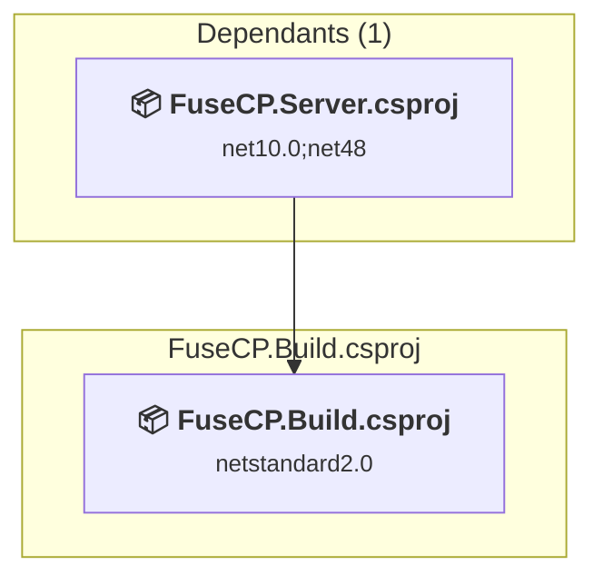

### API Compatibility

| Category | Count | Impact |
| :--- | :---: | :--- |
| 🔴 Binary Incompatible | 0 | High - Require code changes |
| 🟡 Source Incompatible | 0 | Medium - Needs re-compilation and potential conflicting API error fixing |
| 🔵 Behavioral change | 0 | Low - Behavioral changes that may require testing at runtime |
| ✅ Compatible | 2451 |  |
| ***Total APIs Analyzed*** | ***2451*** |  |

<a id="fusecpprovidersbasefusecpprovidersbasecsproj"></a>
### FuseCP.Providers.Base\FuseCP.Providers.Base.csproj

#### Project Info

- **Current Target Framework:** netstandard2.0✅
- **SDK-style**: True
- **Project Kind:** ClassLibrary
- **Dependencies**: 0
- **Dependants**: 89
- **Number of Files**: 367
- **Number of Files with Incidents**: 18
- **Lines of Code**: 29140
- **Estimated LOC to modify**: 437+ (at least 1.5% of the project)

#### Dependency Graph

Legend:
📦 SDK-style project
⚙️ Classic project

```mermaid
flowchart TB
    subgraph upstream["Dependants (89)"]
        P1["<b>📦&nbsp;FuseCP.Server.csproj</b><br/><small>net10.0;net48</small>"]
        P3["<b>📦&nbsp;FuseCP.Server.Utils.csproj</b><br/><small>netstandard2.0</small>"]
        P4["<b>📦&nbsp;FuseCP.Providers.Database.SqlServer.csproj</b><br/><small>netstandard2.0</small>"]
        P5["<b>📦&nbsp;FuseCP.Providers.Database.MySQL.csproj</b><br/><small>netstandard2.0</small>"]
        P6["<b>📦&nbsp;FuseCP.Providers.FTP.Gene6.csproj</b><br/><small>net48</small>"]
        P7["<b>📦&nbsp;FuseCP.Providers.Web.IIs60.csproj</b><br/><small>net48</small>"]
        P8["<b>📦&nbsp;FuseCP.Providers.DNS.MsDNS.csproj</b><br/><small>net48</small>"]
        P9["<b>📦&nbsp;FuseCP.Providers.DNS.SimpleDNS.csproj</b><br/><small>net48</small>"]
        P10["<b>📦&nbsp;FuseCP.Providers.Mail.SmarterMail2.csproj</b><br/><small>net48</small>"]
        P11["<b>📦&nbsp;FuseCP.Providers.Mail.SmarterMail3.csproj</b><br/><small>net48</small>"]
        P12["<b>📦&nbsp;FuseCP.Providers.Statistics.AWStats.csproj</b><br/><small>net48</small>"]
        P13["<b>📦&nbsp;FuseCP.Providers.Statistics.SmarterStats.csproj</b><br/><small>net48</small>"]
        P14["<b>📦&nbsp;FuseCP.Providers.Mail.MailEnable.vbproj</b><br/><small>net48</small>"]
        P15["<b>📦&nbsp;FuseCP.Providers.Mail.Merak.vbproj</b><br/><small>net48</small>"]
        P16["<b>📦&nbsp;FuseCP.Providers.Mail.AbilityMailServer.csproj</b><br/><small>net48</small>"]
        P17["<b>📦&nbsp;FuseCP.Providers.Mail.ArgoMail.vbproj</b><br/><small>net48</small>"]
        P18["<b>📦&nbsp;FuseCP.Providers.Mail.hMailServer.vbproj</b><br/><small>net48</small>"]
        P19["<b>📦&nbsp;FuseCP.Providers.Mail.MDaemon.vbproj</b><br/><small>net48</small>"]
        P20["<b>📦&nbsp;FuseCP.Providers.Mail.hMailServer43.vbproj</b><br/><small>net48</small>"]
        P21["<b>📦&nbsp;FuseCP.Providers.DNS.Bind.csproj</b><br/><small>netstandard2.0</small>"]
        P22["<b>📦&nbsp;FuseCP.Providers.FTP.ServU.csproj</b><br/><small>net48</small>"]
        P23["<b>📦&nbsp;FuseCP.Providers.FTP.FileZilla.csproj</b><br/><small>net48</small>"]
        P24["<b>📦&nbsp;FuseCP.Providers.DNS.Nettica.csproj</b><br/><small>net48</small>"]
        P25["<b>📦&nbsp;FuseCP.Providers.Web.IIs70.csproj</b><br/><small>net48</small>"]
        P26["<b>📦&nbsp;FuseCP.Providers.DNS.PowerDNS.csproj</b><br/><small>netstandard2.0</small>"]
        P27["<b>📦&nbsp;FuseCP.Providers.HostedSolution.csproj</b><br/><small>net48</small>"]
        P28["<b>📦&nbsp;FuseCP.Providers.DNS.SimpleDNS50.csproj</b><br/><small>net48</small>"]
        P29["<b>📦&nbsp;FuseCP.Providers.Mail.SmarterMail5.csproj</b><br/><small>net48</small>"]
        P30["<b>📦&nbsp;FuseCP.Providers.Virtualization.HyperV.csproj</b><br/><small>net48</small>"]
        P31["<b>📦&nbsp;FuseCP.Providers.Mail.SmarterMail6.csproj</b><br/><small>net48</small>"]
        P32["<b>📦&nbsp;FuseCP.Providers.Mail.Merak10.vbproj</b><br/><small>net48</small>"]
        P33["<b>📦&nbsp;FuseCP.Providers.Mail.hMailServer5.vbproj</b><br/><small>net48</small>"]
        P34["<b>📦&nbsp;FuseCP.Providers.Mail.SmarterMail7.csproj</b><br/><small>net48</small>"]
        P35["<b>📦&nbsp;FuseCP.Providers.Mail.SmarterMail9.csproj</b><br/><small>net48</small>"]
        P36["<b>📦&nbsp;FuseCP.Providers.Mail.SmarterMail10.csproj</b><br/><small>net48</small>"]
        P37["<b>📦&nbsp;FuseCP.Providers.Web.IIs80.csproj</b><br/><small>net48</small>"]
        P38["<b>📦&nbsp;FuseCP.Providers.HostedSolution.Exchange2013.csproj</b><br/><small>net48</small>"]
        P39["<b>📦&nbsp;FuseCP.Providers.HostedSolution.Crm2011.csproj</b><br/><small>net48</small>"]
        P40["<b>📦&nbsp;FuseCP.Providers.HostedSolution.SharePoint2013.csproj</b><br/><small>net48</small>"]
        P41["<b>📦&nbsp;FuseCP.Providers.HostedSolution.Lync2013.csproj</b><br/><small>net48</small>"]
        P42["<b>📦&nbsp;FuseCP.Providers.RemoteDesktopServices.Windows2012.csproj</b><br/><small>net48</small>"]
        P43["<b>📦&nbsp;FuseCP.Providers.EnterpriseStorage.Windows2016.csproj</b><br/><small>net48</small>"]
        P44["<b>📦&nbsp;FuseCP.Providers.HostedSolution.Lync2013HP.csproj</b><br/><small>net48</small>"]
        P45["<b>📦&nbsp;FuseCP.Providers.Web.WebDav.csproj</b><br/><small>net48</small>"]
        P46["<b>📦&nbsp;FuseCP.Providers.DNS.MsDNS2012.csproj</b><br/><small>net48</small>"]
        P47["<b>📦&nbsp;FuseCP.Providers.HostedSolution.Crm2013.csproj</b><br/><small>net48</small>"]
        P48["<b>📦&nbsp;FuseCP.Providers.Mail.IceWarp.csproj</b><br/><small>net48</small>"]
        P49["<b>📦&nbsp;FuseCP.Providers.Virtualization.HyperV2012R2.csproj</b><br/><small>net48</small>"]
        P50["<b>📦&nbsp;FuseCP.Providers.HostedSolution.SharePoint2013Ent.csproj</b><br/><small>net48</small>"]
        P51["<b>📦&nbsp;FuseCP.Providers.StorageSpaces.Windows2016.csproj</b><br/><small>net48</small>"]
        P52["<b>📦&nbsp;FuseCP.Providers.HostedSolution.Crm2015.csproj</b><br/><small>net48</small>"]
        P53["<b>📦&nbsp;FuseCP.Providers.HostedSolution.Crm2016.csproj</b><br/><small>net48</small>"]
        P54["<b>📦&nbsp;FuseCP.Providers.Database.MariaDB.csproj</b><br/><small>netstandard2.0</small>"]
        P55["<b>📦&nbsp;FuseCP.Providers.HostedSolution.Exchange2016.csproj</b><br/><small>net48</small>"]
        P56["<b>📦&nbsp;FuseCP.Providers.HostedSolution.Exchange2019.csproj</b><br/><small>net48</small>"]
        P57["<b>📦&nbsp;FuseCP.Providers.OS.Windows2016.csproj</b><br/><small>net48</small>"]
        P58["<b>📦&nbsp;FuseCP.Providers.Web.IIs100.csproj</b><br/><small>net48</small>"]
        P59["<b>📦&nbsp;FuseCP.Providers.FTP.IIs100.csproj</b><br/><small>net48</small>"]
        P60["<b>📦&nbsp;FuseCP.Providers.HostedSolution.SfB2015.csproj</b><br/><small>net48</small>"]
        P61["<b>📦&nbsp;FuseCP.Providers.HostedSolution.SfB2019.csproj</b><br/><small>net48</small>"]
        P62["<b>📦&nbsp;FuseCP.Providers.HostedSolution.SharePoint2016Ent.csproj</b><br/><small>net48</small>"]
        P63["<b>📦&nbsp;FuseCP.Providers.HostedSolution.SharePoint2016.csproj</b><br/><small>net48</small>"]
        P64["<b>📦&nbsp;FuseCP.Providers.HostedSolution.SharePoint2019.csproj</b><br/><small>net48</small>"]
        P65["<b>📦&nbsp;FuseCP.Providers.Virtualization.HyperVvmm.csproj</b><br/><small>net48</small>"]
        P66["<b>📦&nbsp;FuseCP.Providers.Filters.MailCleaner.csproj</b><br/><small>net48</small>"]
        P67["<b>📦&nbsp;FuseCP.Providers.DNS.SimpleDNS60.csproj</b><br/><small>net48</small>"]
        P68["<b>📦&nbsp;FuseCP.Providers.Virtualization.Proxmox.csproj</b><br/><small>netstandard2.0</small>"]
        P69["<b>📦&nbsp;FuseCP.Providers.Virtualization.HyperV2016.csproj</b><br/><small>net48</small>"]
        P71["<b>📦&nbsp;FuseCP.Providers.FTP.CerberusFTP6.csproj</b><br/><small>net48</small>"]
        P72["<b>📦&nbsp;FuseCP.Providers.Filters.SpamExperts.csproj</b><br/><small>net48</small>"]
        P73["<b>📦&nbsp;FuseCP.Providers.OS.Windows2019.csproj</b><br/><small>net48</small>"]
        P74["<b>📦&nbsp;FuseCP.Providers.Virtualization.HyperV2019.csproj</b><br/><small>net48</small>"]
        P75["<b>📦&nbsp;FuseCP.Providers.RemoteDesktopServices.Windows2016.csproj</b><br/><small>net48</small>"]
        P76["<b>📦&nbsp;FuseCP.Providers.RemoteDesktopServices.Windows2019.csproj</b><br/><small>net48</small>"]
        P77["<b>📦&nbsp;FuseCP.Providers.DNS.SimpleDNS80.csproj</b><br/><small>net48</small>"]
        P78["<b>📦&nbsp;FuseCP.Providers.DNS.MsDNS2016.csproj</b><br/><small>net48</small>"]
        P79["<b>📦&nbsp;FuseCP.Providers.DNS.SimpleDNS90.csproj</b><br/><small>net48</small>"]
        P80["<b>📦&nbsp;FuseCP.Providers.Mail.SmarterMail100.csproj</b><br/><small>netstandard2.0</small>"]
        P81["<b>📦&nbsp;FuseCP.Providers.Virtualization.HyperV2022.csproj</b><br/><small>net48</small>"]
        P82["<b>📦&nbsp;FuseCP.Providers.RemoteDesktopServices.Windows2022.csproj</b><br/><small>net48</small>"]
        P83["<b>📦&nbsp;FuseCP.Providers.OS.Windows2022.csproj</b><br/><small>net48</small>"]
        P84["<b>📦&nbsp;FuseCP.Web.Clients.csproj</b><br/><small>net48;net10.0</small>"]
        P86["<b>📦&nbsp;FuseCP.Web.Services.csproj</b><br/><small>net48;net10.0</small>"]
        P87["<b>📦&nbsp;FuseCP.Providers.OS.Unix.csproj</b><br/><small>netstandard2.0</small>"]
        P89["<b>📦&nbsp;FuseCP.Providers.FTP.VsFtp.csproj</b><br/><small>netstandard2.1</small>"]
        P90["<b>📦&nbsp;FuseCP.Providers.Web.Apache.csproj</b><br/><small>netstandard2.0</small>"]
        P91["<b>📦&nbsp;FuseCP.Providers.RemoteDesktopServices.Windows2025.csproj</b><br/><small>net48</small>"]
        P92["<b>📦&nbsp;FuseCP.Providers.OS.Windows2025.csproj</b><br/><small>net48</small>"]
        P93["<b>📦&nbsp;FuseCP.Providers.Virtualization.HyperV2025.csproj</b><br/><small>net48</small>"]
        click P1 "#fusecpserverfusecpservercsproj"
        click P3 "#fusecpserverutilsfusecpserverutilscsproj"
        click P4 "#fusecpprovidersdatabasesqlserverfusecpprovidersdatabasesqlservercsproj"
        click P5 "#fusecpprovidersdatabasemysqlfusecpprovidersdatabasemysqlcsproj"
        click P6 "#fusecpprovidersftpgene6fusecpprovidersftpgene6csproj"
        click P7 "#fusecpproviderswebiis60fusecpproviderswebiis60csproj"
        click P8 "#fusecpprovidersdnsmsdnsfusecpprovidersdnsmsdnscsproj"
        click P9 "#fusecpprovidersdnssimplednsfusecpprovidersdnssimplednscsproj"
        click P10 "#fusecpprovidersmailsmartermail2fusecpprovidersmailsmartermail2csproj"
        click P11 "#fusecpprovidersmailsmartermail3fusecpprovidersmailsmartermail3csproj"
        click P12 "#fusecpprovidersstatisticsawstatsfusecpprovidersstatisticsawstatscsproj"
        click P13 "#fusecpprovidersstatisticssmarterstatsfusecpprovidersstatisticssmarterstatscsproj"
        click P14 "#fusecpprovidersmailmailenablefusecpprovidersmailmailenablevbproj"
        click P15 "#fusecpprovidersmailmerakfusecpprovidersmailmerakvbproj"
        click P16 "#fusecpprovidersmailabilitymailserverfusecpprovidersmailabilitymailservercsproj"
        click P17 "#fusecpprovidersmailargomailfusecpprovidersmailargomailvbproj"
        click P18 "#fusecpprovidersmailhmailserverfusecpprovidersmailhmailservervbproj"
        click P19 "#fusecpprovidersmailmdaemonfusecpprovidersmailmdaemonvbproj"
        click P20 "#fusecpprovidersmailhmailserver43fusecpprovidersmailhmailserver43vbproj"
        click P21 "#fusecpprovidersdnsbindfusecpprovidersdnsbindcsproj"
        click P22 "#fusecpprovidersftpservufusecpprovidersftpservucsproj"
        click P23 "#fusecpprovidersftpfilezillafusecpprovidersftpfilezillacsproj"
        click P24 "#fusecpprovidersdnsnetticafusecpprovidersdnsnetticacsproj"
        click P25 "#fusecpproviderswebiis70fusecpproviderswebiis70csproj"
        click P26 "#fusecpprovidersdnspowerdnsfusecpprovidersdnspowerdnscsproj"
        click P27 "#fusecpprovidershostedsolutionfusecpprovidershostedsolutioncsproj"
        click P28 "#fusecpprovidersdnssimpledns50fusecpprovidersdnssimpledns50csproj"
        click P29 "#fusecpprovidersmailsmartermail5fusecpprovidersmailsmartermail5csproj"
        click P30 "#fusecpprovidersvirtualizationhypervfusecpprovidersvirtualizationhypervcsproj"
        click P31 "#fusecpprovidersmailsmartermail6fusecpprovidersmailsmartermail6csproj"
        click P32 "#fusecpprovidersmailmerak10fusecpprovidersmailmerak10vbproj"
        click P33 "#fusecpprovidersmailhmail5fusecpprovidersmailhmailserver5vbproj"
        click P34 "#fusecpprovidersmailsmartermail7fusecpprovidersmailsmartermail7csproj"
        click P35 "#fusecpprovidersmailsmartermail9fusecpprovidersmailsmartermail9csproj"
        click P36 "#fusecpprovidersmailsmartermail10fusecpprovidersmailsmartermail10csproj"
        click P37 "#fusecpproviderswebiis80fusecpproviderswebiis80csproj"
        click P38 "#fusecpprovidershostedsolutionexchange2013fusecpprovidershostedsolutionexchange2013csproj"
        click P39 "#fusecpprovidershostedsolutioncrm2011fusecpprovidershostedsolutioncrm2011csproj"
        click P40 "#fusecpprovidershostedsolutionsharepoint2013fusecpprovidershostedsolutionsharepoint2013csproj"
        click P41 "#fusecpprovidershostedsolutionlync2013fusecpprovidershostedsolutionlync2013csproj"
        click P42 "#fusecpprovidersterminalserviceswindows2012fusecpprovidersremotedesktopserviceswindows2012csproj"
        click P43 "#fusecpprovidersenterprisestoragewindows2016fusecpprovidersenterprisestoragewindows2016csproj"
        click P44 "#fusecpprovidershostedsolutionlync2013hpfusecpprovidershostedsolutionlync2013hpcsproj"
        click P45 "#fusecpproviderswebwebdavfusecpproviderswebwebdavcsproj"
        click P46 "#fusecpprovidersdnsmsdns2012fusecpprovidersdnsmsdns2012csproj"
        click P47 "#fusecpprovidershostedsolutioncrm2013fusecpprovidershostedsolutioncrm2013csproj"
        click P48 "#fusecpprovidersmailicewarpfusecpprovidersmailicewarpcsproj"
        click P49 "#fusecpprovidersvirtualizationhyperv-2012r2fusecpprovidersvirtualizationhyperv2012r2csproj"
        click P50 "#fusecpprovidershostedsolutionsharepoint2013entfusecpprovidershostedsolutionsharepoint2013entcsproj"
        click P51 "#fusecpprovidersstoragespaceswindows2016fusecpprovidersstoragespaceswindows2016csproj"
        click P52 "#fusecpprovidershostedsolutioncrm2015fusecpprovidershostedsolutioncrm2015csproj"
        click P53 "#fusecpprovidershostedsolutioncrm2016fusecpprovidershostedsolutioncrm2016csproj"
        click P54 "#fusecpprovidersdatabasemariadbfusecpprovidersdatabasemariadbcsproj"
        click P55 "#fusecpprovidershostedsolutionexchange2016fusecpprovidershostedsolutionexchange2016csproj"
        click P56 "#fusecpprovidershostedsolutionexchange2019fusecpprovidershostedsolutionexchange2019csproj"
        click P57 "#fusecpprovidersoswindows2016fusecpprovidersoswindows2016csproj"
        click P58 "#fusecpproviderswebiis100fusecpproviderswebiis100csproj"
        click P59 "#fusecpprovidersftpiis100fusecpprovidersftpiis100csproj"
        click P60 "#fusecpprovidershostedsolutionsfb2015fusecpprovidershostedsolutionsfb2015csproj"
        click P61 "#fusecpprovidershostedsolutionsfb2019fusecpprovidershostedsolutionsfb2019csproj"
        click P62 "#fusecpprovidershostedsolutionsharepoint2016entfusecpprovidershostedsolutionsharepoint2016entcsproj"
        click P63 "#fusecpprovidershostedsolutionsharepoint2016fusecpprovidershostedsolutionsharepoint2016csproj"
        click P64 "#fusecpprovidershostedsolutionsharepoint2019fusecpprovidershostedsolutionsharepoint2019csproj"
        click P65 "#fusecpprovidersvirtualizationhyperv-vmmfusecpprovidersvirtualizationhypervvmmcsproj"
        click P66 "#fusecpprovidersfiltersmailcleanerfusecpprovidersfiltersmailcleanercsproj"
        click P67 "#fusecpprovidersdnssimpledns60fusecpprovidersdnssimpledns60csproj"
        click P68 "#fusecpprovidersvirtualizationproxmoxfusecpprovidersvirtualizationproxmoxcsproj"
        click P69 "#fusecpprovidersvirtualizationhyperv-2016fusecpprovidersvirtualizationhyperv2016csproj"
        click P71 "#fusecpprovidersftpcerberusftp6fusecpprovidersftpcerberusftp6csproj"
        click P72 "#fusecpprovidersfiltersspamexpertsfusecpprovidersfiltersspamexpertscsproj"
        click P73 "#fusecpprovidersoswindows2019fusecpprovidersoswindows2019csproj"
        click P74 "#fusecpprovidersvirtualizationhyperv-2019fusecpprovidersvirtualizationhyperv2019csproj"
        click P75 "#fusecpprovidersterminalserviceswindows2016fusecpprovidersremotedesktopserviceswindows2016csproj"
        click P76 "#fusecpprovidersterminalserviceswindows2019fusecpprovidersremotedesktopserviceswindows2019csproj"
        click P77 "#fusecpprovidersdnssimpledns80fusecpprovidersdnssimpledns80csproj"
        click P78 "#fusecpprovidersdnsmsdns2016fusecpprovidersdnsmsdns2016csproj"
        click P79 "#fusecpprovidersdnssimpledns90fusecpprovidersdnssimpledns90csproj"
        click P80 "#fusecpprovidersmailsmartermail100fusecpprovidersmailsmartermail100csproj"
        click P81 "#fusecpprovidersvirtualizationhyperv-2022fusecpprovidersvirtualizationhyperv2022csproj"
        click P82 "#fusecpprovidersterminalserviceswindows2022fusecpprovidersremotedesktopserviceswindows2022csproj"
        click P83 "#fusecpprovidersoswindows2022fusecpprovidersoswindows2022csproj"
        click P84 "#fusecpwebclientsfusecpwebclientscsproj"
        click P86 "#fusecpwebservicesfusecpwebservicescsproj"
        click P87 "#fusecpprovidersosunixfusecpprovidersosunixcsproj"
        click P89 "#fusecpprovidersftpvsftpfusecpprovidersftpvsftpcsproj"
        click P90 "#fusecpproviderswebapachefusecpproviderswebapachecsproj"
        click P91 "#fusecpprovidersterminalserviceswindows2025fusecpprovidersremotedesktopserviceswindows2025csproj"
        click P92 "#fusecpprovidersoswindows2025fusecpprovidersoswindows2025csproj"
        click P93 "#fusecpprovidersvirtualizationhyperv-2025fusecpprovidersvirtualizationhyperv2025csproj"
    end
    subgraph current["FuseCP.Providers.Base.csproj"]
        MAIN["<b>📦&nbsp;FuseCP.Providers.Base.csproj</b><br/><small>netstandard2.0</small>"]
        click MAIN "#fusecpprovidersbasefusecpprovidersbasecsproj"
    end
    P1 --> MAIN
    P3 --> MAIN
    P4 --> MAIN
    P5 --> MAIN
    P6 --> MAIN
    P7 --> MAIN
    P8 --> MAIN
    P9 --> MAIN
    P10 --> MAIN
    P11 --> MAIN
    P12 --> MAIN
    P13 --> MAIN
    P14 --> MAIN
    P15 --> MAIN
    P16 --> MAIN
    P17 --> MAIN
    P18 --> MAIN
    P19 --> MAIN
    P20 --> MAIN
    P21 --> MAIN
    P22 --> MAIN
    P23 --> MAIN
    P24 --> MAIN
    P25 --> MAIN
    P26 --> MAIN
    P27 --> MAIN
    P28 --> MAIN
    P29 --> MAIN
    P30 --> MAIN
    P31 --> MAIN
    P32 --> MAIN
    P33 --> MAIN
    P34 --> MAIN
    P35 --> MAIN
    P36 --> MAIN
    P37 --> MAIN
    P38 --> MAIN
    P39 --> MAIN
    P40 --> MAIN
    P41 --> MAIN
    P42 --> MAIN
    P43 --> MAIN
    P44 --> MAIN
    P45 --> MAIN
    P46 --> MAIN
    P47 --> MAIN
    P48 --> MAIN
    P49 --> MAIN
    P50 --> MAIN
    P51 --> MAIN
    P52 --> MAIN
    P53 --> MAIN
    P54 --> MAIN
    P55 --> MAIN
    P56 --> MAIN
    P57 --> MAIN
    P58 --> MAIN
    P59 --> MAIN
    P60 --> MAIN
    P61 --> MAIN
    P62 --> MAIN
    P63 --> MAIN
    P64 --> MAIN
    P65 --> MAIN
    P66 --> MAIN
    P67 --> MAIN
    P68 --> MAIN
    P69 --> MAIN
    P71 --> MAIN
    P72 --> MAIN
    P73 --> MAIN
    P74 --> MAIN
    P75 --> MAIN
    P76 --> MAIN
    P77 --> MAIN
    P78 --> MAIN
    P79 --> MAIN
    P80 --> MAIN
    P81 --> MAIN
    P82 --> MAIN
    P83 --> MAIN
    P84 --> MAIN
    P86 --> MAIN
    P87 --> MAIN
    P89 --> MAIN
    P90 --> MAIN
    P91 --> MAIN
    P92 --> MAIN
    P93 --> MAIN

```

### API Compatibility

| Category | Count | Impact |
| :--- | :---: | :--- |
| 🔴 Binary Incompatible | 0 | High - Require code changes |
| 🟡 Source Incompatible | 403 | Medium - Needs re-compilation and potential conflicting API error fixing |
| 🔵 Behavioral change | 34 | Low - Behavioral changes that may require testing at runtime |
| ✅ Compatible | 21118 |  |
| ***Total APIs Analyzed*** | ***21555*** |  |

#### Project Technologies and Features

| Technology | Issues | Percentage | Migration Path |
| :--- | :---: | :---: | :--- |
| Legacy Cryptography | 9 | 2.1% | Obsolete or insecure cryptographic algorithms that have been deprecated for security reasons. These algorithms are no longer considered secure by modern standards. Migrate to modern cryptographic APIs using secure algorithms. |
| Directory Services (LDAP/Active Directory) | 390 | 89.2% | APIs for interacting with directory services like Active Directory and LDAP that are available via NuGet packages. The core functionality has been moved to separate packages. Install System.DirectoryServices (AD/LDAP), System.DirectoryServices.AccountManagement (user/group management), System.DirectoryServices.Protocols (LDAP protocol). |

<a id="fusecpprovidersdatabasemariadbfusecpprovidersdatabasemariadbcsproj"></a>
### FuseCP.Providers.Database.MariaDB\FuseCP.Providers.Database.MariaDB.csproj

#### Project Info

- **Current Target Framework:** netstandard2.0✅
- **SDK-style**: True
- **Project Kind:** ClassLibrary
- **Dependencies**: 2
- **Dependants**: 0
- **Number of Files**: 23
- **Number of Files with Incidents**: 1
- **Lines of Code**: 1905
- **Estimated LOC to modify**: 0+ (at least 0.0% of the project)

#### Dependency Graph

Legend:
📦 SDK-style project
⚙️ Classic project

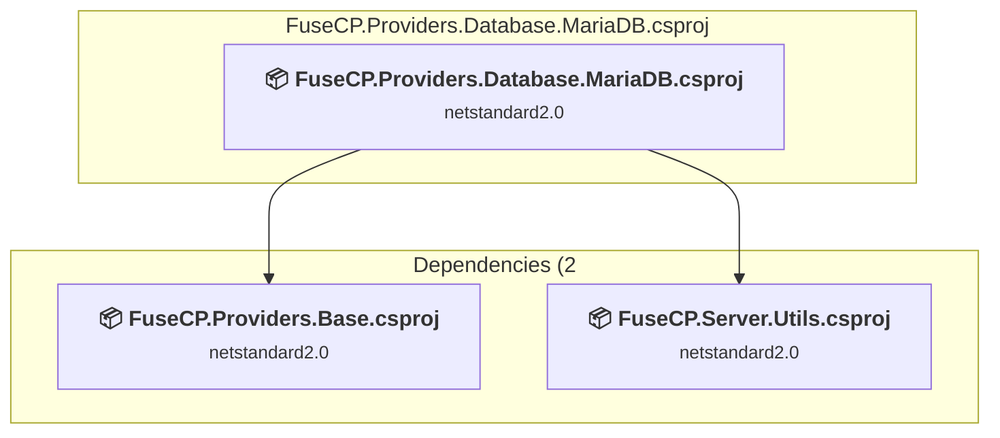

### API Compatibility

| Category | Count | Impact |
| :--- | :---: | :--- |
| 🔴 Binary Incompatible | 0 | High - Require code changes |
| 🟡 Source Incompatible | 0 | Medium - Needs re-compilation and potential conflicting API error fixing |
| 🔵 Behavioral change | 0 | Low - Behavioral changes that may require testing at runtime |
| ✅ Compatible | 1114 |  |
| ***Total APIs Analyzed*** | ***1114*** |  |

<a id="fusecpprovidersdatabasemysqlfusecpprovidersdatabasemysqlcsproj"></a>
### FuseCP.Providers.Database.MySQL\FuseCP.Providers.Database.MySQL.csproj

#### Project Info

- **Current Target Framework:** netstandard2.0✅
- **SDK-style**: True
- **Project Kind:** ClassLibrary
- **Dependencies**: 2
- **Dependants**: 0
- **Number of Files**: 14
- **Number of Files with Incidents**: 1
- **Lines of Code**: 1475
- **Estimated LOC to modify**: 0+ (at least 0.0% of the project)

#### Dependency Graph

Legend:
📦 SDK-style project
⚙️ Classic project

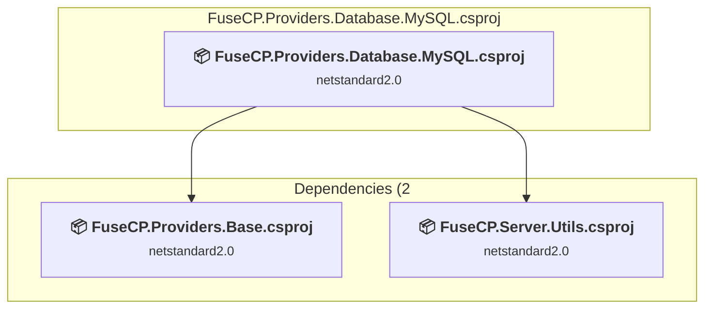

### API Compatibility

| Category | Count | Impact |
| :--- | :---: | :--- |
| 🔴 Binary Incompatible | 0 | High - Require code changes |
| 🟡 Source Incompatible | 0 | Medium - Needs re-compilation and potential conflicting API error fixing |
| 🔵 Behavioral change | 0 | Low - Behavioral changes that may require testing at runtime |
| ✅ Compatible | 953 |  |
| ***Total APIs Analyzed*** | ***953*** |  |

<a id="fusecpprovidersdatabasesqlserverfusecpprovidersdatabasesqlservercsproj"></a>
### FuseCP.Providers.Database.SqlServer\FuseCP.Providers.Database.SqlServer.csproj

#### Project Info

- **Current Target Framework:** netstandard2.0✅
- **SDK-style**: True
- **Project Kind:** ClassLibrary
- **Dependencies**: 2
- **Dependants**: 1
- **Number of Files**: 13
- **Number of Files with Incidents**: 1
- **Lines of Code**: 3329
- **Estimated LOC to modify**: 43+ (at least 1.3% of the project)

#### Dependency Graph

Legend:
📦 SDK-style project
⚙️ Classic project

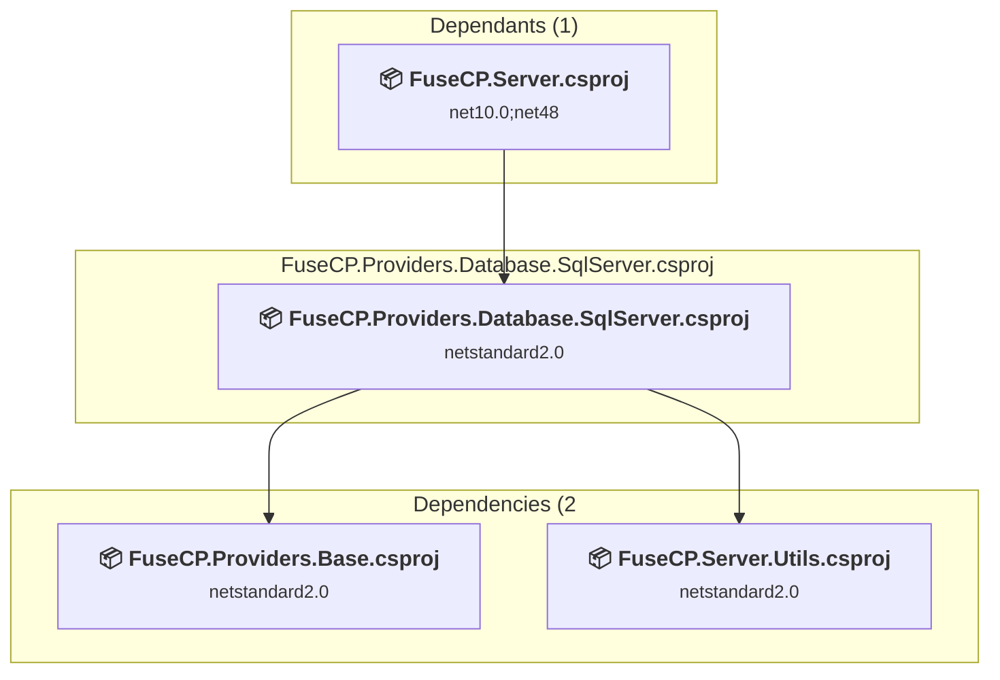

### API Compatibility

| Category | Count | Impact |
| :--- | :---: | :--- |
| 🔴 Binary Incompatible | 0 | High - Require code changes |
| 🟡 Source Incompatible | 43 | Medium - Needs re-compilation and potential conflicting API error fixing |
| 🔵 Behavioral change | 0 | Low - Behavioral changes that may require testing at runtime |
| ✅ Compatible | 2453 |  |
| ***Total APIs Analyzed*** | ***2496*** |  |

<a id="fusecpprovidersdnsbindfusecpprovidersdnsbindcsproj"></a>
### FuseCP.Providers.DNS.Bind\FuseCP.Providers.DNS.Bind.csproj

#### Project Info

- **Current Target Framework:** netstandard2.0✅
- **SDK-style**: True
- **Project Kind:** ClassLibrary
- **Dependencies**: 2
- **Dependants**: 0
- **Number of Files**: 3
- **Number of Files with Incidents**: 1
- **Lines of Code**: 1193
- **Estimated LOC to modify**: 0+ (at least 0.0% of the project)

#### Dependency Graph

Legend:
📦 SDK-style project
⚙️ Classic project

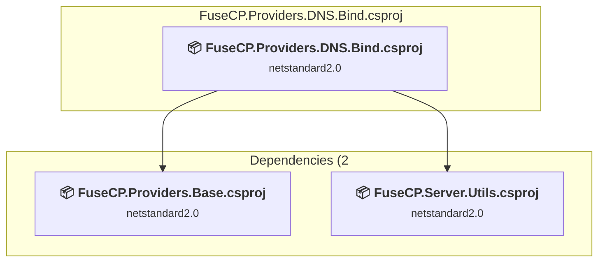

### API Compatibility

| Category | Count | Impact |
| :--- | :---: | :--- |
| 🔴 Binary Incompatible | 0 | High - Require code changes |
| 🟡 Source Incompatible | 0 | Medium - Needs re-compilation and potential conflicting API error fixing |
| 🔵 Behavioral change | 0 | Low - Behavioral changes that may require testing at runtime |
| ✅ Compatible | 928 |  |
| ***Total APIs Analyzed*** | ***928*** |  |

<a id="fusecpprovidersdnsmsdnsfusecpprovidersdnsmsdnscsproj"></a>
### FuseCP.Providers.DNS.MsDNS\FuseCP.Providers.DNS.MsDNS.csproj

#### Project Info

- **Current Target Framework:** net48
- **Proposed Target Framework:** net10.0
- **SDK-style**: True
- **Project Kind:** ClassLibrary
- **Dependencies**: 2
- **Dependants**: 0
- **Number of Files**: 3
- **Number of Files with Incidents**: 2
- **Lines of Code**: 1406
- **Estimated LOC to modify**: 323+ (at least 23.0% of the project)

#### Dependency Graph

Legend:
📦 SDK-style project
⚙️ Classic project

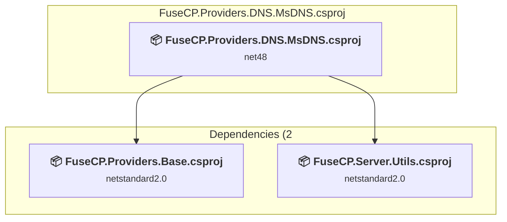

### API Compatibility

| Category | Count | Impact |
| :--- | :---: | :--- |
| 🔴 Binary Incompatible | 0 | High - Require code changes |
| 🟡 Source Incompatible | 323 | Medium - Needs re-compilation and potential conflicting API error fixing |
| 🔵 Behavioral change | 0 | Low - Behavioral changes that may require testing at runtime |
| ✅ Compatible | 731 |  |
| ***Total APIs Analyzed*** | ***1054*** |  |

#### Project Technologies and Features

| Technology | Issues | Percentage | Migration Path |
| :--- | :---: | :---: | :--- |
| System Management (WMI) | 323 | 100.0% | Windows Management Instrumentation (WMI) APIs for system administration and monitoring that are available via NuGet package System.Management. These APIs provide access to Windows system information but are Windows-only; consider cross-platform alternatives for new code. |

<a id="fusecpprovidersdnsmsdns2012fusecpprovidersdnsmsdns2012csproj"></a>
### FuseCP.Providers.DNS.MsDNS2012\FuseCP.Providers.DNS.MsDNS2012.csproj

#### Project Info

- **Current Target Framework:** net48
- **Proposed Target Framework:** net10.0
- **SDK-style**: True
- **Project Kind:** ClassLibrary
- **Dependencies**: 2
- **Dependants**: 1
- **Number of Files**: 7
- **Number of Files with Incidents**: 1
- **Lines of Code**: 1157
- **Estimated LOC to modify**: 0+ (at least 0.0% of the project)

#### Dependency Graph

Legend:
📦 SDK-style project
⚙️ Classic project

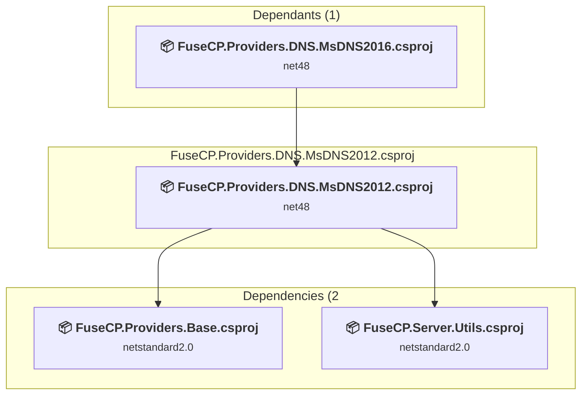

### API Compatibility

| Category | Count | Impact |
| :--- | :---: | :--- |
| 🔴 Binary Incompatible | 0 | High - Require code changes |
| 🟡 Source Incompatible | 0 | Medium - Needs re-compilation and potential conflicting API error fixing |
| 🔵 Behavioral change | 0 | Low - Behavioral changes that may require testing at runtime |
| ✅ Compatible | 880 |  |
| ***Total APIs Analyzed*** | ***880*** |  |

<a id="fusecpprovidersdnsmsdns2016fusecpprovidersdnsmsdns2016csproj"></a>
### FuseCP.Providers.DNS.MsDNS2016\FuseCP.Providers.DNS.MsDNS2016.csproj

#### Project Info

- **Current Target Framework:** net48
- **Proposed Target Framework:** net10.0
- **SDK-style**: True
- **Project Kind:** ClassLibrary
- **Dependencies**: 3
- **Dependants**: 0
- **Number of Files**: 6
- **Number of Files with Incidents**: 2
- **Lines of Code**: 855
- **Estimated LOC to modify**: 9+ (at least 1.1% of the project)

#### Dependency Graph

Legend:
📦 SDK-style project
⚙️ Classic project

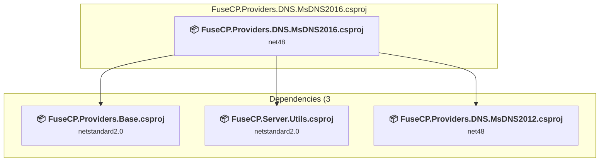

### API Compatibility

| Category | Count | Impact |
| :--- | :---: | :--- |
| 🔴 Binary Incompatible | 0 | High - Require code changes |
| 🟡 Source Incompatible | 9 | Medium - Needs re-compilation and potential conflicting API error fixing |
| 🔵 Behavioral change | 0 | Low - Behavioral changes that may require testing at runtime |
| ✅ Compatible | 734 |  |
| ***Total APIs Analyzed*** | ***743*** |  |

<a id="fusecpprovidersdnsnetticafusecpprovidersdnsnetticacsproj"></a>
### FuseCP.Providers.DNS.Nettica\FuseCP.Providers.DNS.Nettica.csproj

#### Project Info

- **Current Target Framework:** net48
- **Proposed Target Framework:** net10.0
- **SDK-style**: True
- **Project Kind:** ClassLibrary
- **Dependencies**: 2
- **Dependants**: 0
- **Number of Files**: 4
- **Number of Files with Incidents**: 3
- **Lines of Code**: 1311
- **Estimated LOC to modify**: 62+ (at least 4.7% of the project)

#### Dependency Graph

Legend:
📦 SDK-style project
⚙️ Classic project

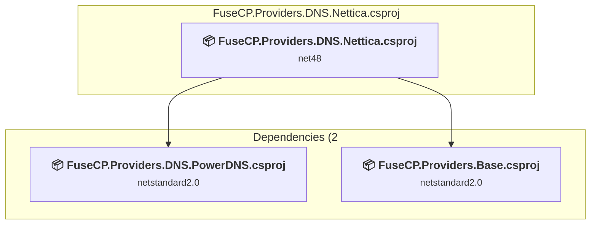

### API Compatibility

| Category | Count | Impact |
| :--- | :---: | :--- |
| 🔴 Binary Incompatible | 58 | High - Require code changes |
| 🟡 Source Incompatible | 4 | Medium - Needs re-compilation and potential conflicting API error fixing |
| 🔵 Behavioral change | 0 | Low - Behavioral changes that may require testing at runtime |
| ✅ Compatible | 921 |  |
| ***Total APIs Analyzed*** | ***983*** |  |

#### Project Technologies and Features

| Technology | Issues | Percentage | Migration Path |
| :--- | :---: | :---: | :--- |
| Legacy Configuration System | 4 | 6.5% | Legacy XML-based configuration system (app.config/web.config) that has been replaced by a more flexible configuration model in .NET Core. The old system was rigid and XML-based. Migrate to Microsoft.Extensions.Configuration with JSON/environment variables; use System.Configuration.ConfigurationManager NuGet package as interim bridge if needed. |
| ASP.NET Framework (System.Web) | 58 | 93.5% | Legacy ASP.NET Framework APIs for web applications (System.Web.*) that don't exist in ASP.NET Core due to architectural differences. ASP.NET Core represents a complete redesign of the web framework. Migrate to ASP.NET Core equivalents or consider System.Web.Adapters package for compatibility. |

<a id="fusecpprovidersdnspowerdnsfusecpprovidersdnspowerdnscsproj"></a>
### FuseCP.Providers.DNS.PowerDNS\FuseCP.Providers.DNS.PowerDNS.csproj

#### Project Info

- **Current Target Framework:** netstandard2.0✅
- **SDK-style**: True
- **Project Kind:** ClassLibrary
- **Dependencies**: 2
- **Dependants**: 1
- **Number of Files**: 3
- **Number of Files with Incidents**: 1
- **Lines of Code**: 1411
- **Estimated LOC to modify**: 0+ (at least 0.0% of the project)

#### Dependency Graph

Legend:
📦 SDK-style project
⚙️ Classic project

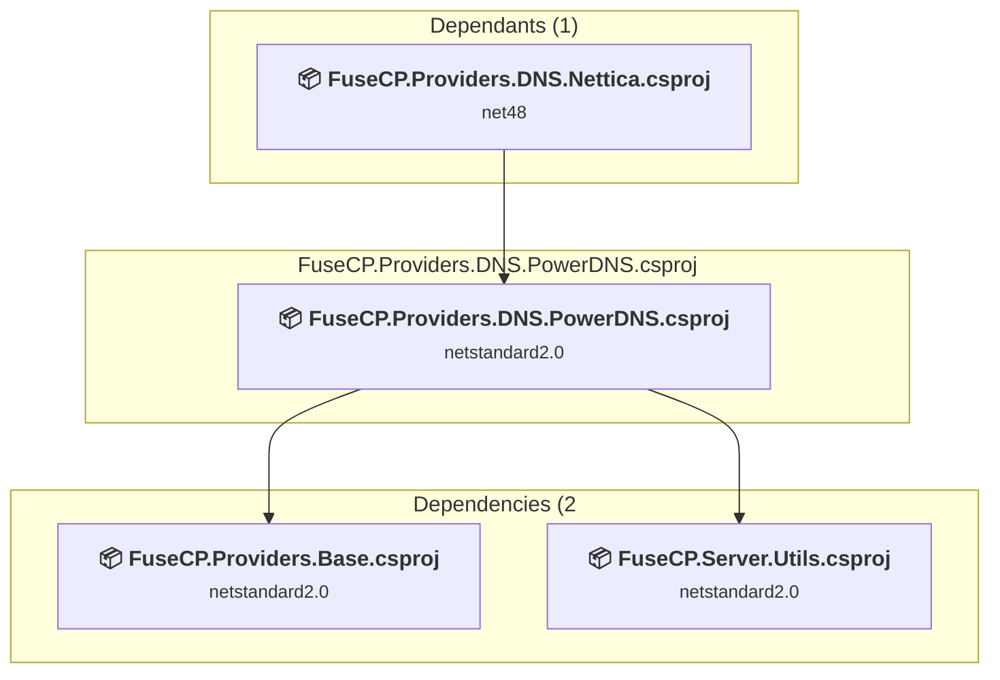

### API Compatibility

| Category | Count | Impact |
| :--- | :---: | :--- |
| 🔴 Binary Incompatible | 0 | High - Require code changes |
| 🟡 Source Incompatible | 0 | Medium - Needs re-compilation and potential conflicting API error fixing |
| 🔵 Behavioral change | 0 | Low - Behavioral changes that may require testing at runtime |
| ✅ Compatible | 895 |  |
| ***Total APIs Analyzed*** | ***895*** |  |

<a id="fusecpprovidersdnssimplednsfusecpprovidersdnssimplednscsproj"></a>
### FuseCP.Providers.DNS.SimpleDNS\FuseCP.Providers.DNS.SimpleDNS.csproj

#### Project Info

- **Current Target Framework:** net48
- **Proposed Target Framework:** net10.0
- **SDK-style**: True
- **Project Kind:** ClassLibrary
- **Dependencies**: 2
- **Dependants**: 2
- **Number of Files**: 3
- **Number of Files with Incidents**: 2
- **Lines of Code**: 1190
- **Estimated LOC to modify**: 3+ (at least 0.3% of the project)

#### Dependency Graph

Legend:
📦 SDK-style project
⚙️ Classic project

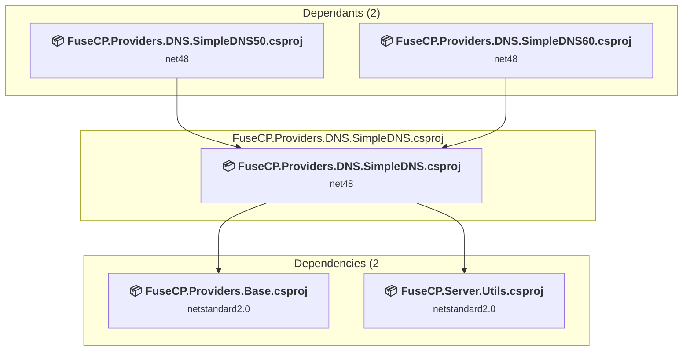

### API Compatibility

| Category | Count | Impact |
| :--- | :---: | :--- |
| 🔴 Binary Incompatible | 0 | High - Require code changes |
| 🟡 Source Incompatible | 1 | Medium - Needs re-compilation and potential conflicting API error fixing |
| 🔵 Behavioral change | 2 | Low - Behavioral changes that may require testing at runtime |
| ✅ Compatible | 811 |  |
| ***Total APIs Analyzed*** | ***814*** |  |

<a id="fusecpprovidersdnssimpledns50fusecpprovidersdnssimpledns50csproj"></a>
### FuseCP.Providers.DNS.SimpleDNS50\FuseCP.Providers.DNS.SimpleDNS50.csproj

#### Project Info

- **Current Target Framework:** net48
- **Proposed Target Framework:** net10.0
- **SDK-style**: True
- **Project Kind:** ClassLibrary
- **Dependencies**: 3
- **Dependants**: 0
- **Number of Files**: 3
- **Number of Files with Incidents**: 2
- **Lines of Code**: 882
- **Estimated LOC to modify**: 2+ (at least 0.2% of the project)

#### Dependency Graph

Legend:
📦 SDK-style project
⚙️ Classic project


### API Compatibility

| Category | Count | Impact |
| :--- | :---: | :--- |
| 🔴 Binary Incompatible | 0 | High - Require code changes |
| 🟡 Source Incompatible | 0 | Medium - Needs re-compilation and potential conflicting API error fixing |
| 🔵 Behavioral change | 2 | Low - Behavioral changes that may require testing at runtime |
| ✅ Compatible | 734 |  |
| ***Total APIs Analyzed*** | ***736*** |  |

<a id="fusecpprovidersdnssimpledns60fusecpprovidersdnssimpledns60csproj"></a>
### FuseCP.Providers.DNS.SimpleDNS60\FuseCP.Providers.DNS.SimpleDNS60.csproj

#### Project Info

- **Current Target Framework:** net48
- **Proposed Target Framework:** net10.0
- **SDK-style**: True
- **Project Kind:** ClassLibrary
- **Dependencies**: 3
- **Dependants**: 0
- **Number of Files**: 3
- **Number of Files with Incidents**: 2
- **Lines of Code**: 883
- **Estimated LOC to modify**: 2+ (at least 0.2% of the project)

#### Dependency Graph

Legend:
📦 SDK-style project
⚙️ Classic project

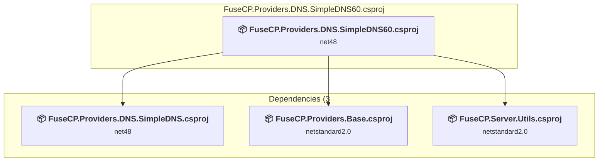

### API Compatibility

| Category | Count | Impact |
| :--- | :---: | :--- |
| 🔴 Binary Incompatible | 0 | High - Require code changes |
| 🟡 Source Incompatible | 0 | Medium - Needs re-compilation and potential conflicting API error fixing |
| 🔵 Behavioral change | 2 | Low - Behavioral changes that may require testing at runtime |
| ✅ Compatible | 735 |  |
| ***Total APIs Analyzed*** | ***737*** |  |

<a id="fusecpprovidersdnssimpledns80fusecpprovidersdnssimpledns80csproj"></a>
### FuseCP.Providers.DNS.SimpleDNS80\FuseCP.Providers.DNS.SimpleDNS80.csproj

#### Project Info

- **Current Target Framework:** net48
- **Proposed Target Framework:** net10.0
- **SDK-style**: True
- **Project Kind:** ClassLibrary
- **Dependencies**: 2
- **Dependants**: 1
- **Number of Files**: 10
- **Number of Files with Incidents**: 3
- **Lines of Code**: 1074
- **Estimated LOC to modify**: 12+ (at least 1.1% of the project)

#### Dependency Graph

Legend:
📦 SDK-style project
⚙️ Classic project

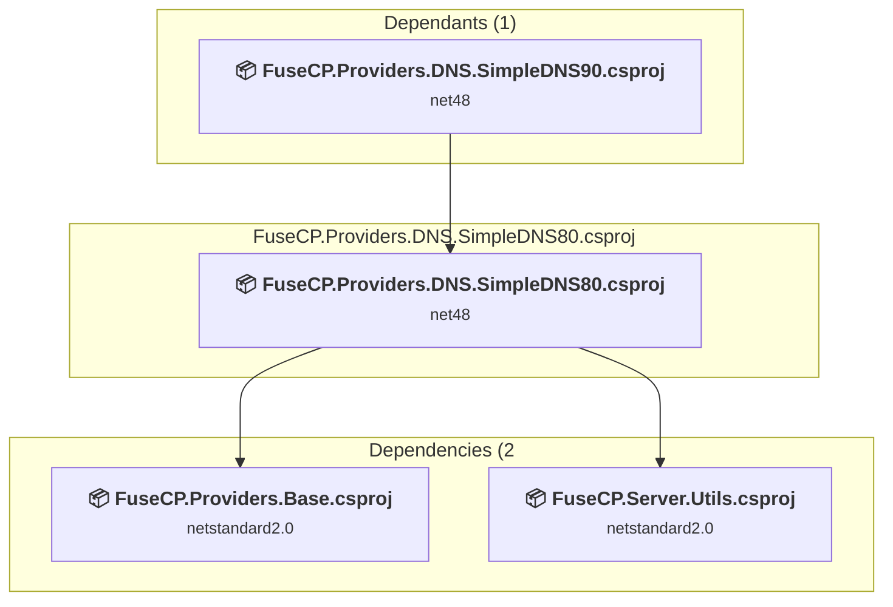

### API Compatibility

| Category | Count | Impact |
| :--- | :---: | :--- |
| 🔴 Binary Incompatible | 0 | High - Require code changes |
| 🟡 Source Incompatible | 0 | Medium - Needs re-compilation and potential conflicting API error fixing |
| 🔵 Behavioral change | 12 | Low - Behavioral changes that may require testing at runtime |
| ✅ Compatible | 737 |  |
| ***Total APIs Analyzed*** | ***749*** |  |

<a id="fusecpprovidersdnssimpledns90fusecpprovidersdnssimpledns90csproj"></a>
### FuseCP.Providers.DNS.SimpleDNS90\FuseCP.Providers.DNS.SimpleDNS90.csproj

#### Project Info

- **Current Target Framework:** net48
- **Proposed Target Framework:** net10.0
- **SDK-style**: True
- **Project Kind:** ClassLibrary
- **Dependencies**: 3
- **Dependants**: 0
- **Number of Files**: 10
- **Number of Files with Incidents**: 3
- **Lines of Code**: 1118
- **Estimated LOC to modify**: 12+ (at least 1.1% of the project)

#### Dependency Graph

Legend:
📦 SDK-style project
⚙️ Classic project


### API Compatibility

| Category | Count | Impact |
| :--- | :---: | :--- |
| 🔴 Binary Incompatible | 0 | High - Require code changes |
| 🟡 Source Incompatible | 0 | Medium - Needs re-compilation and potential conflicting API error fixing |
| 🔵 Behavioral change | 12 | Low - Behavioral changes that may require testing at runtime |
| ✅ Compatible | 788 |  |
| ***Total APIs Analyzed*** | ***800*** |  |

<a id="fusecpprovidersenterprisestoragewindows2016fusecpprovidersenterprisestoragewindows2016csproj"></a>
### FuseCP.Providers.EnterpriseStorage.Windows2016\FuseCP.Providers.EnterpriseStorage.Windows2016.csproj

#### Project Info

- **Current Target Framework:** net48
- **Proposed Target Framework:** net10.0
- **SDK-style**: True
- **Project Kind:** ClassLibrary
- **Dependencies**: 7
- **Dependants**: 0
- **Number of Files**: 4
- **Number of Files with Incidents**: 2
- **Lines of Code**: 911
- **Estimated LOC to modify**: 26+ (at least 2.9% of the project)

#### Dependency Graph

Legend:
📦 SDK-style project
⚙️ Classic project

```mermaid
flowchart TB
    subgraph current["FuseCP.Providers.EnterpriseStorage.Windows2016.csproj"]
        MAIN["<b>📦&nbsp;FuseCP.Providers.EnterpriseStorage.Windows2016.csproj</b><br/><small>net48</small>"]
        click MAIN "#fusecpprovidersenterprisestoragewindows2016fusecpprovidersenterprisestoragewindows2016csproj"
    end
    subgraph downstream["Dependencies (7"]
        P25["<b>📦&nbsp;FuseCP.Providers.Web.IIs70.csproj</b><br/><small>net48</small>"]
        P2["<b>📦&nbsp;FuseCP.Providers.Base.csproj</b><br/><small>netstandard2.0</small>"]
        P83["<b>📦&nbsp;FuseCP.Providers.OS.Windows2022.csproj</b><br/><small>net48</small>"]
        P3["<b>📦&nbsp;FuseCP.Server.Utils.csproj</b><br/><small>netstandard2.0</small>"]
        P45["<b>📦&nbsp;FuseCP.Providers.Web.WebDav.csproj</b><br/><small>net48</small>"]
        P7["<b>📦&nbsp;FuseCP.Providers.Web.IIs60.csproj</b><br/><small>net48</small>"]
        P37["<b>📦&nbsp;FuseCP.Providers.Web.IIs80.csproj</b><br/><small>net48</small>"]
        click P25 "#fusecpproviderswebiis70fusecpproviderswebiis70csproj"
        click P2 "#fusecpprovidersbasefusecpprovidersbasecsproj"
        click P83 "#fusecpprovidersoswindows2022fusecpprovidersoswindows2022csproj"
        click P3 "#fusecpserverutilsfusecpserverutilscsproj"
        click P45 "#fusecpproviderswebwebdavfusecpproviderswebwebdavcsproj"
        click P7 "#fusecpproviderswebiis60fusecpproviderswebiis60csproj"
        click P37 "#fusecpproviderswebiis80fusecpproviderswebiis80csproj"
    end
    MAIN --> P25
    MAIN --> P2
    MAIN --> P83
    MAIN --> P3
    MAIN --> P45
    MAIN --> P7
    MAIN --> P37

```

### API Compatibility

| Category | Count | Impact |
| :--- | :---: | :--- |
| 🔴 Binary Incompatible | 8 | High - Require code changes |
| 🟡 Source Incompatible | 18 | Medium - Needs re-compilation and potential conflicting API error fixing |
| 🔵 Behavioral change | 0 | Low - Behavioral changes that may require testing at runtime |
| ✅ Compatible | 687 |  |
| ***Total APIs Analyzed*** | ***713*** |  |

<a id="fusecpprovidersfiltersmailcleanerfusecpprovidersfiltersmailcleanercsproj"></a>
### FuseCP.Providers.Filters.MailCleaner\FuseCP.Providers.Filters.MailCleaner.csproj

#### Project Info

- **Current Target Framework:** net48
- **Proposed Target Framework:** net10.0
- **SDK-style**: True
- **Project Kind:** ClassLibrary
- **Dependencies**: 2
- **Dependants**: 0
- **Number of Files**: 4
- **Number of Files with Incidents**: 1
- **Lines of Code**: 151
- **Estimated LOC to modify**: 0+ (at least 0.0% of the project)

#### Dependency Graph

Legend:
📦 SDK-style project
⚙️ Classic project

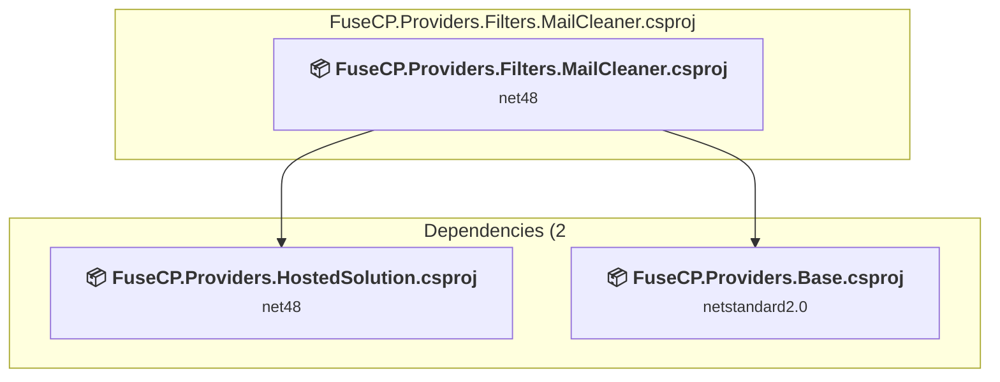

### API Compatibility

| Category | Count | Impact |
| :--- | :---: | :--- |
| 🔴 Binary Incompatible | 0 | High - Require code changes |
| 🟡 Source Incompatible | 0 | Medium - Needs re-compilation and potential conflicting API error fixing |
| 🔵 Behavioral change | 0 | Low - Behavioral changes that may require testing at runtime |
| ✅ Compatible | 16 |  |
| ***Total APIs Analyzed*** | ***16*** |  |

<a id="fusecpprovidersfiltersspamexpertsfusecpprovidersfiltersspamexpertscsproj"></a>
### FuseCP.Providers.Filters.SpamExperts\FuseCP.Providers.Filters.SpamExperts.csproj

#### Project Info

- **Current Target Framework:** net48
- **Proposed Target Framework:** net10.0
- **SDK-style**: True
- **Project Kind:** ClassLibrary
- **Dependencies**: 2
- **Dependants**: 0
- **Number of Files**: 3
- **Number of Files with Incidents**: 2
- **Lines of Code**: 320
- **Estimated LOC to modify**: 2+ (at least 0.6% of the project)

#### Dependency Graph

Legend:
📦 SDK-style project
⚙️ Classic project

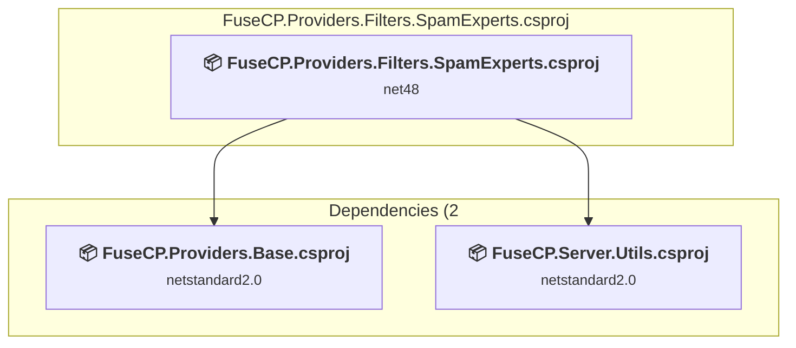

### API Compatibility

| Category | Count | Impact |
| :--- | :---: | :--- |
| 🔴 Binary Incompatible | 0 | High - Require code changes |
| 🟡 Source Incompatible | 1 | Medium - Needs re-compilation and potential conflicting API error fixing |
| 🔵 Behavioral change | 1 | Low - Behavioral changes that may require testing at runtime |
| ✅ Compatible | 149 |  |
| ***Total APIs Analyzed*** | ***151*** |  |

<a id="fusecpprovidersftpcerberusftp6fusecpprovidersftpcerberusftp6csproj"></a>
### FuseCP.Providers.FTP.CerberusFTP6\FuseCP.Providers.FTP.CerberusFTP6.csproj

#### Project Info

- **Current Target Framework:** net48
- **Proposed Target Framework:** net10.0
- **SDK-style**: True
- **Project Kind:** ClassLibrary
- **Dependencies**: 2
- **Dependants**: 0
- **Number of Files**: 4
- **Number of Files with Incidents**: 3
- **Lines of Code**: 10090
- **Estimated LOC to modify**: 362+ (at least 3.6% of the project)

#### Dependency Graph

Legend:
📦 SDK-style project
⚙️ Classic project

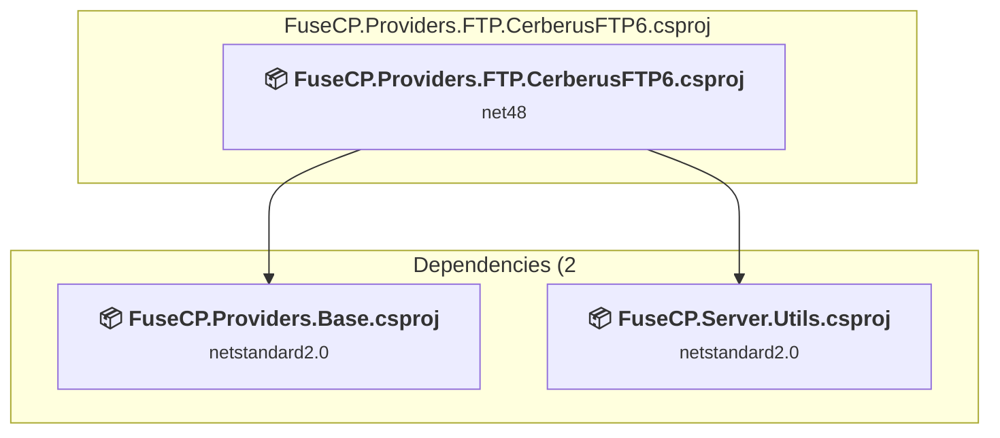

### API Compatibility

| Category | Count | Impact |
| :--- | :---: | :--- |
| 🔴 Binary Incompatible | 361 | High - Require code changes |
| 🟡 Source Incompatible | 1 | Medium - Needs re-compilation and potential conflicting API error fixing |
| 🔵 Behavioral change | 0 | Low - Behavioral changes that may require testing at runtime |
| ✅ Compatible | 4338 |  |
| ***Total APIs Analyzed*** | ***4700*** |  |

#### Project Technologies and Features

| Technology | Issues | Percentage | Migration Path |
| :--- | :---: | :---: | :--- |
| ASP.NET Framework (System.Web) | 361 | 99.7% | Legacy ASP.NET Framework APIs for web applications (System.Web.*) that don't exist in ASP.NET Core due to architectural differences. ASP.NET Core represents a complete redesign of the web framework. Migrate to ASP.NET Core equivalents or consider System.Web.Adapters package for compatibility. |
| Legacy Cryptography | 1 | 0.3% | Obsolete or insecure cryptographic algorithms that have been deprecated for security reasons. These algorithms are no longer considered secure by modern standards. Migrate to modern cryptographic APIs using secure algorithms. |

<a id="fusecpprovidersftpfilezillafusecpprovidersftpfilezillacsproj"></a>
### FuseCP.Providers.FTP.FileZilla\FuseCP.Providers.FTP.FileZilla.csproj

#### Project Info

- **Current Target Framework:** net48
- **Proposed Target Framework:** net10.0
- **SDK-style**: True
- **Project Kind:** ClassLibrary
- **Dependencies**: 2
- **Dependants**: 0
- **Number of Files**: 3
- **Number of Files with Incidents**: 2
- **Lines of Code**: 499
- **Estimated LOC to modify**: 1+ (at least 0.2% of the project)

#### Dependency Graph

Legend:
📦 SDK-style project
⚙️ Classic project

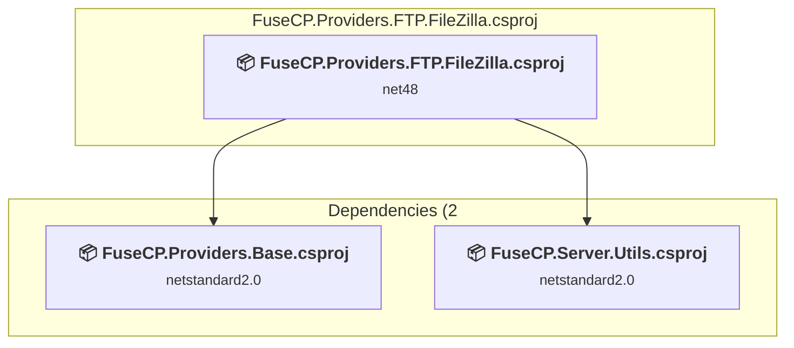

### API Compatibility

| Category | Count | Impact |
| :--- | :---: | :--- |
| 🔴 Binary Incompatible | 0 | High - Require code changes |
| 🟡 Source Incompatible | 1 | Medium - Needs re-compilation and potential conflicting API error fixing |
| 🔵 Behavioral change | 0 | Low - Behavioral changes that may require testing at runtime |
| ✅ Compatible | 378 |  |
| ***Total APIs Analyzed*** | ***379*** |  |

#### Project Technologies and Features

| Technology | Issues | Percentage | Migration Path |
| :--- | :---: | :---: | :--- |
| Legacy Cryptography | 1 | 100.0% | Obsolete or insecure cryptographic algorithms that have been deprecated for security reasons. These algorithms are no longer considered secure by modern standards. Migrate to modern cryptographic APIs using secure algorithms. |

<a id="fusecpprovidersftpgene6fusecpprovidersftpgene6csproj"></a>
### FuseCP.Providers.FTP.Gene6\FuseCP.Providers.FTP.Gene6.csproj

#### Project Info

- **Current Target Framework:** net48
- **Proposed Target Framework:** net10.0
- **SDK-style**: True
- **Project Kind:** ClassLibrary
- **Dependencies**: 2
- **Dependants**: 0
- **Number of Files**: 3
- **Number of Files with Incidents**: 2
- **Lines of Code**: 734
- **Estimated LOC to modify**: 1+ (at least 0.1% of the project)

#### Dependency Graph

Legend:
📦 SDK-style project
⚙️ Classic project

```mermaid
flowchart TB
    subgraph current["FuseCP.Providers.FTP.Gene6.csproj"]
        MAIN["<b>📦&nbsp;FuseCP.Providers.FTP.Gene6.csproj</b><br/><small>net48</small>"]
        click MAIN "#fusecpprovidersftpgene6fusecpprovidersftpgene6csproj"
    end
    subgraph downstream["Dependencies (2"]
        P2["<b>📦&nbsp;FuseCP.Providers.Base.csproj</b><br/><small>netstandard2.0</small>"]
        P3["<b>📦&nbsp;FuseCP.Server.Utils.csproj</b><br/><small>netstandard2.0</small>"]
        click P2 "#fusecpprovidersbasefusecpprovidersbasecsproj"
        click P3 "#fusecpserverutilsfusecpserverutilscsproj"
    end
    MAIN --> P2
    MAIN --> P3

```

### API Compatibility

| Category | Count | Impact |
| :--- | :---: | :--- |
| 🔴 Binary Incompatible | 0 | High - Require code changes |
| 🟡 Source Incompatible | 1 | Medium - Needs re-compilation and potential conflicting API error fixing |
| 🔵 Behavioral change | 0 | Low - Behavioral changes that may require testing at runtime |
| ✅ Compatible | 516 |  |
| ***Total APIs Analyzed*** | ***517*** |  |

#### Project Technologies and Features

| Technology | Issues | Percentage | Migration Path |
| :--- | :---: | :---: | :--- |
| Legacy Cryptography | 1 | 100.0% | Obsolete or insecure cryptographic algorithms that have been deprecated for security reasons. These algorithms are no longer considered secure by modern standards. Migrate to modern cryptographic APIs using secure algorithms. |

<a id="fusecpprovidersftpiis100fusecpprovidersftpiis100csproj"></a>
### FuseCP.Providers.FTP.IIs100\FuseCP.Providers.FTP.IIs100.csproj

#### Project Info

- **Current Target Framework:** net48
- **Proposed Target Framework:** net10.0
- **SDK-style**: True
- **Project Kind:** ClassLibrary
- **Dependencies**: 2
- **Dependants**: 0
- **Number of Files**: 46
- **Number of Files with Incidents**: 3
- **Lines of Code**: 4932
- **Estimated LOC to modify**: 19+ (at least 0.4% of the project)

#### Dependency Graph

Legend:
📦 SDK-style project
⚙️ Classic project

```mermaid
flowchart TB
    subgraph current["FuseCP.Providers.FTP.IIs100.csproj"]
        MAIN["<b>📦&nbsp;FuseCP.Providers.FTP.IIs100.csproj</b><br/><small>net48</small>"]
        click MAIN "#fusecpprovidersftpiis100fusecpprovidersftpiis100csproj"
    end
    subgraph downstream["Dependencies (2"]
        P2["<b>📦&nbsp;FuseCP.Providers.Base.csproj</b><br/><small>netstandard2.0</small>"]
        P3["<b>📦&nbsp;FuseCP.Server.Utils.csproj</b><br/><small>netstandard2.0</small>"]
        click P2 "#fusecpprovidersbasefusecpprovidersbasecsproj"
        click P3 "#fusecpserverutilsfusecpserverutilscsproj"
    end
    MAIN --> P2
    MAIN --> P3

```

### API Compatibility

| Category | Count | Impact |
| :--- | :---: | :--- |
| 🔴 Binary Incompatible | 10 | High - Require code changes |
| 🟡 Source Incompatible | 9 | Medium - Needs re-compilation and potential conflicting API error fixing |
| 🔵 Behavioral change | 0 | Low - Behavioral changes that may require testing at runtime |
| ✅ Compatible | 2707 |  |
| ***Total APIs Analyzed*** | ***2726*** |  |

#### Project Technologies and Features

| Technology | Issues | Percentage | Migration Path |
| :--- | :---: | :---: | :--- |
| ASP.NET Framework (System.Web) | 10 | 52.6% | Legacy ASP.NET Framework APIs for web applications (System.Web.*) that don't exist in ASP.NET Core due to architectural differences. ASP.NET Core represents a complete redesign of the web framework. Migrate to ASP.NET Core equivalents or consider System.Web.Adapters package for compatibility. |
| Directory Services (LDAP/Active Directory) | 9 | 47.4% | APIs for interacting with directory services like Active Directory and LDAP that are available via NuGet packages. The core functionality has been moved to separate packages. Install System.DirectoryServices (AD/LDAP), System.DirectoryServices.AccountManagement (user/group management), System.DirectoryServices.Protocols (LDAP protocol). |

<a id="fusecpprovidersftpservufusecpprovidersftpservucsproj"></a>
### FuseCP.Providers.FTP.ServU\FuseCP.Providers.FTP.ServU.csproj

#### Project Info

- **Current Target Framework:** net48
- **Proposed Target Framework:** net10.0
- **SDK-style**: True
- **Project Kind:** ClassLibrary
- **Dependencies**: 2
- **Dependants**: 0
- **Number of Files**: 3
- **Number of Files with Incidents**: 2
- **Lines of Code**: 495
- **Estimated LOC to modify**: 1+ (at least 0.2% of the project)

#### Dependency Graph

Legend:
📦 SDK-style project
⚙️ Classic project

```mermaid
flowchart TB
    subgraph current["FuseCP.Providers.FTP.ServU.csproj"]
        MAIN["<b>📦&nbsp;FuseCP.Providers.FTP.ServU.csproj</b><br/><small>net48</small>"]
        click MAIN "#fusecpprovidersftpservufusecpprovidersftpservucsproj"
    end
    subgraph downstream["Dependencies (2"]
        P2["<b>📦&nbsp;FuseCP.Providers.Base.csproj</b><br/><small>netstandard2.0</small>"]
        P3["<b>📦&nbsp;FuseCP.Server.Utils.csproj</b><br/><small>netstandard2.0</small>"]
        click P2 "#fusecpprovidersbasefusecpprovidersbasecsproj"
        click P3 "#fusecpserverutilsfusecpserverutilscsproj"
    end
    MAIN --> P2
    MAIN --> P3

```

### API Compatibility

| Category | Count | Impact |
| :--- | :---: | :--- |
| 🔴 Binary Incompatible | 0 | High - Require code changes |
| 🟡 Source Incompatible | 1 | Medium - Needs re-compilation and potential conflicting API error fixing |
| 🔵 Behavioral change | 0 | Low - Behavioral changes that may require testing at runtime |
| ✅ Compatible | 339 |  |
| ***Total APIs Analyzed*** | ***340*** |  |

#### Project Technologies and Features

| Technology | Issues | Percentage | Migration Path |
| :--- | :---: | :---: | :--- |
| Legacy Cryptography | 1 | 100.0% | Obsolete or insecure cryptographic algorithms that have been deprecated for security reasons. These algorithms are no longer considered secure by modern standards. Migrate to modern cryptographic APIs using secure algorithms. |

<a id="fusecpprovidersftpvsftpfusecpprovidersftpvsftpcsproj"></a>
### FuseCP.Providers.FTP.VsFtp\FuseCP.Providers.FTP.VsFtp.csproj

#### Project Info

- **Current Target Framework:** netstandard2.1✅
- **SDK-style**: True
- **Project Kind:** ClassLibrary
- **Dependencies**: 2
- **Dependants**: 0
- **Number of Files**: 47
- **Lines of Code**: 6804
- **Estimated LOC to modify**: 0+ (at least 0.0% of the project)

#### Dependency Graph

Legend:
📦 SDK-style project
⚙️ Classic project

```mermaid
flowchart TB
    subgraph current["FuseCP.Providers.FTP.VsFtp.csproj"]
        MAIN["<b>📦&nbsp;FuseCP.Providers.FTP.VsFtp.csproj</b><br/><small>netstandard2.1</small>"]
        click MAIN "#fusecpprovidersftpvsftpfusecpprovidersftpvsftpcsproj"
    end
    subgraph downstream["Dependencies (2"]
        P2["<b>📦&nbsp;FuseCP.Providers.Base.csproj</b><br/><small>netstandard2.0</small>"]
        P3["<b>📦&nbsp;FuseCP.Server.Utils.csproj</b><br/><small>netstandard2.0</small>"]
        click P2 "#fusecpprovidersbasefusecpprovidersbasecsproj"
        click P3 "#fusecpserverutilsfusecpserverutilscsproj"
    end
    MAIN --> P2
    MAIN --> P3

```

### API Compatibility

| Category | Count | Impact |
| :--- | :---: | :--- |
| 🔴 Binary Incompatible | 0 | High - Require code changes |
| 🟡 Source Incompatible | 0 | Medium - Needs re-compilation and potential conflicting API error fixing |
| 🔵 Behavioral change | 0 | Low - Behavioral changes that may require testing at runtime |
| ✅ Compatible | 3560 |  |
| ***Total APIs Analyzed*** | ***3560*** |  |

<a id="fusecpprovidershostedsolutioncrm2011fusecpprovidershostedsolutioncrm2011csproj"></a>
### FuseCP.Providers.HostedSolution.Crm2011\FuseCP.Providers.HostedSolution.Crm2011.csproj

#### Project Info

- **Current Target Framework:** net48
- **Proposed Target Framework:** net10.0
- **SDK-style**: True
- **Project Kind:** ClassLibrary
- **Dependencies**: 2
- **Dependants**: 0
- **Number of Files**: 6
- **Number of Files with Incidents**: 2
- **Lines of Code**: 171033
- **Estimated LOC to modify**: 82+ (at least 0.0% of the project)

#### Dependency Graph

Legend:
📦 SDK-style project
⚙️ Classic project

```mermaid
flowchart TB
    subgraph current["FuseCP.Providers.HostedSolution.Crm2011.csproj"]
        MAIN["<b>📦&nbsp;FuseCP.Providers.HostedSolution.Crm2011.csproj</b><br/><small>net48</small>"]
        click MAIN "#fusecpprovidershostedsolutioncrm2011fusecpprovidershostedsolutioncrm2011csproj"
    end
    subgraph downstream["Dependencies (2"]
        P2["<b>📦&nbsp;FuseCP.Providers.Base.csproj</b><br/><small>netstandard2.0</small>"]
        P3["<b>📦&nbsp;FuseCP.Server.Utils.csproj</b><br/><small>netstandard2.0</small>"]
        click P2 "#fusecpprovidersbasefusecpprovidersbasecsproj"
        click P3 "#fusecpserverutilsfusecpserverutilscsproj"
    end
    MAIN --> P2
    MAIN --> P3

```

### API Compatibility

| Category | Count | Impact |
| :--- | :---: | :--- |
| 🔴 Binary Incompatible | 0 | High - Require code changes |
| 🟡 Source Incompatible | 70 | Medium - Needs re-compilation and potential conflicting API error fixing |
| 🔵 Behavioral change | 12 | Low - Behavioral changes that may require testing at runtime |
| ✅ Compatible | 81914 |  |
| ***Total APIs Analyzed*** | ***81996*** |  |

#### Project Technologies and Features

| Technology | Issues | Percentage | Migration Path |
| :--- | :---: | :---: | :--- |
| WCF Client APIs | 18 | 22.0% | WCF client-side APIs for building service clients that communicate with WCF services. These APIs are available as exact equivalents via NuGet packages - add System.ServiceModel.* NuGet packages (System.ServiceModel.Http, System.ServiceModel.Primitives, System.ServiceModel.NetTcp, etc.) |

<a id="fusecpprovidershostedsolutioncrm2013fusecpprovidershostedsolutioncrm2013csproj"></a>
### FuseCP.Providers.HostedSolution.Crm2013\FuseCP.Providers.HostedSolution.Crm2013.csproj

#### Project Info

- **Current Target Framework:** net48
- **Proposed Target Framework:** net10.0
- **SDK-style**: True
- **Project Kind:** ClassLibrary
- **Dependencies**: 2
- **Dependants**: 0
- **Number of Files**: 6
- **Number of Files with Incidents**: 2
- **Lines of Code**: 187552
- **Estimated LOC to modify**: 89+ (at least 0.0% of the project)

#### Dependency Graph

Legend:
📦 SDK-style project
⚙️ Classic project

```mermaid
flowchart TB
    subgraph current["FuseCP.Providers.HostedSolution.Crm2013.csproj"]
        MAIN["<b>📦&nbsp;FuseCP.Providers.HostedSolution.Crm2013.csproj</b><br/><small>net48</small>"]
        click MAIN "#fusecpprovidershostedsolutioncrm2013fusecpprovidershostedsolutioncrm2013csproj"
    end
    subgraph downstream["Dependencies (2"]
        P2["<b>📦&nbsp;FuseCP.Providers.Base.csproj</b><br/><small>netstandard2.0</small>"]
        P3["<b>📦&nbsp;FuseCP.Server.Utils.csproj</b><br/><small>netstandard2.0</small>"]
        click P2 "#fusecpprovidersbasefusecpprovidersbasecsproj"
        click P3 "#fusecpserverutilsfusecpserverutilscsproj"
    end
    MAIN --> P2
    MAIN --> P3

```

### API Compatibility

| Category | Count | Impact |
| :--- | :---: | :--- |
| 🔴 Binary Incompatible | 0 | High - Require code changes |
| 🟡 Source Incompatible | 77 | Medium - Needs re-compilation and potential conflicting API error fixing |
| 🔵 Behavioral change | 12 | Low - Behavioral changes that may require testing at runtime |
| ✅ Compatible | 89634 |  |
| ***Total APIs Analyzed*** | ***89723*** |  |

#### Project Technologies and Features

| Technology | Issues | Percentage | Migration Path |
| :--- | :---: | :---: | :--- |
| WCF Client APIs | 18 | 20.2% | WCF client-side APIs for building service clients that communicate with WCF services. These APIs are available as exact equivalents via NuGet packages - add System.ServiceModel.* NuGet packages (System.ServiceModel.Http, System.ServiceModel.Primitives, System.ServiceModel.NetTcp, etc.) |

<a id="fusecpprovidershostedsolutioncrm2015fusecpprovidershostedsolutioncrm2015csproj"></a>
### FuseCP.Providers.HostedSolution.Crm2015\FuseCP.Providers.HostedSolution.Crm2015.csproj

#### Project Info

- **Current Target Framework:** net48
- **Proposed Target Framework:** net10.0
- **SDK-style**: True
- **Project Kind:** ClassLibrary
- **Dependencies**: 2
- **Dependants**: 0
- **Number of Files**: 6
- **Number of Files with Incidents**: 2
- **Lines of Code**: 215696
- **Estimated LOC to modify**: 89+ (at least 0.0% of the project)

#### Dependency Graph

Legend:
📦 SDK-style project
⚙️ Classic project

```mermaid
flowchart TB
    subgraph current["FuseCP.Providers.HostedSolution.Crm2015.csproj"]
        MAIN["<b>📦&nbsp;FuseCP.Providers.HostedSolution.Crm2015.csproj</b><br/><small>net48</small>"]
        click MAIN "#fusecpprovidershostedsolutioncrm2015fusecpprovidershostedsolutioncrm2015csproj"
    end
    subgraph downstream["Dependencies (2"]
        P2["<b>📦&nbsp;FuseCP.Providers.Base.csproj</b><br/><small>netstandard2.0</small>"]
        P3["<b>📦&nbsp;FuseCP.Server.Utils.csproj</b><br/><small>netstandard2.0</small>"]
        click P2 "#fusecpprovidersbasefusecpprovidersbasecsproj"
        click P3 "#fusecpserverutilsfusecpserverutilscsproj"
    end
    MAIN --> P2
    MAIN --> P3

```

### API Compatibility

| Category | Count | Impact |
| :--- | :---: | :--- |
| 🔴 Binary Incompatible | 0 | High - Require code changes |
| 🟡 Source Incompatible | 77 | Medium - Needs re-compilation and potential conflicting API error fixing |
| 🔵 Behavioral change | 12 | Low - Behavioral changes that may require testing at runtime |
| ✅ Compatible | 103013 |  |
| ***Total APIs Analyzed*** | ***103102*** |  |

#### Project Technologies and Features

| Technology | Issues | Percentage | Migration Path |
| :--- | :---: | :---: | :--- |
| WCF Client APIs | 18 | 20.2% | WCF client-side APIs for building service clients that communicate with WCF services. These APIs are available as exact equivalents via NuGet packages - add System.ServiceModel.* NuGet packages (System.ServiceModel.Http, System.ServiceModel.Primitives, System.ServiceModel.NetTcp, etc.) |

<a id="fusecpprovidershostedsolutioncrm2016fusecpprovidershostedsolutioncrm2016csproj"></a>
### FuseCP.Providers.HostedSolution.Crm2016\FuseCP.Providers.HostedSolution.Crm2016.csproj

#### Project Info

- **Current Target Framework:** net48
- **Proposed Target Framework:** net10.0
- **SDK-style**: True
- **Project Kind:** ClassLibrary
- **Dependencies**: 2
- **Dependants**: 0
- **Number of Files**: 6
- **Number of Files with Incidents**: 2
- **Lines of Code**: 215696
- **Estimated LOC to modify**: 89+ (at least 0.0% of the project)

#### Dependency Graph

Legend:
📦 SDK-style project
⚙️ Classic project

```mermaid
flowchart TB
    subgraph current["FuseCP.Providers.HostedSolution.Crm2016.csproj"]
        MAIN["<b>📦&nbsp;FuseCP.Providers.HostedSolution.Crm2016.csproj</b><br/><small>net48</small>"]
        click MAIN "#fusecpprovidershostedsolutioncrm2016fusecpprovidershostedsolutioncrm2016csproj"
    end
    subgraph downstream["Dependencies (2"]
        P2["<b>📦&nbsp;FuseCP.Providers.Base.csproj</b><br/><small>netstandard2.0</small>"]
        P3["<b>📦&nbsp;FuseCP.Server.Utils.csproj</b><br/><small>netstandard2.0</small>"]
        click P2 "#fusecpprovidersbasefusecpprovidersbasecsproj"
        click P3 "#fusecpserverutilsfusecpserverutilscsproj"
    end
    MAIN --> P2
    MAIN --> P3

```

### API Compatibility

| Category | Count | Impact |
| :--- | :---: | :--- |
| 🔴 Binary Incompatible | 0 | High - Require code changes |
| 🟡 Source Incompatible | 77 | Medium - Needs re-compilation and potential conflicting API error fixing |
| 🔵 Behavioral change | 12 | Low - Behavioral changes that may require testing at runtime |
| ✅ Compatible | 103013 |  |
| ***Total APIs Analyzed*** | ***103102*** |  |

#### Project Technologies and Features

| Technology | Issues | Percentage | Migration Path |
| :--- | :---: | :---: | :--- |
| WCF Client APIs | 18 | 20.2% | WCF client-side APIs for building service clients that communicate with WCF services. These APIs are available as exact equivalents via NuGet packages - add System.ServiceModel.* NuGet packages (System.ServiceModel.Http, System.ServiceModel.Primitives, System.ServiceModel.NetTcp, etc.) |

<a id="fusecpprovidershostedsolutionexchange2013fusecpprovidershostedsolutionexchange2013csproj"></a>
### FuseCP.Providers.HostedSolution.Exchange2013\FuseCP.Providers.HostedSolution.Exchange2013.csproj

#### Project Info

- **Current Target Framework:** net48
- **Proposed Target Framework:** net10.0
- **SDK-style**: True
- **Project Kind:** ClassLibrary
- **Dependencies**: 3
- **Dependants**: 0
- **Number of Files**: 3
- **Number of Files with Incidents**: 2
- **Lines of Code**: 8791
- **Estimated LOC to modify**: 148+ (at least 1.7% of the project)

#### Dependency Graph

Legend:
📦 SDK-style project
⚙️ Classic project

```mermaid
flowchart TB
    subgraph current["FuseCP.Providers.HostedSolution.Exchange2013.csproj"]
        MAIN["<b>📦&nbsp;FuseCP.Providers.HostedSolution.Exchange2013.csproj</b><br/><small>net48</small>"]
        click MAIN "#fusecpprovidershostedsolutionexchange2013fusecpprovidershostedsolutionexchange2013csproj"
    end
    subgraph downstream["Dependencies (3"]
        P27["<b>📦&nbsp;FuseCP.Providers.HostedSolution.csproj</b><br/><small>net48</small>"]
        P2["<b>📦&nbsp;FuseCP.Providers.Base.csproj</b><br/><small>netstandard2.0</small>"]
        P3["<b>📦&nbsp;FuseCP.Server.Utils.csproj</b><br/><small>netstandard2.0</small>"]
        click P27 "#fusecpprovidershostedsolutionfusecpprovidershostedsolutioncsproj"
        click P2 "#fusecpprovidersbasefusecpprovidersbasecsproj"
        click P3 "#fusecpserverutilsfusecpserverutilscsproj"
    end
    MAIN --> P27
    MAIN --> P2
    MAIN --> P3

```

### API Compatibility

| Category | Count | Impact |
| :--- | :---: | :--- |
| 🔴 Binary Incompatible | 0 | High - Require code changes |
| 🟡 Source Incompatible | 146 | Medium - Needs re-compilation and potential conflicting API error fixing |
| 🔵 Behavioral change | 2 | Low - Behavioral changes that may require testing at runtime |
| ✅ Compatible | 7933 |  |
| ***Total APIs Analyzed*** | ***8081*** |  |

#### Project Technologies and Features

| Technology | Issues | Percentage | Migration Path |
| :--- | :---: | :---: | :--- |
| Directory Services (LDAP/Active Directory) | 146 | 98.6% | APIs for interacting with directory services like Active Directory and LDAP that are available via NuGet packages. The core functionality has been moved to separate packages. Install System.DirectoryServices (AD/LDAP), System.DirectoryServices.AccountManagement (user/group management), System.DirectoryServices.Protocols (LDAP protocol). |

<a id="fusecpprovidershostedsolutionexchange2016fusecpprovidershostedsolutionexchange2016csproj"></a>
### FuseCP.Providers.HostedSolution.Exchange2016\FuseCP.Providers.HostedSolution.Exchange2016.csproj

#### Project Info

- **Current Target Framework:** net48
- **Proposed Target Framework:** net10.0
- **SDK-style**: True
- **Project Kind:** ClassLibrary
- **Dependencies**: 3
- **Dependants**: 0
- **Number of Files**: 3
- **Number of Files with Incidents**: 2
- **Lines of Code**: 8813
- **Estimated LOC to modify**: 148+ (at least 1.7% of the project)

#### Dependency Graph

Legend:
📦 SDK-style project
⚙️ Classic project

```mermaid
flowchart TB
    subgraph current["FuseCP.Providers.HostedSolution.Exchange2016.csproj"]
        MAIN["<b>📦&nbsp;FuseCP.Providers.HostedSolution.Exchange2016.csproj</b><br/><small>net48</small>"]
        click MAIN "#fusecpprovidershostedsolutionexchange2016fusecpprovidershostedsolutionexchange2016csproj"
    end
    subgraph downstream["Dependencies (3"]
        P27["<b>📦&nbsp;FuseCP.Providers.HostedSolution.csproj</b><br/><small>net48</small>"]
        P2["<b>📦&nbsp;FuseCP.Providers.Base.csproj</b><br/><small>netstandard2.0</small>"]
        P3["<b>📦&nbsp;FuseCP.Server.Utils.csproj</b><br/><small>netstandard2.0</small>"]
        click P27 "#fusecpprovidershostedsolutionfusecpprovidershostedsolutioncsproj"
        click P2 "#fusecpprovidersbasefusecpprovidersbasecsproj"
        click P3 "#fusecpserverutilsfusecpserverutilscsproj"
    end
    MAIN --> P27
    MAIN --> P2
    MAIN --> P3

```

### API Compatibility

| Category | Count | Impact |
| :--- | :---: | :--- |
| 🔴 Binary Incompatible | 0 | High - Require code changes |
| 🟡 Source Incompatible | 146 | Medium - Needs re-compilation and potential conflicting API error fixing |
| 🔵 Behavioral change | 2 | Low - Behavioral changes that may require testing at runtime |
| ✅ Compatible | 7954 |  |
| ***Total APIs Analyzed*** | ***8102*** |  |

#### Project Technologies and Features

| Technology | Issues | Percentage | Migration Path |
| :--- | :---: | :---: | :--- |
| Directory Services (LDAP/Active Directory) | 146 | 98.6% | APIs for interacting with directory services like Active Directory and LDAP that are available via NuGet packages. The core functionality has been moved to separate packages. Install System.DirectoryServices (AD/LDAP), System.DirectoryServices.AccountManagement (user/group management), System.DirectoryServices.Protocols (LDAP protocol). |

<a id="fusecpprovidershostedsolutionexchange2019fusecpprovidershostedsolutionexchange2019csproj"></a>
### FuseCP.Providers.HostedSolution.Exchange2019\FuseCP.Providers.HostedSolution.Exchange2019.csproj

#### Project Info

- **Current Target Framework:** net48
- **Proposed Target Framework:** net10.0
- **SDK-style**: True
- **Project Kind:** ClassLibrary
- **Dependencies**: 3
- **Dependants**: 0
- **Number of Files**: 3
- **Number of Files with Incidents**: 2
- **Lines of Code**: 8814
- **Estimated LOC to modify**: 148+ (at least 1.7% of the project)

#### Dependency Graph

Legend:
📦 SDK-style project
⚙️ Classic project

```mermaid
flowchart TB
    subgraph current["FuseCP.Providers.HostedSolution.Exchange2019.csproj"]
        MAIN["<b>📦&nbsp;FuseCP.Providers.HostedSolution.Exchange2019.csproj</b><br/><small>net48</small>"]
        click MAIN "#fusecpprovidershostedsolutionexchange2019fusecpprovidershostedsolutionexchange2019csproj"
    end
    subgraph downstream["Dependencies (3"]
        P27["<b>📦&nbsp;FuseCP.Providers.HostedSolution.csproj</b><br/><small>net48</small>"]
        P2["<b>📦&nbsp;FuseCP.Providers.Base.csproj</b><br/><small>netstandard2.0</small>"]
        P3["<b>📦&nbsp;FuseCP.Server.Utils.csproj</b><br/><small>netstandard2.0</small>"]
        click P27 "#fusecpprovidershostedsolutionfusecpprovidershostedsolutioncsproj"
        click P2 "#fusecpprovidersbasefusecpprovidersbasecsproj"
        click P3 "#fusecpserverutilsfusecpserverutilscsproj"
    end
    MAIN --> P27
    MAIN --> P2
    MAIN --> P3

```

### API Compatibility

| Category | Count | Impact |
| :--- | :---: | :--- |
| 🔴 Binary Incompatible | 0 | High - Require code changes |
| 🟡 Source Incompatible | 146 | Medium - Needs re-compilation and potential conflicting API error fixing |
| 🔵 Behavioral change | 2 | Low - Behavioral changes that may require testing at runtime |
| ✅ Compatible | 7954 |  |
| ***Total APIs Analyzed*** | ***8102*** |  |

#### Project Technologies and Features

| Technology | Issues | Percentage | Migration Path |
| :--- | :---: | :---: | :--- |
| Directory Services (LDAP/Active Directory) | 146 | 98.6% | APIs for interacting with directory services like Active Directory and LDAP that are available via NuGet packages. The core functionality has been moved to separate packages. Install System.DirectoryServices (AD/LDAP), System.DirectoryServices.AccountManagement (user/group management), System.DirectoryServices.Protocols (LDAP protocol). |

<a id="fusecpprovidershostedsolutionlync2013fusecpprovidershostedsolutionlync2013csproj"></a>
### FuseCP.Providers.HostedSolution.Lync2013\FuseCP.Providers.HostedSolution.Lync2013.csproj

#### Project Info

- **Current Target Framework:** net48
- **Proposed Target Framework:** net10.0
- **SDK-style**: True
- **Project Kind:** ClassLibrary
- **Dependencies**: 2
- **Dependants**: 0
- **Number of Files**: 4
- **Number of Files with Incidents**: 2
- **Lines of Code**: 1611
- **Estimated LOC to modify**: 9+ (at least 0.6% of the project)

#### Dependency Graph

Legend:
📦 SDK-style project
⚙️ Classic project

```mermaid
flowchart TB
    subgraph current["FuseCP.Providers.HostedSolution.Lync2013.csproj"]
        MAIN["<b>📦&nbsp;FuseCP.Providers.HostedSolution.Lync2013.csproj</b><br/><small>net48</small>"]
        click MAIN "#fusecpprovidershostedsolutionlync2013fusecpprovidershostedsolutionlync2013csproj"
    end
    subgraph downstream["Dependencies (2"]
        P27["<b>📦&nbsp;FuseCP.Providers.HostedSolution.csproj</b><br/><small>net48</small>"]
        P2["<b>📦&nbsp;FuseCP.Providers.Base.csproj</b><br/><small>netstandard2.0</small>"]
        click P27 "#fusecpprovidershostedsolutionfusecpprovidershostedsolutioncsproj"
        click P2 "#fusecpprovidersbasefusecpprovidersbasecsproj"
    end
    MAIN --> P27
    MAIN --> P2

```

### API Compatibility

| Category | Count | Impact |
| :--- | :---: | :--- |
| 🔴 Binary Incompatible | 0 | High - Require code changes |
| 🟡 Source Incompatible | 9 | Medium - Needs re-compilation and potential conflicting API error fixing |
| 🔵 Behavioral change | 0 | Low - Behavioral changes that may require testing at runtime |
| ✅ Compatible | 1334 |  |
| ***Total APIs Analyzed*** | ***1343*** |  |

#### Project Technologies and Features

| Technology | Issues | Percentage | Migration Path |
| :--- | :---: | :---: | :--- |
| Directory Services (LDAP/Active Directory) | 9 | 100.0% | APIs for interacting with directory services like Active Directory and LDAP that are available via NuGet packages. The core functionality has been moved to separate packages. Install System.DirectoryServices (AD/LDAP), System.DirectoryServices.AccountManagement (user/group management), System.DirectoryServices.Protocols (LDAP protocol). |

<a id="fusecpprovidershostedsolutionlync2013hpfusecpprovidershostedsolutionlync2013hpcsproj"></a>
### FuseCP.Providers.HostedSolution.Lync2013HP\FuseCP.Providers.HostedSolution.Lync2013HP.csproj

#### Project Info

- **Current Target Framework:** net48
- **Proposed Target Framework:** net10.0
- **SDK-style**: True
- **Project Kind:** ClassLibrary
- **Dependencies**: 3
- **Dependants**: 0
- **Number of Files**: 3
- **Number of Files with Incidents**: 2
- **Lines of Code**: 1646
- **Estimated LOC to modify**: 14+ (at least 0.9% of the project)

#### Dependency Graph

Legend:
📦 SDK-style project
⚙️ Classic project

```mermaid
flowchart TB
    subgraph current["FuseCP.Providers.HostedSolution.Lync2013HP.csproj"]
        MAIN["<b>📦&nbsp;FuseCP.Providers.HostedSolution.Lync2013HP.csproj</b><br/><small>net48</small>"]
        click MAIN "#fusecpprovidershostedsolutionlync2013hpfusecpprovidershostedsolutionlync2013hpcsproj"
    end
    subgraph downstream["Dependencies (3"]
        P27["<b>📦&nbsp;FuseCP.Providers.HostedSolution.csproj</b><br/><small>net48</small>"]
        P2["<b>📦&nbsp;FuseCP.Providers.Base.csproj</b><br/><small>netstandard2.0</small>"]
        P3["<b>📦&nbsp;FuseCP.Server.Utils.csproj</b><br/><small>netstandard2.0</small>"]
        click P27 "#fusecpprovidershostedsolutionfusecpprovidershostedsolutioncsproj"
        click P2 "#fusecpprovidersbasefusecpprovidersbasecsproj"
        click P3 "#fusecpserverutilsfusecpserverutilscsproj"
    end
    MAIN --> P27
    MAIN --> P2
    MAIN --> P3

```

### API Compatibility

| Category | Count | Impact |
| :--- | :---: | :--- |
| 🔴 Binary Incompatible | 0 | High - Require code changes |
| 🟡 Source Incompatible | 14 | Medium - Needs re-compilation and potential conflicting API error fixing |
| 🔵 Behavioral change | 0 | Low - Behavioral changes that may require testing at runtime |
| ✅ Compatible | 1398 |  |
| ***Total APIs Analyzed*** | ***1412*** |  |

#### Project Technologies and Features

| Technology | Issues | Percentage | Migration Path |
| :--- | :---: | :---: | :--- |
| Directory Services (LDAP/Active Directory) | 14 | 100.0% | APIs for interacting with directory services like Active Directory and LDAP that are available via NuGet packages. The core functionality has been moved to separate packages. Install System.DirectoryServices (AD/LDAP), System.DirectoryServices.AccountManagement (user/group management), System.DirectoryServices.Protocols (LDAP protocol). |

<a id="fusecpprovidershostedsolutionsfb2015fusecpprovidershostedsolutionsfb2015csproj"></a>
### FuseCP.Providers.HostedSolution.SfB2015\FuseCP.Providers.HostedSolution.SfB2015.csproj

#### Project Info

- **Current Target Framework:** net48
- **Proposed Target Framework:** net10.0
- **SDK-style**: True
- **Project Kind:** ClassLibrary
- **Dependencies**: 2
- **Dependants**: 0
- **Number of Files**: 4
- **Number of Files with Incidents**: 2
- **Lines of Code**: 1611
- **Estimated LOC to modify**: 9+ (at least 0.6% of the project)

#### Dependency Graph

Legend:
📦 SDK-style project
⚙️ Classic project

```mermaid
flowchart TB
    subgraph current["FuseCP.Providers.HostedSolution.SfB2015.csproj"]
        MAIN["<b>📦&nbsp;FuseCP.Providers.HostedSolution.SfB2015.csproj</b><br/><small>net48</small>"]
        click MAIN "#fusecpprovidershostedsolutionsfb2015fusecpprovidershostedsolutionsfb2015csproj"
    end
    subgraph downstream["Dependencies (2"]
        P27["<b>📦&nbsp;FuseCP.Providers.HostedSolution.csproj</b><br/><small>net48</small>"]
        P2["<b>📦&nbsp;FuseCP.Providers.Base.csproj</b><br/><small>netstandard2.0</small>"]
        click P27 "#fusecpprovidershostedsolutionfusecpprovidershostedsolutioncsproj"
        click P2 "#fusecpprovidersbasefusecpprovidersbasecsproj"
    end
    MAIN --> P27
    MAIN --> P2

```

### API Compatibility

| Category | Count | Impact |
| :--- | :---: | :--- |
| 🔴 Binary Incompatible | 0 | High - Require code changes |
| 🟡 Source Incompatible | 9 | Medium - Needs re-compilation and potential conflicting API error fixing |
| 🔵 Behavioral change | 0 | Low - Behavioral changes that may require testing at runtime |
| ✅ Compatible | 1334 |  |
| ***Total APIs Analyzed*** | ***1343*** |  |

#### Project Technologies and Features

| Technology | Issues | Percentage | Migration Path |
| :--- | :---: | :---: | :--- |
| Directory Services (LDAP/Active Directory) | 9 | 100.0% | APIs for interacting with directory services like Active Directory and LDAP that are available via NuGet packages. The core functionality has been moved to separate packages. Install System.DirectoryServices (AD/LDAP), System.DirectoryServices.AccountManagement (user/group management), System.DirectoryServices.Protocols (LDAP protocol). |

<a id="fusecpprovidershostedsolutionsfb2019fusecpprovidershostedsolutionsfb2019csproj"></a>
### FuseCP.Providers.HostedSolution.SfB2019\FuseCP.Providers.HostedSolution.SfB2019.csproj

#### Project Info

- **Current Target Framework:** net48
- **Proposed Target Framework:** net10.0
- **SDK-style**: True
- **Project Kind:** ClassLibrary
- **Dependencies**: 2
- **Dependants**: 0
- **Number of Files**: 4
- **Number of Files with Incidents**: 2
- **Lines of Code**: 1601
- **Estimated LOC to modify**: 9+ (at least 0.6% of the project)

#### Dependency Graph

Legend:
📦 SDK-style project
⚙️ Classic project

```mermaid
flowchart TB
    subgraph current["FuseCP.Providers.HostedSolution.SfB2019.csproj"]
        MAIN["<b>📦&nbsp;FuseCP.Providers.HostedSolution.SfB2019.csproj</b><br/><small>net48</small>"]
        click MAIN "#fusecpprovidershostedsolutionsfb2019fusecpprovidershostedsolutionsfb2019csproj"
    end
    subgraph downstream["Dependencies (2"]
        P27["<b>📦&nbsp;FuseCP.Providers.HostedSolution.csproj</b><br/><small>net48</small>"]
        P2["<b>📦&nbsp;FuseCP.Providers.Base.csproj</b><br/><small>netstandard2.0</small>"]
        click P27 "#fusecpprovidershostedsolutionfusecpprovidershostedsolutioncsproj"
        click P2 "#fusecpprovidersbasefusecpprovidersbasecsproj"
    end
    MAIN --> P27
    MAIN --> P2

```

### API Compatibility

| Category | Count | Impact |
| :--- | :---: | :--- |
| 🔴 Binary Incompatible | 0 | High - Require code changes |
| 🟡 Source Incompatible | 9 | Medium - Needs re-compilation and potential conflicting API error fixing |
| 🔵 Behavioral change | 0 | Low - Behavioral changes that may require testing at runtime |
| ✅ Compatible | 1334 |  |
| ***Total APIs Analyzed*** | ***1343*** |  |

#### Project Technologies and Features

| Technology | Issues | Percentage | Migration Path |
| :--- | :---: | :---: | :--- |
| Directory Services (LDAP/Active Directory) | 9 | 100.0% | APIs for interacting with directory services like Active Directory and LDAP that are available via NuGet packages. The core functionality has been moved to separate packages. Install System.DirectoryServices (AD/LDAP), System.DirectoryServices.AccountManagement (user/group management), System.DirectoryServices.Protocols (LDAP protocol). |

<a id="fusecpprovidershostedsolutionsharepoint2013fusecpprovidershostedsolutionsharepoint2013csproj"></a>
### FuseCP.Providers.HostedSolution.SharePoint2013\FuseCP.Providers.HostedSolution.SharePoint2013.csproj

#### Project Info

- **Current Target Framework:** net48
- **Proposed Target Framework:** net10.0
- **SDK-style**: True
- **Project Kind:** ClassLibrary
- **Dependencies**: 3
- **Dependants**: 1
- **Number of Files**: 4
- **Number of Files with Incidents**: 3
- **Lines of Code**: 1229
- **Estimated LOC to modify**: 43+ (at least 3.5% of the project)

#### Dependency Graph

Legend:
📦 SDK-style project
⚙️ Classic project

```mermaid
flowchart TB
    subgraph upstream["Dependants (1)"]
        P50["<b>📦&nbsp;FuseCP.Providers.HostedSolution.SharePoint2013Ent.csproj</b><br/><small>net48</small>"]
        click P50 "#fusecpprovidershostedsolutionsharepoint2013entfusecpprovidershostedsolutionsharepoint2013entcsproj"
    end
    subgraph current["FuseCP.Providers.HostedSolution.SharePoint2013.csproj"]
        MAIN["<b>📦&nbsp;FuseCP.Providers.HostedSolution.SharePoint2013.csproj</b><br/><small>net48</small>"]
        click MAIN "#fusecpprovidershostedsolutionsharepoint2013fusecpprovidershostedsolutionsharepoint2013csproj"
    end
    subgraph downstream["Dependencies (3"]
        P27["<b>📦&nbsp;FuseCP.Providers.HostedSolution.csproj</b><br/><small>net48</small>"]
        P2["<b>📦&nbsp;FuseCP.Providers.Base.csproj</b><br/><small>netstandard2.0</small>"]
        P3["<b>📦&nbsp;FuseCP.Server.Utils.csproj</b><br/><small>netstandard2.0</small>"]
        click P27 "#fusecpprovidershostedsolutionfusecpprovidershostedsolutioncsproj"
        click P2 "#fusecpprovidersbasefusecpprovidersbasecsproj"
        click P3 "#fusecpserverutilsfusecpserverutilscsproj"
    end
    P50 --> MAIN
    MAIN --> P27
    MAIN --> P2
    MAIN --> P3

```

### API Compatibility

| Category | Count | Impact |
| :--- | :---: | :--- |
| 🔴 Binary Incompatible | 9 | High - Require code changes |
| 🟡 Source Incompatible | 1 | Medium - Needs re-compilation and potential conflicting API error fixing |
| 🔵 Behavioral change | 33 | Low - Behavioral changes that may require testing at runtime |
| ✅ Compatible | 908 |  |
| ***Total APIs Analyzed*** | ***951*** |  |

#### Project Technologies and Features

| Technology | Issues | Percentage | Migration Path |
| :--- | :---: | :---: | :--- |
| AppDomain APIs | 4 | 9.3% | AppDomain-related APIs that are unsupported in .NET Core due to architectural changes. AppDomains were used for isolation but have been replaced by AssemblyLoadContext API for loading assemblies. Most AppDomain scenarios are not supported; redesign application isolation approach. |

<a id="fusecpprovidershostedsolutionsharepoint2013entfusecpprovidershostedsolutionsharepoint2013entcsproj"></a>
### FuseCP.Providers.HostedSolution.SharePoint2013Ent\FuseCP.Providers.HostedSolution.SharePoint2013Ent.csproj

#### Project Info

- **Current Target Framework:** net48
- **Proposed Target Framework:** net10.0
- **SDK-style**: True
- **Project Kind:** ClassLibrary
- **Dependencies**: 4
- **Dependants**: 0
- **Number of Files**: 4
- **Number of Files with Incidents**: 3
- **Lines of Code**: 1229
- **Estimated LOC to modify**: 43+ (at least 3.5% of the project)

#### Dependency Graph

Legend:
📦 SDK-style project
⚙️ Classic project

```mermaid
flowchart TB
    subgraph current["FuseCP.Providers.HostedSolution.SharePoint2013Ent.csproj"]
        MAIN["<b>📦&nbsp;FuseCP.Providers.HostedSolution.SharePoint2013Ent.csproj</b><br/><small>net48</small>"]
        click MAIN "#fusecpprovidershostedsolutionsharepoint2013entfusecpprovidershostedsolutionsharepoint2013entcsproj"
    end
    subgraph downstream["Dependencies (4"]
        P27["<b>📦&nbsp;FuseCP.Providers.HostedSolution.csproj</b><br/><small>net48</small>"]
        P40["<b>📦&nbsp;FuseCP.Providers.HostedSolution.SharePoint2013.csproj</b><br/><small>net48</small>"]
        P2["<b>📦&nbsp;FuseCP.Providers.Base.csproj</b><br/><small>netstandard2.0</small>"]
        P3["<b>📦&nbsp;FuseCP.Server.Utils.csproj</b><br/><small>netstandard2.0</small>"]
        click P27 "#fusecpprovidershostedsolutionfusecpprovidershostedsolutioncsproj"
        click P40 "#fusecpprovidershostedsolutionsharepoint2013fusecpprovidershostedsolutionsharepoint2013csproj"
        click P2 "#fusecpprovidersbasefusecpprovidersbasecsproj"
        click P3 "#fusecpserverutilsfusecpserverutilscsproj"
    end
    MAIN --> P27
    MAIN --> P40
    MAIN --> P2
    MAIN --> P3

```

### API Compatibility

| Category | Count | Impact |
| :--- | :---: | :--- |
| 🔴 Binary Incompatible | 9 | High - Require code changes |
| 🟡 Source Incompatible | 1 | Medium - Needs re-compilation and potential conflicting API error fixing |
| 🔵 Behavioral change | 33 | Low - Behavioral changes that may require testing at runtime |
| ✅ Compatible | 908 |  |
| ***Total APIs Analyzed*** | ***951*** |  |

#### Project Technologies and Features

| Technology | Issues | Percentage | Migration Path |
| :--- | :---: | :---: | :--- |
| AppDomain APIs | 4 | 9.3% | AppDomain-related APIs that are unsupported in .NET Core due to architectural changes. AppDomains were used for isolation but have been replaced by AssemblyLoadContext API for loading assemblies. Most AppDomain scenarios are not supported; redesign application isolation approach. |

<a id="fusecpprovidershostedsolutionsharepoint2016fusecpprovidershostedsolutionsharepoint2016csproj"></a>
### FuseCP.Providers.HostedSolution.SharePoint2016\FuseCP.Providers.HostedSolution.SharePoint2016.csproj

#### Project Info

- **Current Target Framework:** net48
- **Proposed Target Framework:** net10.0
- **SDK-style**: True
- **Project Kind:** ClassLibrary
- **Dependencies**: 3
- **Dependants**: 1
- **Number of Files**: 4
- **Number of Files with Incidents**: 3
- **Lines of Code**: 1229
- **Estimated LOC to modify**: 43+ (at least 3.5% of the project)

#### Dependency Graph

Legend:
📦 SDK-style project
⚙️ Classic project

```mermaid
flowchart TB
    subgraph upstream["Dependants (1)"]
        P62["<b>📦&nbsp;FuseCP.Providers.HostedSolution.SharePoint2016Ent.csproj</b><br/><small>net48</small>"]
        click P62 "#fusecpprovidershostedsolutionsharepoint2016entfusecpprovidershostedsolutionsharepoint2016entcsproj"
    end
    subgraph current["FuseCP.Providers.HostedSolution.SharePoint2016.csproj"]
        MAIN["<b>📦&nbsp;FuseCP.Providers.HostedSolution.SharePoint2016.csproj</b><br/><small>net48</small>"]
        click MAIN "#fusecpprovidershostedsolutionsharepoint2016fusecpprovidershostedsolutionsharepoint2016csproj"
    end
    subgraph downstream["Dependencies (3"]
        P27["<b>📦&nbsp;FuseCP.Providers.HostedSolution.csproj</b><br/><small>net48</small>"]
        P2["<b>📦&nbsp;FuseCP.Providers.Base.csproj</b><br/><small>netstandard2.0</small>"]
        P3["<b>📦&nbsp;FuseCP.Server.Utils.csproj</b><br/><small>netstandard2.0</small>"]
        click P27 "#fusecpprovidershostedsolutionfusecpprovidershostedsolutioncsproj"
        click P2 "#fusecpprovidersbasefusecpprovidersbasecsproj"
        click P3 "#fusecpserverutilsfusecpserverutilscsproj"
    end
    P62 --> MAIN
    MAIN --> P27
    MAIN --> P2
    MAIN --> P3

```

### API Compatibility

| Category | Count | Impact |
| :--- | :---: | :--- |
| 🔴 Binary Incompatible | 9 | High - Require code changes |
| 🟡 Source Incompatible | 1 | Medium - Needs re-compilation and potential conflicting API error fixing |
| 🔵 Behavioral change | 33 | Low - Behavioral changes that may require testing at runtime |
| ✅ Compatible | 908 |  |
| ***Total APIs Analyzed*** | ***951*** |  |

#### Project Technologies and Features

| Technology | Issues | Percentage | Migration Path |
| :--- | :---: | :---: | :--- |
| AppDomain APIs | 4 | 9.3% | AppDomain-related APIs that are unsupported in .NET Core due to architectural changes. AppDomains were used for isolation but have been replaced by AssemblyLoadContext API for loading assemblies. Most AppDomain scenarios are not supported; redesign application isolation approach. |

<a id="fusecpprovidershostedsolutionsharepoint2016entfusecpprovidershostedsolutionsharepoint2016entcsproj"></a>
### FuseCP.Providers.HostedSolution.SharePoint2016Ent\FuseCP.Providers.HostedSolution.SharePoint2016Ent.csproj

#### Project Info

- **Current Target Framework:** net48
- **Proposed Target Framework:** net10.0
- **SDK-style**: True
- **Project Kind:** ClassLibrary
- **Dependencies**: 4
- **Dependants**: 0
- **Number of Files**: 4
- **Number of Files with Incidents**: 3
- **Lines of Code**: 1229
- **Estimated LOC to modify**: 43+ (at least 3.5% of the project)

#### Dependency Graph

Legend:
📦 SDK-style project
⚙️ Classic project

```mermaid
flowchart TB
    subgraph current["FuseCP.Providers.HostedSolution.SharePoint2016Ent.csproj"]
        MAIN["<b>📦&nbsp;FuseCP.Providers.HostedSolution.SharePoint2016Ent.csproj</b><br/><small>net48</small>"]
        click MAIN "#fusecpprovidershostedsolutionsharepoint2016entfusecpprovidershostedsolutionsharepoint2016entcsproj"
    end
    subgraph downstream["Dependencies (4"]
        P27["<b>📦&nbsp;FuseCP.Providers.HostedSolution.csproj</b><br/><small>net48</small>"]
        P63["<b>📦&nbsp;FuseCP.Providers.HostedSolution.SharePoint2016.csproj</b><br/><small>net48</small>"]
        P2["<b>📦&nbsp;FuseCP.Providers.Base.csproj</b><br/><small>netstandard2.0</small>"]
        P3["<b>📦&nbsp;FuseCP.Server.Utils.csproj</b><br/><small>netstandard2.0</small>"]
        click P27 "#fusecpprovidershostedsolutionfusecpprovidershostedsolutioncsproj"
        click P63 "#fusecpprovidershostedsolutionsharepoint2016fusecpprovidershostedsolutionsharepoint2016csproj"
        click P2 "#fusecpprovidersbasefusecpprovidersbasecsproj"
        click P3 "#fusecpserverutilsfusecpserverutilscsproj"
    end
    MAIN --> P27
    MAIN --> P63
    MAIN --> P2
    MAIN --> P3

```

### API Compatibility

| Category | Count | Impact |
| :--- | :---: | :--- |
| 🔴 Binary Incompatible | 9 | High - Require code changes |
| 🟡 Source Incompatible | 1 | Medium - Needs re-compilation and potential conflicting API error fixing |
| 🔵 Behavioral change | 33 | Low - Behavioral changes that may require testing at runtime |
| ✅ Compatible | 908 |  |
| ***Total APIs Analyzed*** | ***951*** |  |

#### Project Technologies and Features

| Technology | Issues | Percentage | Migration Path |
| :--- | :---: | :---: | :--- |
| AppDomain APIs | 4 | 9.3% | AppDomain-related APIs that are unsupported in .NET Core due to architectural changes. AppDomains were used for isolation but have been replaced by AssemblyLoadContext API for loading assemblies. Most AppDomain scenarios are not supported; redesign application isolation approach. |

<a id="fusecpprovidershostedsolutionsharepoint2019fusecpprovidershostedsolutionsharepoint2019csproj"></a>
### FuseCP.Providers.HostedSolution.SharePoint2019\FuseCP.Providers.HostedSolution.SharePoint2019.csproj

#### Project Info

- **Current Target Framework:** net48
- **Proposed Target Framework:** net10.0
- **SDK-style**: True
- **Project Kind:** ClassLibrary
- **Dependencies**: 3
- **Dependants**: 0
- **Number of Files**: 4
- **Number of Files with Incidents**: 3
- **Lines of Code**: 1229
- **Estimated LOC to modify**: 43+ (at least 3.5% of the project)

#### Dependency Graph

Legend:
📦 SDK-style project
⚙️ Classic project

```mermaid
flowchart TB
    subgraph current["FuseCP.Providers.HostedSolution.SharePoint2019.csproj"]
        MAIN["<b>📦&nbsp;FuseCP.Providers.HostedSolution.SharePoint2019.csproj</b><br/><small>net48</small>"]
        click MAIN "#fusecpprovidershostedsolutionsharepoint2019fusecpprovidershostedsolutionsharepoint2019csproj"
    end
    subgraph downstream["Dependencies (3"]
        P27["<b>📦&nbsp;FuseCP.Providers.HostedSolution.csproj</b><br/><small>net48</small>"]
        P2["<b>📦&nbsp;FuseCP.Providers.Base.csproj</b><br/><small>netstandard2.0</small>"]
        P3["<b>📦&nbsp;FuseCP.Server.Utils.csproj</b><br/><small>netstandard2.0</small>"]
        click P27 "#fusecpprovidershostedsolutionfusecpprovidershostedsolutioncsproj"
        click P2 "#fusecpprovidersbasefusecpprovidersbasecsproj"
        click P3 "#fusecpserverutilsfusecpserverutilscsproj"
    end
    MAIN --> P27
    MAIN --> P2
    MAIN --> P3

```

### API Compatibility

| Category | Count | Impact |
| :--- | :---: | :--- |
| 🔴 Binary Incompatible | 9 | High - Require code changes |
| 🟡 Source Incompatible | 1 | Medium - Needs re-compilation and potential conflicting API error fixing |
| 🔵 Behavioral change | 33 | Low - Behavioral changes that may require testing at runtime |
| ✅ Compatible | 908 |  |
| ***Total APIs Analyzed*** | ***951*** |  |

#### Project Technologies and Features

| Technology | Issues | Percentage | Migration Path |
| :--- | :---: | :---: | :--- |
| AppDomain APIs | 4 | 9.3% | AppDomain-related APIs that are unsupported in .NET Core due to architectural changes. AppDomains were used for isolation but have been replaced by AssemblyLoadContext API for loading assemblies. Most AppDomain scenarios are not supported; redesign application isolation approach. |

<a id="fusecpprovidershostedsolutionfusecpprovidershostedsolutioncsproj"></a>
### FuseCP.Providers.HostedSolution\FuseCP.Providers.HostedSolution.csproj

#### Project Info

- **Current Target Framework:** net48
- **Proposed Target Framework:** net10.0
- **SDK-style**: True
- **Project Kind:** ClassLibrary
- **Dependencies**: 2
- **Dependants**: 19
- **Number of Files**: 21
- **Number of Files with Incidents**: 13
- **Lines of Code**: 114274
- **Estimated LOC to modify**: 674+ (at least 0.6% of the project)

#### Dependency Graph

Legend:
📦 SDK-style project
⚙️ Classic project

```mermaid
flowchart TB
    subgraph upstream["Dependants (19)"]
        P38["<b>📦&nbsp;FuseCP.Providers.HostedSolution.Exchange2013.csproj</b><br/><small>net48</small>"]
        P40["<b>📦&nbsp;FuseCP.Providers.HostedSolution.SharePoint2013.csproj</b><br/><small>net48</small>"]
        P41["<b>📦&nbsp;FuseCP.Providers.HostedSolution.Lync2013.csproj</b><br/><small>net48</small>"]
        P44["<b>📦&nbsp;FuseCP.Providers.HostedSolution.Lync2013HP.csproj</b><br/><small>net48</small>"]
        P49["<b>📦&nbsp;FuseCP.Providers.Virtualization.HyperV2012R2.csproj</b><br/><small>net48</small>"]
        P50["<b>📦&nbsp;FuseCP.Providers.HostedSolution.SharePoint2013Ent.csproj</b><br/><small>net48</small>"]
        P55["<b>📦&nbsp;FuseCP.Providers.HostedSolution.Exchange2016.csproj</b><br/><small>net48</small>"]
        P56["<b>📦&nbsp;FuseCP.Providers.HostedSolution.Exchange2019.csproj</b><br/><small>net48</small>"]
        P60["<b>📦&nbsp;FuseCP.Providers.HostedSolution.SfB2015.csproj</b><br/><small>net48</small>"]
        P61["<b>📦&nbsp;FuseCP.Providers.HostedSolution.SfB2019.csproj</b><br/><small>net48</small>"]
        P62["<b>📦&nbsp;FuseCP.Providers.HostedSolution.SharePoint2016Ent.csproj</b><br/><small>net48</small>"]
        P63["<b>📦&nbsp;FuseCP.Providers.HostedSolution.SharePoint2016.csproj</b><br/><small>net48</small>"]
        P64["<b>📦&nbsp;FuseCP.Providers.HostedSolution.SharePoint2019.csproj</b><br/><small>net48</small>"]
        P65["<b>📦&nbsp;FuseCP.Providers.Virtualization.HyperVvmm.csproj</b><br/><small>net48</small>"]
        P66["<b>📦&nbsp;FuseCP.Providers.Filters.MailCleaner.csproj</b><br/><small>net48</small>"]
        P69["<b>📦&nbsp;FuseCP.Providers.Virtualization.HyperV2016.csproj</b><br/><small>net48</small>"]
        P74["<b>📦&nbsp;FuseCP.Providers.Virtualization.HyperV2019.csproj</b><br/><small>net48</small>"]
        P81["<b>📦&nbsp;FuseCP.Providers.Virtualization.HyperV2022.csproj</b><br/><small>net48</small>"]
        P93["<b>📦&nbsp;FuseCP.Providers.Virtualization.HyperV2025.csproj</b><br/><small>net48</small>"]
        click P38 "#fusecpprovidershostedsolutionexchange2013fusecpprovidershostedsolutionexchange2013csproj"
        click P40 "#fusecpprovidershostedsolutionsharepoint2013fusecpprovidershostedsolutionsharepoint2013csproj"
        click P41 "#fusecpprovidershostedsolutionlync2013fusecpprovidershostedsolutionlync2013csproj"
        click P44 "#fusecpprovidershostedsolutionlync2013hpfusecpprovidershostedsolutionlync2013hpcsproj"
        click P49 "#fusecpprovidersvirtualizationhyperv-2012r2fusecpprovidersvirtualizationhyperv2012r2csproj"
        click P50 "#fusecpprovidershostedsolutionsharepoint2013entfusecpprovidershostedsolutionsharepoint2013entcsproj"
        click P55 "#fusecpprovidershostedsolutionexchange2016fusecpprovidershostedsolutionexchange2016csproj"
        click P56 "#fusecpprovidershostedsolutionexchange2019fusecpprovidershostedsolutionexchange2019csproj"
        click P60 "#fusecpprovidershostedsolutionsfb2015fusecpprovidershostedsolutionsfb2015csproj"
        click P61 "#fusecpprovidershostedsolutionsfb2019fusecpprovidershostedsolutionsfb2019csproj"
        click P62 "#fusecpprovidershostedsolutionsharepoint2016entfusecpprovidershostedsolutionsharepoint2016entcsproj"
        click P63 "#fusecpprovidershostedsolutionsharepoint2016fusecpprovidershostedsolutionsharepoint2016csproj"
        click P64 "#fusecpprovidershostedsolutionsharepoint2019fusecpprovidershostedsolutionsharepoint2019csproj"
        click P65 "#fusecpprovidersvirtualizationhyperv-vmmfusecpprovidersvirtualizationhypervvmmcsproj"
        click P66 "#fusecpprovidersfiltersmailcleanerfusecpprovidersfiltersmailcleanercsproj"
        click P69 "#fusecpprovidersvirtualizationhyperv-2016fusecpprovidersvirtualizationhyperv2016csproj"
        click P74 "#fusecpprovidersvirtualizationhyperv-2019fusecpprovidersvirtualizationhyperv2019csproj"
        click P81 "#fusecpprovidersvirtualizationhyperv-2022fusecpprovidersvirtualizationhyperv2022csproj"
        click P93 "#fusecpprovidersvirtualizationhyperv-2025fusecpprovidersvirtualizationhyperv2025csproj"
    end
    subgraph current["FuseCP.Providers.HostedSolution.csproj"]
        MAIN["<b>📦&nbsp;FuseCP.Providers.HostedSolution.csproj</b><br/><small>net48</small>"]
        click MAIN "#fusecpprovidershostedsolutionfusecpprovidershostedsolutioncsproj"
    end
    subgraph downstream["Dependencies (2"]
        P2["<b>📦&nbsp;FuseCP.Providers.Base.csproj</b><br/><small>netstandard2.0</small>"]
        P3["<b>📦&nbsp;FuseCP.Server.Utils.csproj</b><br/><small>netstandard2.0</small>"]
        click P2 "#fusecpprovidersbasefusecpprovidersbasecsproj"
        click P3 "#fusecpserverutilsfusecpserverutilscsproj"
    end
    P38 --> MAIN
    P40 --> MAIN
    P41 --> MAIN
    P44 --> MAIN
    P49 --> MAIN
    P50 --> MAIN
    P55 --> MAIN
    P56 --> MAIN
    P60 --> MAIN
    P61 --> MAIN
    P62 --> MAIN
    P63 --> MAIN
    P64 --> MAIN
    P65 --> MAIN
    P66 --> MAIN
    P69 --> MAIN
    P74 --> MAIN
    P81 --> MAIN
    P93 --> MAIN
    MAIN --> P2
    MAIN --> P3

```

### API Compatibility

| Category | Count | Impact |
| :--- | :---: | :--- |
| 🔴 Binary Incompatible | 80 | High - Require code changes |
| 🟡 Source Incompatible | 566 | Medium - Needs re-compilation and potential conflicting API error fixing |
| 🔵 Behavioral change | 28 | Low - Behavioral changes that may require testing at runtime |
| ✅ Compatible | 32641 |  |
| ***Total APIs Analyzed*** | ***33315*** |  |

#### Project Technologies and Features

| Technology | Issues | Percentage | Migration Path |
| :--- | :---: | :---: | :--- |
| AppDomain APIs | 4 | 0.6% | AppDomain-related APIs that are unsupported in .NET Core due to architectural changes. AppDomains were used for isolation but have been replaced by AssemblyLoadContext API for loading assemblies. Most AppDomain scenarios are not supported; redesign application isolation approach. |
| Legacy Configuration System | 4 | 0.6% | Legacy XML-based configuration system (app.config/web.config) that has been replaced by a more flexible configuration model in .NET Core. The old system was rigid and XML-based. Migrate to Microsoft.Extensions.Configuration with JSON/environment variables; use System.Configuration.ConfigurationManager NuGet package as interim bridge if needed. |
| Directory Services (LDAP/Active Directory) | 499 | 74.0% | APIs for interacting with directory services like Active Directory and LDAP that are available via NuGet packages. The core functionality has been moved to separate packages. Install System.DirectoryServices (AD/LDAP), System.DirectoryServices.AccountManagement (user/group management), System.DirectoryServices.Protocols (LDAP protocol). |
| System Management (WMI) | 49 | 7.3% | Windows Management Instrumentation (WMI) APIs for system administration and monitoring that are available via NuGet package System.Management. These APIs provide access to Windows system information but are Windows-only; consider cross-platform alternatives for new code. |
| ASP.NET Framework (System.Web) | 47 | 7.0% | Legacy ASP.NET Framework APIs for web applications (System.Web.*) that don't exist in ASP.NET Core due to architectural differences. ASP.NET Core represents a complete redesign of the web framework. Migrate to ASP.NET Core equivalents or consider System.Web.Adapters package for compatibility. |

<a id="fusecpprovidersmailabilitymailserverfusecpprovidersmailabilitymailservercsproj"></a>
### FuseCP.Providers.Mail.AbilityMailServer\FuseCP.Providers.Mail.AbilityMailServer.csproj

#### Project Info

- **Current Target Framework:** net48
- **Proposed Target Framework:** net10.0
- **SDK-style**: True
- **Project Kind:** ClassLibrary
- **Dependencies**: 2
- **Dependants**: 0
- **Number of Files**: 8
- **Number of Files with Incidents**: 1
- **Lines of Code**: 1970
- **Estimated LOC to modify**: 0+ (at least 0.0% of the project)

#### Dependency Graph

Legend:
📦 SDK-style project
⚙️ Classic project

```mermaid
flowchart TB
    subgraph current["FuseCP.Providers.Mail.AbilityMailServer.csproj"]
        MAIN["<b>📦&nbsp;FuseCP.Providers.Mail.AbilityMailServer.csproj</b><br/><small>net48</small>"]
        click MAIN "#fusecpprovidersmailabilitymailserverfusecpprovidersmailabilitymailservercsproj"
    end
    subgraph downstream["Dependencies (2"]
        P2["<b>📦&nbsp;FuseCP.Providers.Base.csproj</b><br/><small>netstandard2.0</small>"]
        P3["<b>📦&nbsp;FuseCP.Server.Utils.csproj</b><br/><small>netstandard2.0</small>"]
        click P2 "#fusecpprovidersbasefusecpprovidersbasecsproj"
        click P3 "#fusecpserverutilsfusecpserverutilscsproj"
    end
    MAIN --> P2
    MAIN --> P3

```

### API Compatibility

| Category | Count | Impact |
| :--- | :---: | :--- |
| 🔴 Binary Incompatible | 0 | High - Require code changes |
| 🟡 Source Incompatible | 0 | Medium - Needs re-compilation and potential conflicting API error fixing |
| 🔵 Behavioral change | 0 | Low - Behavioral changes that may require testing at runtime |
| ✅ Compatible | 1154 |  |
| ***Total APIs Analyzed*** | ***1154*** |  |

<a id="fusecpprovidersmailargomailfusecpprovidersmailargomailvbproj"></a>
### FuseCP.Providers.Mail.ArgoMail\FuseCP.Providers.Mail.ArgoMail.vbproj

#### Project Info

- **Current Target Framework:** net48
- **Proposed Target Framework:** net10.0
- **SDK-style**: True
- **Project Kind:** ClassLibrary
- **Dependencies**: 2
- **Dependants**: 0
- **Number of Files**: 9
- **Number of Files with Incidents**: 1
- **Lines of Code**: 1870
- **Estimated LOC to modify**: 0+ (at least 0.0% of the project)

#### Dependency Graph

Legend:
📦 SDK-style project
⚙️ Classic project

```mermaid
flowchart TB
    subgraph current["FuseCP.Providers.Mail.ArgoMail.vbproj"]
        MAIN["<b>📦&nbsp;FuseCP.Providers.Mail.ArgoMail.vbproj</b><br/><small>net48</small>"]
        click MAIN "#fusecpprovidersmailargomailfusecpprovidersmailargomailvbproj"
    end
    subgraph downstream["Dependencies (2"]
        P2["<b>📦&nbsp;FuseCP.Providers.Base.csproj</b><br/><small>netstandard2.0</small>"]
        P3["<b>📦&nbsp;FuseCP.Server.Utils.csproj</b><br/><small>netstandard2.0</small>"]
        click P2 "#fusecpprovidersbasefusecpprovidersbasecsproj"
        click P3 "#fusecpserverutilsfusecpserverutilscsproj"
    end
    MAIN --> P2
    MAIN --> P3

```

### API Compatibility

| Category | Count | Impact |
| :--- | :---: | :--- |
| 🔴 Binary Incompatible | 0 | High - Require code changes |
| 🟡 Source Incompatible | 0 | Medium - Needs re-compilation and potential conflicting API error fixing |
| 🔵 Behavioral change | 0 | Low - Behavioral changes that may require testing at runtime |
| ✅ Compatible | 928 |  |
| ***Total APIs Analyzed*** | ***928*** |  |

<a id="fusecpprovidersmailhmail5fusecpprovidersmailhmailserver5vbproj"></a>
### FuseCP.Providers.Mail.hMail5\FuseCP.Providers.Mail.hMailServer5.vbproj

#### Project Info

- **Current Target Framework:** net48
- **Proposed Target Framework:** net10.0
- **SDK-style**: True
- **Project Kind:** ClassLibrary
- **Dependencies**: 2
- **Dependants**: 0
- **Number of Files**: 7
- **Number of Files with Incidents**: 1
- **Lines of Code**: 1570
- **Estimated LOC to modify**: 0+ (at least 0.0% of the project)

#### Dependency Graph

Legend:
📦 SDK-style project
⚙️ Classic project

```mermaid
flowchart TB
    subgraph current["FuseCP.Providers.Mail.hMailServer5.vbproj"]
        MAIN["<b>📦&nbsp;FuseCP.Providers.Mail.hMailServer5.vbproj</b><br/><small>net48</small>"]
        click MAIN "#fusecpprovidersmailhmail5fusecpprovidersmailhmailserver5vbproj"
    end
    subgraph downstream["Dependencies (2"]
        P2["<b>📦&nbsp;FuseCP.Providers.Base.csproj</b><br/><small>netstandard2.0</small>"]
        P3["<b>📦&nbsp;FuseCP.Server.Utils.csproj</b><br/><small>netstandard2.0</small>"]
        click P2 "#fusecpprovidersbasefusecpprovidersbasecsproj"
        click P3 "#fusecpserverutilsfusecpserverutilscsproj"
    end
    MAIN --> P2
    MAIN --> P3

```

### API Compatibility

| Category | Count | Impact |
| :--- | :---: | :--- |
| 🔴 Binary Incompatible | 0 | High - Require code changes |
| 🟡 Source Incompatible | 0 | Medium - Needs re-compilation and potential conflicting API error fixing |
| 🔵 Behavioral change | 0 | Low - Behavioral changes that may require testing at runtime |
| ✅ Compatible | 690 |  |
| ***Total APIs Analyzed*** | ***690*** |  |

<a id="fusecpprovidersmailhmailserverfusecpprovidersmailhmailservervbproj"></a>
### FuseCP.Providers.Mail.hMailServer\FuseCP.Providers.Mail.hMailServer.vbproj

#### Project Info

- **Current Target Framework:** net48
- **Proposed Target Framework:** net10.0
- **SDK-style**: True
- **Project Kind:** ClassLibrary
- **Dependencies**: 2
- **Dependants**: 1
- **Number of Files**: 7
- **Number of Files with Incidents**: 1
- **Lines of Code**: 1403
- **Estimated LOC to modify**: 0+ (at least 0.0% of the project)

#### Dependency Graph

Legend:
📦 SDK-style project
⚙️ Classic project

```mermaid
flowchart TB
    subgraph upstream["Dependants (1)"]
        P20["<b>📦&nbsp;FuseCP.Providers.Mail.hMailServer43.vbproj</b><br/><small>net48</small>"]
        click P20 "#fusecpprovidersmailhmailserver43fusecpprovidersmailhmailserver43vbproj"
    end
    subgraph current["FuseCP.Providers.Mail.hMailServer.vbproj"]
        MAIN["<b>📦&nbsp;FuseCP.Providers.Mail.hMailServer.vbproj</b><br/><small>net48</small>"]
        click MAIN "#fusecpprovidersmailhmailserverfusecpprovidersmailhmailservervbproj"
    end
    subgraph downstream["Dependencies (2"]
        P2["<b>📦&nbsp;FuseCP.Providers.Base.csproj</b><br/><small>netstandard2.0</small>"]
        P3["<b>📦&nbsp;FuseCP.Server.Utils.csproj</b><br/><small>netstandard2.0</small>"]
        click P2 "#fusecpprovidersbasefusecpprovidersbasecsproj"
        click P3 "#fusecpserverutilsfusecpserverutilscsproj"
    end
    P20 --> MAIN
    MAIN --> P2
    MAIN --> P3

```

### API Compatibility

| Category | Count | Impact |
| :--- | :---: | :--- |
| 🔴 Binary Incompatible | 0 | High - Require code changes |
| 🟡 Source Incompatible | 0 | Medium - Needs re-compilation and potential conflicting API error fixing |
| 🔵 Behavioral change | 0 | Low - Behavioral changes that may require testing at runtime |
| ✅ Compatible | 564 |  |
| ***Total APIs Analyzed*** | ***564*** |  |

<a id="fusecpprovidersmailhmailserver43fusecpprovidersmailhmailserver43vbproj"></a>
### FuseCP.Providers.Mail.hMailServer43\FuseCP.Providers.Mail.hMailServer43.vbproj

#### Project Info

- **Current Target Framework:** net48
- **Proposed Target Framework:** net10.0
- **SDK-style**: True
- **Project Kind:** ClassLibrary
- **Dependencies**: 3
- **Dependants**: 0
- **Number of Files**: 7
- **Number of Files with Incidents**: 1
- **Lines of Code**: 286
- **Estimated LOC to modify**: 0+ (at least 0.0% of the project)

#### Dependency Graph

Legend:
📦 SDK-style project
⚙️ Classic project

```mermaid
flowchart TB
    subgraph current["FuseCP.Providers.Mail.hMailServer43.vbproj"]
        MAIN["<b>📦&nbsp;FuseCP.Providers.Mail.hMailServer43.vbproj</b><br/><small>net48</small>"]
        click MAIN "#fusecpprovidersmailhmailserver43fusecpprovidersmailhmailserver43vbproj"
    end
    subgraph downstream["Dependencies (3"]
        P2["<b>📦&nbsp;FuseCP.Providers.Base.csproj</b><br/><small>netstandard2.0</small>"]
        P18["<b>📦&nbsp;FuseCP.Providers.Mail.hMailServer.vbproj</b><br/><small>net48</small>"]
        P3["<b>📦&nbsp;FuseCP.Server.Utils.csproj</b><br/><small>netstandard2.0</small>"]
        click P2 "#fusecpprovidersbasefusecpprovidersbasecsproj"
        click P18 "#fusecpprovidersmailhmailserverfusecpprovidersmailhmailservervbproj"
        click P3 "#fusecpserverutilsfusecpserverutilscsproj"
    end
    MAIN --> P2
    MAIN --> P18
    MAIN --> P3

```

### API Compatibility

| Category | Count | Impact |
| :--- | :---: | :--- |
| 🔴 Binary Incompatible | 0 | High - Require code changes |
| 🟡 Source Incompatible | 0 | Medium - Needs re-compilation and potential conflicting API error fixing |
| 🔵 Behavioral change | 0 | Low - Behavioral changes that may require testing at runtime |
| ✅ Compatible | 59 |  |
| ***Total APIs Analyzed*** | ***59*** |  |

<a id="fusecpprovidersmailicewarpfusecpprovidersmailicewarpcsproj"></a>
### FuseCP.Providers.Mail.IceWarp\FuseCP.Providers.Mail.IceWarp.csproj

#### Project Info

- **Current Target Framework:** net48
- **Proposed Target Framework:** net10.0
- **SDK-style**: True
- **Project Kind:** ClassLibrary
- **Dependencies**: 2
- **Dependants**: 0
- **Number of Files**: 3
- **Number of Files with Incidents**: 2
- **Lines of Code**: 1750
- **Estimated LOC to modify**: 2+ (at least 0.1% of the project)

#### Dependency Graph

Legend:
📦 SDK-style project
⚙️ Classic project

```mermaid
flowchart TB
    subgraph current["FuseCP.Providers.Mail.IceWarp.csproj"]
        MAIN["<b>📦&nbsp;FuseCP.Providers.Mail.IceWarp.csproj</b><br/><small>net48</small>"]
        click MAIN "#fusecpprovidersmailicewarpfusecpprovidersmailicewarpcsproj"
    end
    subgraph downstream["Dependencies (2"]
        P2["<b>📦&nbsp;FuseCP.Providers.Base.csproj</b><br/><small>netstandard2.0</small>"]
        P3["<b>📦&nbsp;FuseCP.Server.Utils.csproj</b><br/><small>netstandard2.0</small>"]
        click P2 "#fusecpprovidersbasefusecpprovidersbasecsproj"
        click P3 "#fusecpserverutilsfusecpserverutilscsproj"
    end
    MAIN --> P2
    MAIN --> P3

```

### API Compatibility

| Category | Count | Impact |
| :--- | :---: | :--- |
| 🔴 Binary Incompatible | 2 | High - Require code changes |
| 🟡 Source Incompatible | 0 | Medium - Needs re-compilation and potential conflicting API error fixing |
| 🔵 Behavioral change | 0 | Low - Behavioral changes that may require testing at runtime |
| ✅ Compatible | 1022 |  |
| ***Total APIs Analyzed*** | ***1024*** |  |

#### Project Technologies and Features

| Technology | Issues | Percentage | Migration Path |
| :--- | :---: | :---: | :--- |
| ASP.NET Framework (System.Web) | 2 | 100.0% | Legacy ASP.NET Framework APIs for web applications (System.Web.*) that don't exist in ASP.NET Core due to architectural differences. ASP.NET Core represents a complete redesign of the web framework. Migrate to ASP.NET Core equivalents or consider System.Web.Adapters package for compatibility. |

<a id="fusecpprovidersmailmailenablefusecpprovidersmailmailenablevbproj"></a>
### FuseCP.Providers.Mail.MailEnable\FuseCP.Providers.Mail.MailEnable.vbproj

#### Project Info

- **Current Target Framework:** net48
- **Proposed Target Framework:** net10.0
- **SDK-style**: True
- **Project Kind:** ClassLibrary
- **Dependencies**: 2
- **Dependants**: 0
- **Number of Files**: 19
- **Number of Files with Incidents**: 1
- **Lines of Code**: 6140
- **Estimated LOC to modify**: 0+ (at least 0.0% of the project)

#### Dependency Graph

Legend:
📦 SDK-style project
⚙️ Classic project

```mermaid
flowchart TB
    subgraph current["FuseCP.Providers.Mail.MailEnable.vbproj"]
        MAIN["<b>📦&nbsp;FuseCP.Providers.Mail.MailEnable.vbproj</b><br/><small>net48</small>"]
        click MAIN "#fusecpprovidersmailmailenablefusecpprovidersmailmailenablevbproj"
    end
    subgraph downstream["Dependencies (2"]
        P2["<b>📦&nbsp;FuseCP.Providers.Base.csproj</b><br/><small>netstandard2.0</small>"]
        P3["<b>📦&nbsp;FuseCP.Server.Utils.csproj</b><br/><small>netstandard2.0</small>"]
        click P2 "#fusecpprovidersbasefusecpprovidersbasecsproj"
        click P3 "#fusecpserverutilsfusecpserverutilscsproj"
    end
    MAIN --> P2
    MAIN --> P3

```

### API Compatibility

| Category | Count | Impact |
| :--- | :---: | :--- |
| 🔴 Binary Incompatible | 0 | High - Require code changes |
| 🟡 Source Incompatible | 0 | Medium - Needs re-compilation and potential conflicting API error fixing |
| 🔵 Behavioral change | 0 | Low - Behavioral changes that may require testing at runtime |
| ✅ Compatible | 5474 |  |
| ***Total APIs Analyzed*** | ***5474*** |  |

<a id="fusecpprovidersmailmdaemonfusecpprovidersmailmdaemonvbproj"></a>
### FuseCP.Providers.Mail.MDaemon\FuseCP.Providers.Mail.MDaemon.vbproj

#### Project Info

- **Current Target Framework:** net48
- **Proposed Target Framework:** net10.0
- **SDK-style**: True
- **Project Kind:** ClassLibrary
- **Dependencies**: 2
- **Dependants**: 0
- **Number of Files**: 12
- **Number of Files with Incidents**: 1
- **Lines of Code**: 2552
- **Estimated LOC to modify**: 0+ (at least 0.0% of the project)

#### Dependency Graph

Legend:
📦 SDK-style project
⚙️ Classic project

```mermaid
flowchart TB
    subgraph current["FuseCP.Providers.Mail.MDaemon.vbproj"]
        MAIN["<b>📦&nbsp;FuseCP.Providers.Mail.MDaemon.vbproj</b><br/><small>net48</small>"]
        click MAIN "#fusecpprovidersmailmdaemonfusecpprovidersmailmdaemonvbproj"
    end
    subgraph downstream["Dependencies (2"]
        P2["<b>📦&nbsp;FuseCP.Providers.Base.csproj</b><br/><small>netstandard2.0</small>"]
        P3["<b>📦&nbsp;FuseCP.Server.Utils.csproj</b><br/><small>netstandard2.0</small>"]
        click P2 "#fusecpprovidersbasefusecpprovidersbasecsproj"
        click P3 "#fusecpserverutilsfusecpserverutilscsproj"
    end
    MAIN --> P2
    MAIN --> P3

```

### API Compatibility

| Category | Count | Impact |
| :--- | :---: | :--- |
| 🔴 Binary Incompatible | 0 | High - Require code changes |
| 🟡 Source Incompatible | 0 | Medium - Needs re-compilation and potential conflicting API error fixing |
| 🔵 Behavioral change | 0 | Low - Behavioral changes that may require testing at runtime |
| ✅ Compatible | 1719 |  |
| ***Total APIs Analyzed*** | ***1719*** |  |

<a id="fusecpprovidersmailmerakfusecpprovidersmailmerakvbproj"></a>
### FuseCP.Providers.Mail.Merak\FuseCP.Providers.Mail.Merak.vbproj

#### Project Info

- **Current Target Framework:** net48
- **Proposed Target Framework:** net10.0
- **SDK-style**: True
- **Project Kind:** ClassLibrary
- **Dependencies**: 2
- **Dependants**: 1
- **Number of Files**: 7
- **Number of Files with Incidents**: 1
- **Lines of Code**: 2063
- **Estimated LOC to modify**: 0+ (at least 0.0% of the project)

#### Dependency Graph

Legend:
📦 SDK-style project
⚙️ Classic project

```mermaid
flowchart TB
    subgraph upstream["Dependants (1)"]
        P32["<b>📦&nbsp;FuseCP.Providers.Mail.Merak10.vbproj</b><br/><small>net48</small>"]
        click P32 "#fusecpprovidersmailmerak10fusecpprovidersmailmerak10vbproj"
    end
    subgraph current["FuseCP.Providers.Mail.Merak.vbproj"]
        MAIN["<b>📦&nbsp;FuseCP.Providers.Mail.Merak.vbproj</b><br/><small>net48</small>"]
        click MAIN "#fusecpprovidersmailmerakfusecpprovidersmailmerakvbproj"
    end
    subgraph downstream["Dependencies (2"]
        P2["<b>📦&nbsp;FuseCP.Providers.Base.csproj</b><br/><small>netstandard2.0</small>"]
        P3["<b>📦&nbsp;FuseCP.Server.Utils.csproj</b><br/><small>netstandard2.0</small>"]
        click P2 "#fusecpprovidersbasefusecpprovidersbasecsproj"
        click P3 "#fusecpserverutilsfusecpserverutilscsproj"
    end
    P32 --> MAIN
    MAIN --> P2
    MAIN --> P3

```

### API Compatibility

| Category | Count | Impact |
| :--- | :---: | :--- |
| 🔴 Binary Incompatible | 0 | High - Require code changes |
| 🟡 Source Incompatible | 0 | Medium - Needs re-compilation and potential conflicting API error fixing |
| 🔵 Behavioral change | 0 | Low - Behavioral changes that may require testing at runtime |
| ✅ Compatible | 1175 |  |
| ***Total APIs Analyzed*** | ***1175*** |  |

<a id="fusecpprovidersmailmerak10fusecpprovidersmailmerak10vbproj"></a>
### FuseCP.Providers.Mail.Merak10\FuseCP.Providers.Mail.Merak10.vbproj

#### Project Info

- **Current Target Framework:** net48
- **Proposed Target Framework:** net10.0
- **SDK-style**: True
- **Project Kind:** ClassLibrary
- **Dependencies**: 2
- **Dependants**: 0
- **Number of Files**: 7
- **Number of Files with Incidents**: 1
- **Lines of Code**: 270
- **Estimated LOC to modify**: 0+ (at least 0.0% of the project)

#### Dependency Graph

Legend:
📦 SDK-style project
⚙️ Classic project

```mermaid
flowchart TB
    subgraph current["FuseCP.Providers.Mail.Merak10.vbproj"]
        MAIN["<b>📦&nbsp;FuseCP.Providers.Mail.Merak10.vbproj</b><br/><small>net48</small>"]
        click MAIN "#fusecpprovidersmailmerak10fusecpprovidersmailmerak10vbproj"
    end
    subgraph downstream["Dependencies (2"]
        P15["<b>📦&nbsp;FuseCP.Providers.Mail.Merak.vbproj</b><br/><small>net48</small>"]
        P2["<b>📦&nbsp;FuseCP.Providers.Base.csproj</b><br/><small>netstandard2.0</small>"]
        click P15 "#fusecpprovidersmailmerakfusecpprovidersmailmerakvbproj"
        click P2 "#fusecpprovidersbasefusecpprovidersbasecsproj"
    end
    MAIN --> P15
    MAIN --> P2

```

### API Compatibility

| Category | Count | Impact |
| :--- | :---: | :--- |
| 🔴 Binary Incompatible | 0 | High - Require code changes |
| 🟡 Source Incompatible | 0 | Medium - Needs re-compilation and potential conflicting API error fixing |
| 🔵 Behavioral change | 0 | Low - Behavioral changes that may require testing at runtime |
| ✅ Compatible | 43 |  |
| ***Total APIs Analyzed*** | ***43*** |  |

<a id="fusecpprovidersmailsmartermail10fusecpprovidersmailsmartermail10csproj"></a>
### FuseCP.Providers.Mail.SmarterMail10\FuseCP.Providers.Mail.SmarterMail10.csproj

#### Project Info

- **Current Target Framework:** net48
- **Proposed Target Framework:** net10.0
- **SDK-style**: True
- **Project Kind:** ClassLibrary
- **Dependencies**: 2
- **Dependants**: 0
- **Number of Files**: 4
- **Number of Files with Incidents**: 3
- **Lines of Code**: 24798
- **Estimated LOC to modify**: 870+ (at least 3.5% of the project)

#### Dependency Graph

Legend:
📦 SDK-style project
⚙️ Classic project

```mermaid
flowchart TB
    subgraph current["FuseCP.Providers.Mail.SmarterMail10.csproj"]
        MAIN["<b>📦&nbsp;FuseCP.Providers.Mail.SmarterMail10.csproj</b><br/><small>net48</small>"]
        click MAIN "#fusecpprovidersmailsmartermail10fusecpprovidersmailsmartermail10csproj"
    end
    subgraph downstream["Dependencies (2"]
        P2["<b>📦&nbsp;FuseCP.Providers.Base.csproj</b><br/><small>netstandard2.0</small>"]
        P3["<b>📦&nbsp;FuseCP.Server.Utils.csproj</b><br/><small>netstandard2.0</small>"]
        click P2 "#fusecpprovidersbasefusecpprovidersbasecsproj"
        click P3 "#fusecpserverutilsfusecpserverutilscsproj"
    end
    MAIN --> P2
    MAIN --> P3

```

### API Compatibility

| Category | Count | Impact |
| :--- | :---: | :--- |
| 🔴 Binary Incompatible | 869 | High - Require code changes |
| 🟡 Source Incompatible | 1 | Medium - Needs re-compilation and potential conflicting API error fixing |
| 🔵 Behavioral change | 0 | Low - Behavioral changes that may require testing at runtime |
| ✅ Compatible | 15454 |  |
| ***Total APIs Analyzed*** | ***16324*** |  |

#### Project Technologies and Features

| Technology | Issues | Percentage | Migration Path |
| :--- | :---: | :---: | :--- |
| ASP.NET Framework (System.Web) | 869 | 99.9% | Legacy ASP.NET Framework APIs for web applications (System.Web.*) that don't exist in ASP.NET Core due to architectural differences. ASP.NET Core represents a complete redesign of the web framework. Migrate to ASP.NET Core equivalents or consider System.Web.Adapters package for compatibility. |

<a id="fusecpprovidersmailsmartermail100fusecpprovidersmailsmartermail100csproj"></a>
### FuseCP.Providers.Mail.SmarterMail100\FuseCP.Providers.Mail.SmarterMail100.csproj

#### Project Info

- **Current Target Framework:** netstandard2.0✅
- **SDK-style**: True
- **Project Kind:** ClassLibrary
- **Dependencies**: 2
- **Dependants**: 0
- **Number of Files**: 2
- **Number of Files with Incidents**: 1
- **Lines of Code**: 2579
- **Estimated LOC to modify**: 28+ (at least 1.1% of the project)

#### Dependency Graph

Legend:
📦 SDK-style project
⚙️ Classic project

```mermaid
flowchart TB
    subgraph current["FuseCP.Providers.Mail.SmarterMail100.csproj"]
        MAIN["<b>📦&nbsp;FuseCP.Providers.Mail.SmarterMail100.csproj</b><br/><small>netstandard2.0</small>"]
        click MAIN "#fusecpprovidersmailsmartermail100fusecpprovidersmailsmartermail100csproj"
    end
    subgraph downstream["Dependencies (2"]
        P2["<b>📦&nbsp;FuseCP.Providers.Base.csproj</b><br/><small>netstandard2.0</small>"]
        P3["<b>📦&nbsp;FuseCP.Server.Utils.csproj</b><br/><small>netstandard2.0</small>"]
        click P2 "#fusecpprovidersbasefusecpprovidersbasecsproj"
        click P3 "#fusecpserverutilsfusecpserverutilscsproj"
    end
    MAIN --> P2
    MAIN --> P3

```

### API Compatibility

| Category | Count | Impact |
| :--- | :---: | :--- |
| 🔴 Binary Incompatible | 0 | High - Require code changes |
| 🟡 Source Incompatible | 19 | Medium - Needs re-compilation and potential conflicting API error fixing |
| 🔵 Behavioral change | 9 | Low - Behavioral changes that may require testing at runtime |
| ✅ Compatible | 1682 |  |
| ***Total APIs Analyzed*** | ***1710*** |  |

<a id="fusecpprovidersmailsmartermail2fusecpprovidersmailsmartermail2csproj"></a>
### FuseCP.Providers.Mail.SmarterMail2\FuseCP.Providers.Mail.SmarterMail2.csproj

#### Project Info

- **Current Target Framework:** net48
- **Proposed Target Framework:** net10.0
- **SDK-style**: True
- **Project Kind:** ClassLibrary
- **Dependencies**: 2
- **Dependants**: 1
- **Number of Files**: 4
- **Number of Files with Incidents**: 3
- **Lines of Code**: 11311
- **Estimated LOC to modify**: 467+ (at least 4.1% of the project)

#### Dependency Graph

Legend:
📦 SDK-style project
⚙️ Classic project

```mermaid
flowchart TB
    subgraph upstream["Dependants (1)"]
        P11["<b>📦&nbsp;FuseCP.Providers.Mail.SmarterMail3.csproj</b><br/><small>net48</small>"]
        click P11 "#fusecpprovidersmailsmartermail3fusecpprovidersmailsmartermail3csproj"
    end
    subgraph current["FuseCP.Providers.Mail.SmarterMail2.csproj"]
        MAIN["<b>📦&nbsp;FuseCP.Providers.Mail.SmarterMail2.csproj</b><br/><small>net48</small>"]
        click MAIN "#fusecpprovidersmailsmartermail2fusecpprovidersmailsmartermail2csproj"
    end
    subgraph downstream["Dependencies (2"]
        P2["<b>📦&nbsp;FuseCP.Providers.Base.csproj</b><br/><small>netstandard2.0</small>"]
        P3["<b>📦&nbsp;FuseCP.Server.Utils.csproj</b><br/><small>netstandard2.0</small>"]
        click P2 "#fusecpprovidersbasefusecpprovidersbasecsproj"
        click P3 "#fusecpserverutilsfusecpserverutilscsproj"
    end
    P11 --> MAIN
    MAIN --> P2
    MAIN --> P3

```

### API Compatibility

| Category | Count | Impact |
| :--- | :---: | :--- |
| 🔴 Binary Incompatible | 467 | High - Require code changes |
| 🟡 Source Incompatible | 0 | Medium - Needs re-compilation and potential conflicting API error fixing |
| 🔵 Behavioral change | 0 | Low - Behavioral changes that may require testing at runtime |
| ✅ Compatible | 7216 |  |
| ***Total APIs Analyzed*** | ***7683*** |  |

#### Project Technologies and Features

| Technology | Issues | Percentage | Migration Path |
| :--- | :---: | :---: | :--- |
| ASP.NET Framework (System.Web) | 467 | 100.0% | Legacy ASP.NET Framework APIs for web applications (System.Web.*) that don't exist in ASP.NET Core due to architectural differences. ASP.NET Core represents a complete redesign of the web framework. Migrate to ASP.NET Core equivalents or consider System.Web.Adapters package for compatibility. |

<a id="fusecpprovidersmailsmartermail3fusecpprovidersmailsmartermail3csproj"></a>
### FuseCP.Providers.Mail.SmarterMail3\FuseCP.Providers.Mail.SmarterMail3.csproj

#### Project Info

- **Current Target Framework:** net48
- **Proposed Target Framework:** net10.0
- **SDK-style**: True
- **Project Kind:** ClassLibrary
- **Dependencies**: 2
- **Dependants**: 1
- **Number of Files**: 3
- **Number of Files with Incidents**: 1
- **Lines of Code**: 704
- **Estimated LOC to modify**: 0+ (at least 0.0% of the project)

#### Dependency Graph

Legend:
📦 SDK-style project
⚙️ Classic project

```mermaid
flowchart TB
    subgraph upstream["Dependants (1)"]
        P29["<b>📦&nbsp;FuseCP.Providers.Mail.SmarterMail5.csproj</b><br/><small>net48</small>"]
        click P29 "#fusecpprovidersmailsmartermail5fusecpprovidersmailsmartermail5csproj"
    end
    subgraph current["FuseCP.Providers.Mail.SmarterMail3.csproj"]
        MAIN["<b>📦&nbsp;FuseCP.Providers.Mail.SmarterMail3.csproj</b><br/><small>net48</small>"]
        click MAIN "#fusecpprovidersmailsmartermail3fusecpprovidersmailsmartermail3csproj"
    end
    subgraph downstream["Dependencies (2"]
        P2["<b>📦&nbsp;FuseCP.Providers.Base.csproj</b><br/><small>netstandard2.0</small>"]
        P10["<b>📦&nbsp;FuseCP.Providers.Mail.SmarterMail2.csproj</b><br/><small>net48</small>"]
        click P2 "#fusecpprovidersbasefusecpprovidersbasecsproj"
        click P10 "#fusecpprovidersmailsmartermail2fusecpprovidersmailsmartermail2csproj"
    end
    P29 --> MAIN
    MAIN --> P2
    MAIN --> P10

```

### API Compatibility

| Category | Count | Impact |
| :--- | :---: | :--- |
| 🔴 Binary Incompatible | 0 | High - Require code changes |
| 🟡 Source Incompatible | 0 | Medium - Needs re-compilation and potential conflicting API error fixing |
| 🔵 Behavioral change | 0 | Low - Behavioral changes that may require testing at runtime |
| ✅ Compatible | 499 |  |
| ***Total APIs Analyzed*** | ***499*** |  |

<a id="fusecpprovidersmailsmartermail5fusecpprovidersmailsmartermail5csproj"></a>
### FuseCP.Providers.Mail.SmarterMail5\FuseCP.Providers.Mail.SmarterMail5.csproj

#### Project Info

- **Current Target Framework:** net48
- **Proposed Target Framework:** net10.0
- **SDK-style**: True
- **Project Kind:** ClassLibrary
- **Dependencies**: 3
- **Dependants**: 0
- **Number of Files**: 3
- **Number of Files with Incidents**: 3
- **Lines of Code**: 11050
- **Estimated LOC to modify**: 450+ (at least 4.1% of the project)

#### Dependency Graph

Legend:
📦 SDK-style project
⚙️ Classic project

```mermaid
flowchart TB
    subgraph current["FuseCP.Providers.Mail.SmarterMail5.csproj"]
        MAIN["<b>📦&nbsp;FuseCP.Providers.Mail.SmarterMail5.csproj</b><br/><small>net48</small>"]
        click MAIN "#fusecpprovidersmailsmartermail5fusecpprovidersmailsmartermail5csproj"
    end
    subgraph downstream["Dependencies (3"]
        P11["<b>📦&nbsp;FuseCP.Providers.Mail.SmarterMail3.csproj</b><br/><small>net48</small>"]
        P2["<b>📦&nbsp;FuseCP.Providers.Base.csproj</b><br/><small>netstandard2.0</small>"]
        P3["<b>📦&nbsp;FuseCP.Server.Utils.csproj</b><br/><small>netstandard2.0</small>"]
        click P11 "#fusecpprovidersmailsmartermail3fusecpprovidersmailsmartermail3csproj"
        click P2 "#fusecpprovidersbasefusecpprovidersbasecsproj"
        click P3 "#fusecpserverutilsfusecpserverutilscsproj"
    end
    MAIN --> P11
    MAIN --> P2
    MAIN --> P3

```

### API Compatibility

| Category | Count | Impact |
| :--- | :---: | :--- |
| 🔴 Binary Incompatible | 450 | High - Require code changes |
| 🟡 Source Incompatible | 0 | Medium - Needs re-compilation and potential conflicting API error fixing |
| 🔵 Behavioral change | 0 | Low - Behavioral changes that may require testing at runtime |
| ✅ Compatible | 7444 |  |
| ***Total APIs Analyzed*** | ***7894*** |  |

#### Project Technologies and Features

| Technology | Issues | Percentage | Migration Path |
| :--- | :---: | :---: | :--- |
| ASP.NET Framework (System.Web) | 450 | 100.0% | Legacy ASP.NET Framework APIs for web applications (System.Web.*) that don't exist in ASP.NET Core due to architectural differences. ASP.NET Core represents a complete redesign of the web framework. Migrate to ASP.NET Core equivalents or consider System.Web.Adapters package for compatibility. |

<a id="fusecpprovidersmailsmartermail6fusecpprovidersmailsmartermail6csproj"></a>
### FuseCP.Providers.Mail.SmarterMail6\FuseCP.Providers.Mail.SmarterMail6.csproj

#### Project Info

- **Current Target Framework:** net48
- **Proposed Target Framework:** net10.0
- **SDK-style**: True
- **Project Kind:** ClassLibrary
- **Dependencies**: 2
- **Dependants**: 0
- **Number of Files**: 3
- **Number of Files with Incidents**: 3
- **Lines of Code**: 13427
- **Estimated LOC to modify**: 560+ (at least 4.2% of the project)

#### Dependency Graph

Legend:
📦 SDK-style project
⚙️ Classic project

```mermaid
flowchart TB
    subgraph current["FuseCP.Providers.Mail.SmarterMail6.csproj"]
        MAIN["<b>📦&nbsp;FuseCP.Providers.Mail.SmarterMail6.csproj</b><br/><small>net48</small>"]
        click MAIN "#fusecpprovidersmailsmartermail6fusecpprovidersmailsmartermail6csproj"
    end
    subgraph downstream["Dependencies (2"]
        P2["<b>📦&nbsp;FuseCP.Providers.Base.csproj</b><br/><small>netstandard2.0</small>"]
        P3["<b>📦&nbsp;FuseCP.Server.Utils.csproj</b><br/><small>netstandard2.0</small>"]
        click P2 "#fusecpprovidersbasefusecpprovidersbasecsproj"
        click P3 "#fusecpserverutilsfusecpserverutilscsproj"
    end
    MAIN --> P2
    MAIN --> P3

```

### API Compatibility

| Category | Count | Impact |
| :--- | :---: | :--- |
| 🔴 Binary Incompatible | 560 | High - Require code changes |
| 🟡 Source Incompatible | 0 | Medium - Needs re-compilation and potential conflicting API error fixing |
| 🔵 Behavioral change | 0 | Low - Behavioral changes that may require testing at runtime |
| ✅ Compatible | 9014 |  |
| ***Total APIs Analyzed*** | ***9574*** |  |

#### Project Technologies and Features

| Technology | Issues | Percentage | Migration Path |
| :--- | :---: | :---: | :--- |
| ASP.NET Framework (System.Web) | 560 | 100.0% | Legacy ASP.NET Framework APIs for web applications (System.Web.*) that don't exist in ASP.NET Core due to architectural differences. ASP.NET Core represents a complete redesign of the web framework. Migrate to ASP.NET Core equivalents or consider System.Web.Adapters package for compatibility. |

<a id="fusecpprovidersmailsmartermail7fusecpprovidersmailsmartermail7csproj"></a>
### FuseCP.Providers.Mail.SmarterMail7\FuseCP.Providers.Mail.SmarterMail7.csproj

#### Project Info

- **Current Target Framework:** net48
- **Proposed Target Framework:** net10.0
- **SDK-style**: True
- **Project Kind:** ClassLibrary
- **Dependencies**: 2
- **Dependants**: 0
- **Number of Files**: 4
- **Number of Files with Incidents**: 3
- **Lines of Code**: 14324
- **Estimated LOC to modify**: 570+ (at least 4.0% of the project)

#### Dependency Graph

Legend:
📦 SDK-style project
⚙️ Classic project

```mermaid
flowchart TB
    subgraph current["FuseCP.Providers.Mail.SmarterMail7.csproj"]
        MAIN["<b>📦&nbsp;FuseCP.Providers.Mail.SmarterMail7.csproj</b><br/><small>net48</small>"]
        click MAIN "#fusecpprovidersmailsmartermail7fusecpprovidersmailsmartermail7csproj"
    end
    subgraph downstream["Dependencies (2"]
        P2["<b>📦&nbsp;FuseCP.Providers.Base.csproj</b><br/><small>netstandard2.0</small>"]
        P3["<b>📦&nbsp;FuseCP.Server.Utils.csproj</b><br/><small>netstandard2.0</small>"]
        click P2 "#fusecpprovidersbasefusecpprovidersbasecsproj"
        click P3 "#fusecpserverutilsfusecpserverutilscsproj"
    end
    MAIN --> P2
    MAIN --> P3

```

### API Compatibility

| Category | Count | Impact |
| :--- | :---: | :--- |
| 🔴 Binary Incompatible | 570 | High - Require code changes |
| 🟡 Source Incompatible | 0 | Medium - Needs re-compilation and potential conflicting API error fixing |
| 🔵 Behavioral change | 0 | Low - Behavioral changes that may require testing at runtime |
| ✅ Compatible | 10324 |  |
| ***Total APIs Analyzed*** | ***10894*** |  |

#### Project Technologies and Features

| Technology | Issues | Percentage | Migration Path |
| :--- | :---: | :---: | :--- |
| ASP.NET Framework (System.Web) | 570 | 100.0% | Legacy ASP.NET Framework APIs for web applications (System.Web.*) that don't exist in ASP.NET Core due to architectural differences. ASP.NET Core represents a complete redesign of the web framework. Migrate to ASP.NET Core equivalents or consider System.Web.Adapters package for compatibility. |

<a id="fusecpprovidersmailsmartermail9fusecpprovidersmailsmartermail9csproj"></a>
### FuseCP.Providers.Mail.SmarterMail9\FuseCP.Providers.Mail.SmarterMail9.csproj

#### Project Info

- **Current Target Framework:** net48
- **Proposed Target Framework:** net10.0
- **SDK-style**: True
- **Project Kind:** ClassLibrary
- **Dependencies**: 2
- **Dependants**: 0
- **Number of Files**: 4
- **Number of Files with Incidents**: 3
- **Lines of Code**: 14346
- **Estimated LOC to modify**: 570+ (at least 4.0% of the project)

#### Dependency Graph

Legend:
📦 SDK-style project
⚙️ Classic project

```mermaid
flowchart TB
    subgraph current["FuseCP.Providers.Mail.SmarterMail9.csproj"]
        MAIN["<b>📦&nbsp;FuseCP.Providers.Mail.SmarterMail9.csproj</b><br/><small>net48</small>"]
        click MAIN "#fusecpprovidersmailsmartermail9fusecpprovidersmailsmartermail9csproj"
    end
    subgraph downstream["Dependencies (2"]
        P2["<b>📦&nbsp;FuseCP.Providers.Base.csproj</b><br/><small>netstandard2.0</small>"]
        P3["<b>📦&nbsp;FuseCP.Server.Utils.csproj</b><br/><small>netstandard2.0</small>"]
        click P2 "#fusecpprovidersbasefusecpprovidersbasecsproj"
        click P3 "#fusecpserverutilsfusecpserverutilscsproj"
    end
    MAIN --> P2
    MAIN --> P3

```

### API Compatibility

| Category | Count | Impact |
| :--- | :---: | :--- |
| 🔴 Binary Incompatible | 570 | High - Require code changes |
| 🟡 Source Incompatible | 0 | Medium - Needs re-compilation and potential conflicting API error fixing |
| 🔵 Behavioral change | 0 | Low - Behavioral changes that may require testing at runtime |
| ✅ Compatible | 10294 |  |
| ***Total APIs Analyzed*** | ***10864*** |  |

#### Project Technologies and Features

| Technology | Issues | Percentage | Migration Path |
| :--- | :---: | :---: | :--- |
| ASP.NET Framework (System.Web) | 570 | 100.0% | Legacy ASP.NET Framework APIs for web applications (System.Web.*) that don't exist in ASP.NET Core due to architectural differences. ASP.NET Core represents a complete redesign of the web framework. Migrate to ASP.NET Core equivalents or consider System.Web.Adapters package for compatibility. |

<a id="fusecpprovidersosunixfusecpprovidersosunixcsproj"></a>
### FuseCP.Providers.OS.Unix\FuseCP.Providers.OS.Unix.csproj

#### Project Info

- **Current Target Framework:** netstandard2.0✅
- **SDK-style**: True
- **Project Kind:** ClassLibrary
- **Dependencies**: 2
- **Dependants**: 0
- **Number of Files**: 17
- **Lines of Code**: 2375
- **Estimated LOC to modify**: 0+ (at least 0.0% of the project)

#### Dependency Graph

Legend:
📦 SDK-style project
⚙️ Classic project

```mermaid
flowchart TB
    subgraph current["FuseCP.Providers.OS.Unix.csproj"]
        MAIN["<b>📦&nbsp;FuseCP.Providers.OS.Unix.csproj</b><br/><small>netstandard2.0</small>"]
        click MAIN "#fusecpprovidersosunixfusecpprovidersosunixcsproj"
    end
    subgraph downstream["Dependencies (2"]
        P2["<b>📦&nbsp;FuseCP.Providers.Base.csproj</b><br/><small>netstandard2.0</small>"]
        P3["<b>📦&nbsp;FuseCP.Server.Utils.csproj</b><br/><small>netstandard2.0</small>"]
        click P2 "#fusecpprovidersbasefusecpprovidersbasecsproj"
        click P3 "#fusecpserverutilsfusecpserverutilscsproj"
    end
    MAIN --> P2
    MAIN --> P3

```

### API Compatibility

| Category | Count | Impact |
| :--- | :---: | :--- |
| 🔴 Binary Incompatible | 0 | High - Require code changes |
| 🟡 Source Incompatible | 0 | Medium - Needs re-compilation and potential conflicting API error fixing |
| 🔵 Behavioral change | 0 | Low - Behavioral changes that may require testing at runtime |
| ✅ Compatible | 2403 |  |
| ***Total APIs Analyzed*** | ***2403*** |  |

<a id="fusecpprovidersoswindows2016fusecpprovidersoswindows2016csproj"></a>
### FuseCP.Providers.OS.Windows2016\FuseCP.Providers.OS.Windows2016.csproj

#### Project Info

- **Current Target Framework:** net48
- **Proposed Target Framework:** net10.0
- **SDK-style**: True
- **Project Kind:** ClassLibrary
- **Dependencies**: 2
- **Dependants**: 4
- **Number of Files**: 8
- **Number of Files with Incidents**: 2
- **Lines of Code**: 2238
- **Estimated LOC to modify**: 97+ (at least 4.3% of the project)

#### Dependency Graph

Legend:
📦 SDK-style project
⚙️ Classic project

```mermaid
flowchart TB
    subgraph upstream["Dependants (4)"]
        P51["<b>📦&nbsp;FuseCP.Providers.StorageSpaces.Windows2016.csproj</b><br/><small>net48</small>"]
        P73["<b>📦&nbsp;FuseCP.Providers.OS.Windows2019.csproj</b><br/><small>net48</small>"]
        P83["<b>📦&nbsp;FuseCP.Providers.OS.Windows2022.csproj</b><br/><small>net48</small>"]
        P92["<b>📦&nbsp;FuseCP.Providers.OS.Windows2025.csproj</b><br/><small>net48</small>"]
        click P51 "#fusecpprovidersstoragespaceswindows2016fusecpprovidersstoragespaceswindows2016csproj"
        click P73 "#fusecpprovidersoswindows2019fusecpprovidersoswindows2019csproj"
        click P83 "#fusecpprovidersoswindows2022fusecpprovidersoswindows2022csproj"
        click P92 "#fusecpprovidersoswindows2025fusecpprovidersoswindows2025csproj"
    end
    subgraph current["FuseCP.Providers.OS.Windows2016.csproj"]
        MAIN["<b>📦&nbsp;FuseCP.Providers.OS.Windows2016.csproj</b><br/><small>net48</small>"]
        click MAIN "#fusecpprovidersoswindows2016fusecpprovidersoswindows2016csproj"
    end
    subgraph downstream["Dependencies (2"]
        P2["<b>📦&nbsp;FuseCP.Providers.Base.csproj</b><br/><small>netstandard2.0</small>"]
        P3["<b>📦&nbsp;FuseCP.Server.Utils.csproj</b><br/><small>netstandard2.0</small>"]
        click P2 "#fusecpprovidersbasefusecpprovidersbasecsproj"
        click P3 "#fusecpserverutilsfusecpserverutilscsproj"
    end
    P51 --> MAIN
    P73 --> MAIN
    P83 --> MAIN
    P92 --> MAIN
    MAIN --> P2
    MAIN --> P3

```

### API Compatibility

| Category | Count | Impact |
| :--- | :---: | :--- |
| 🔴 Binary Incompatible | 0 | High - Require code changes |
| 🟡 Source Incompatible | 97 | Medium - Needs re-compilation and potential conflicting API error fixing |
| 🔵 Behavioral change | 0 | Low - Behavioral changes that may require testing at runtime |
| ✅ Compatible | 1865 |  |
| ***Total APIs Analyzed*** | ***1962*** |  |

#### Project Technologies and Features

| Technology | Issues | Percentage | Migration Path |
| :--- | :---: | :---: | :--- |
| System Management (WMI) | 35 | 36.1% | Windows Management Instrumentation (WMI) APIs for system administration and monitoring that are available via NuGet package System.Management. These APIs provide access to Windows system information but are Windows-only; consider cross-platform alternatives for new code. |

<a id="fusecpprovidersoswindows2019fusecpprovidersoswindows2019csproj"></a>
### FuseCP.Providers.OS.Windows2019\FuseCP.Providers.OS.Windows2019.csproj

#### Project Info

- **Current Target Framework:** net48
- **Proposed Target Framework:** net10.0
- **SDK-style**: True
- **Project Kind:** ClassLibrary
- **Dependencies**: 3
- **Dependants**: 0
- **Number of Files**: 3
- **Number of Files with Incidents**: 1
- **Lines of Code**: 551
- **Estimated LOC to modify**: 0+ (at least 0.0% of the project)

#### Dependency Graph

Legend:
📦 SDK-style project
⚙️ Classic project

```mermaid
flowchart TB
    subgraph current["FuseCP.Providers.OS.Windows2019.csproj"]
        MAIN["<b>📦&nbsp;FuseCP.Providers.OS.Windows2019.csproj</b><br/><small>net48</small>"]
        click MAIN "#fusecpprovidersoswindows2019fusecpprovidersoswindows2019csproj"
    end
    subgraph downstream["Dependencies (3"]
        P57["<b>📦&nbsp;FuseCP.Providers.OS.Windows2016.csproj</b><br/><small>net48</small>"]
        P2["<b>📦&nbsp;FuseCP.Providers.Base.csproj</b><br/><small>netstandard2.0</small>"]
        P3["<b>📦&nbsp;FuseCP.Server.Utils.csproj</b><br/><small>netstandard2.0</small>"]
        click P57 "#fusecpprovidersoswindows2016fusecpprovidersoswindows2016csproj"
        click P2 "#fusecpprovidersbasefusecpprovidersbasecsproj"
        click P3 "#fusecpserverutilsfusecpserverutilscsproj"
    end
    MAIN --> P57
    MAIN --> P2
    MAIN --> P3

```

### API Compatibility

| Category | Count | Impact |
| :--- | :---: | :--- |
| 🔴 Binary Incompatible | 0 | High - Require code changes |
| 🟡 Source Incompatible | 0 | Medium - Needs re-compilation and potential conflicting API error fixing |
| 🔵 Behavioral change | 0 | Low - Behavioral changes that may require testing at runtime |
| ✅ Compatible | 427 |  |
| ***Total APIs Analyzed*** | ***427*** |  |

<a id="fusecpprovidersoswindows2022fusecpprovidersoswindows2022csproj"></a>
### FuseCP.Providers.OS.Windows2022\FuseCP.Providers.OS.Windows2022.csproj

#### Project Info

- **Current Target Framework:** net48
- **Proposed Target Framework:** net10.0
- **SDK-style**: True
- **Project Kind:** ClassLibrary
- **Dependencies**: 3
- **Dependants**: 1
- **Number of Files**: 3
- **Number of Files with Incidents**: 1
- **Lines of Code**: 552
- **Estimated LOC to modify**: 0+ (at least 0.0% of the project)

#### Dependency Graph

Legend:
📦 SDK-style project
⚙️ Classic project

```mermaid
flowchart TB
    subgraph upstream["Dependants (1)"]
        P43["<b>📦&nbsp;FuseCP.Providers.EnterpriseStorage.Windows2016.csproj</b><br/><small>net48</small>"]
        click P43 "#fusecpprovidersenterprisestoragewindows2016fusecpprovidersenterprisestoragewindows2016csproj"
    end
    subgraph current["FuseCP.Providers.OS.Windows2022.csproj"]
        MAIN["<b>📦&nbsp;FuseCP.Providers.OS.Windows2022.csproj</b><br/><small>net48</small>"]
        click MAIN "#fusecpprovidersoswindows2022fusecpprovidersoswindows2022csproj"
    end
    subgraph downstream["Dependencies (3"]
        P57["<b>📦&nbsp;FuseCP.Providers.OS.Windows2016.csproj</b><br/><small>net48</small>"]
        P2["<b>📦&nbsp;FuseCP.Providers.Base.csproj</b><br/><small>netstandard2.0</small>"]
        P3["<b>📦&nbsp;FuseCP.Server.Utils.csproj</b><br/><small>netstandard2.0</small>"]
        click P57 "#fusecpprovidersoswindows2016fusecpprovidersoswindows2016csproj"
        click P2 "#fusecpprovidersbasefusecpprovidersbasecsproj"
        click P3 "#fusecpserverutilsfusecpserverutilscsproj"
    end
    P43 --> MAIN
    MAIN --> P57
    MAIN --> P2
    MAIN --> P3

```

### API Compatibility

| Category | Count | Impact |
| :--- | :---: | :--- |
| 🔴 Binary Incompatible | 0 | High - Require code changes |
| 🟡 Source Incompatible | 0 | Medium - Needs re-compilation and potential conflicting API error fixing |
| 🔵 Behavioral change | 0 | Low - Behavioral changes that may require testing at runtime |
| ✅ Compatible | 427 |  |
| ***Total APIs Analyzed*** | ***427*** |  |

<a id="fusecpprovidersoswindows2025fusecpprovidersoswindows2025csproj"></a>
### FuseCP.Providers.OS.Windows2025\FuseCP.Providers.OS.Windows2025.csproj

#### Project Info

- **Current Target Framework:** net48
- **Proposed Target Framework:** net10.0
- **SDK-style**: True
- **Project Kind:** ClassLibrary
- **Dependencies**: 3
- **Dependants**: 0
- **Number of Files**: 3
- **Number of Files with Incidents**: 1
- **Lines of Code**: 562
- **Estimated LOC to modify**: 0+ (at least 0.0% of the project)

#### Dependency Graph

Legend:
📦 SDK-style project
⚙️ Classic project

```mermaid
flowchart TB
    subgraph current["FuseCP.Providers.OS.Windows2025.csproj"]
        MAIN["<b>📦&nbsp;FuseCP.Providers.OS.Windows2025.csproj</b><br/><small>net48</small>"]
        click MAIN "#fusecpprovidersoswindows2025fusecpprovidersoswindows2025csproj"
    end
    subgraph downstream["Dependencies (3"]
        P57["<b>📦&nbsp;FuseCP.Providers.OS.Windows2016.csproj</b><br/><small>net48</small>"]
        P2["<b>📦&nbsp;FuseCP.Providers.Base.csproj</b><br/><small>netstandard2.0</small>"]
        P3["<b>📦&nbsp;FuseCP.Server.Utils.csproj</b><br/><small>netstandard2.0</small>"]
        click P57 "#fusecpprovidersoswindows2016fusecpprovidersoswindows2016csproj"
        click P2 "#fusecpprovidersbasefusecpprovidersbasecsproj"
        click P3 "#fusecpserverutilsfusecpserverutilscsproj"
    end
    MAIN --> P57
    MAIN --> P2
    MAIN --> P3

```

### API Compatibility

| Category | Count | Impact |
| :--- | :---: | :--- |
| 🔴 Binary Incompatible | 0 | High - Require code changes |
| 🟡 Source Incompatible | 0 | Medium - Needs re-compilation and potential conflicting API error fixing |
| 🔵 Behavioral change | 0 | Low - Behavioral changes that may require testing at runtime |
| ✅ Compatible | 427 |  |
| ***Total APIs Analyzed*** | ***427*** |  |

<a id="fusecpprovidersstatisticsawstatsfusecpprovidersstatisticsawstatscsproj"></a>
### FuseCP.Providers.Statistics.AWStats\FuseCP.Providers.Statistics.AWStats.csproj

#### Project Info

- **Current Target Framework:** net48
- **Proposed Target Framework:** net10.0
- **SDK-style**: True
- **Project Kind:** ClassLibrary
- **Dependencies**: 2
- **Dependants**: 0
- **Number of Files**: 3
- **Number of Files with Incidents**: 1
- **Lines of Code**: 379
- **Estimated LOC to modify**: 0+ (at least 0.0% of the project)

#### Dependency Graph

Legend:
📦 SDK-style project
⚙️ Classic project

```mermaid
flowchart TB
    subgraph current["FuseCP.Providers.Statistics.AWStats.csproj"]
        MAIN["<b>📦&nbsp;FuseCP.Providers.Statistics.AWStats.csproj</b><br/><small>net48</small>"]
        click MAIN "#fusecpprovidersstatisticsawstatsfusecpprovidersstatisticsawstatscsproj"
    end
    subgraph downstream["Dependencies (2"]
        P2["<b>📦&nbsp;FuseCP.Providers.Base.csproj</b><br/><small>netstandard2.0</small>"]
        P3["<b>📦&nbsp;FuseCP.Server.Utils.csproj</b><br/><small>netstandard2.0</small>"]
        click P2 "#fusecpprovidersbasefusecpprovidersbasecsproj"
        click P3 "#fusecpserverutilsfusecpserverutilscsproj"
    end
    MAIN --> P2
    MAIN --> P3

```

### API Compatibility

| Category | Count | Impact |
| :--- | :---: | :--- |
| 🔴 Binary Incompatible | 0 | High - Require code changes |
| 🟡 Source Incompatible | 0 | Medium - Needs re-compilation and potential conflicting API error fixing |
| 🔵 Behavioral change | 0 | Low - Behavioral changes that may require testing at runtime |
| ✅ Compatible | 259 |  |
| ***Total APIs Analyzed*** | ***259*** |  |

<a id="fusecpprovidersstatisticssmarterstatsfusecpprovidersstatisticssmarterstatscsproj"></a>
### FuseCP.Providers.Statistics.SmarterStats\FuseCP.Providers.Statistics.SmarterStats.csproj

#### Project Info

- **Current Target Framework:** net48
- **Proposed Target Framework:** net10.0
- **SDK-style**: True
- **Project Kind:** ClassLibrary
- **Dependencies**: 2
- **Dependants**: 0
- **Number of Files**: 6
- **Number of Files with Incidents**: 3
- **Lines of Code**: 3773
- **Estimated LOC to modify**: 137+ (at least 3.6% of the project)

#### Dependency Graph

Legend:
📦 SDK-style project
⚙️ Classic project

```mermaid
flowchart TB
    subgraph current["FuseCP.Providers.Statistics.SmarterStats.csproj"]
        MAIN["<b>📦&nbsp;FuseCP.Providers.Statistics.SmarterStats.csproj</b><br/><small>net48</small>"]
        click MAIN "#fusecpprovidersstatisticssmarterstatsfusecpprovidersstatisticssmarterstatscsproj"
    end
    subgraph downstream["Dependencies (2"]
        P2["<b>📦&nbsp;FuseCP.Providers.Base.csproj</b><br/><small>netstandard2.0</small>"]
        P3["<b>📦&nbsp;FuseCP.Server.Utils.csproj</b><br/><small>netstandard2.0</small>"]
        click P2 "#fusecpprovidersbasefusecpprovidersbasecsproj"
        click P3 "#fusecpserverutilsfusecpserverutilscsproj"
    end
    MAIN --> P2
    MAIN --> P3

```

### API Compatibility

| Category | Count | Impact |
| :--- | :---: | :--- |
| 🔴 Binary Incompatible | 137 | High - Require code changes |
| 🟡 Source Incompatible | 0 | Medium - Needs re-compilation and potential conflicting API error fixing |
| 🔵 Behavioral change | 0 | Low - Behavioral changes that may require testing at runtime |
| ✅ Compatible | 2348 |  |
| ***Total APIs Analyzed*** | ***2485*** |  |

#### Project Technologies and Features

| Technology | Issues | Percentage | Migration Path |
| :--- | :---: | :---: | :--- |
| ASP.NET Framework (System.Web) | 137 | 100.0% | Legacy ASP.NET Framework APIs for web applications (System.Web.*) that don't exist in ASP.NET Core due to architectural differences. ASP.NET Core represents a complete redesign of the web framework. Migrate to ASP.NET Core equivalents or consider System.Web.Adapters package for compatibility. |

<a id="fusecpprovidersstoragespaceswindows2016fusecpprovidersstoragespaceswindows2016csproj"></a>
### FuseCP.Providers.StorageSpaces.Windows2016\FuseCP.Providers.StorageSpaces.Windows2016.csproj

#### Project Info

- **Current Target Framework:** net48
- **Proposed Target Framework:** net10.0
- **SDK-style**: True
- **Project Kind:** ClassLibrary
- **Dependencies**: 3
- **Dependants**: 0
- **Number of Files**: 3
- **Number of Files with Incidents**: 2
- **Lines of Code**: 1487
- **Estimated LOC to modify**: 24+ (at least 1.6% of the project)

#### Dependency Graph

Legend:
📦 SDK-style project
⚙️ Classic project

```mermaid
flowchart TB
    subgraph current["FuseCP.Providers.StorageSpaces.Windows2016.csproj"]
        MAIN["<b>📦&nbsp;FuseCP.Providers.StorageSpaces.Windows2016.csproj</b><br/><small>net48</small>"]
        click MAIN "#fusecpprovidersstoragespaceswindows2016fusecpprovidersstoragespaceswindows2016csproj"
    end
    subgraph downstream["Dependencies (3"]
        P57["<b>📦&nbsp;FuseCP.Providers.OS.Windows2016.csproj</b><br/><small>net48</small>"]
        P2["<b>📦&nbsp;FuseCP.Providers.Base.csproj</b><br/><small>netstandard2.0</small>"]
        P3["<b>📦&nbsp;FuseCP.Server.Utils.csproj</b><br/><small>netstandard2.0</small>"]
        click P57 "#fusecpprovidersoswindows2016fusecpprovidersoswindows2016csproj"
        click P2 "#fusecpprovidersbasefusecpprovidersbasecsproj"
        click P3 "#fusecpserverutilsfusecpserverutilscsproj"
    end
    MAIN --> P57
    MAIN --> P2
    MAIN --> P3

```

### API Compatibility

| Category | Count | Impact |
| :--- | :---: | :--- |
| 🔴 Binary Incompatible | 4 | High - Require code changes |
| 🟡 Source Incompatible | 18 | Medium - Needs re-compilation and potential conflicting API error fixing |
| 🔵 Behavioral change | 2 | Low - Behavioral changes that may require testing at runtime |
| ✅ Compatible | 1105 |  |
| ***Total APIs Analyzed*** | ***1129*** |  |

<a id="fusecpprovidersterminalserviceswindows2012fusecpprovidersremotedesktopserviceswindows2012csproj"></a>
### FuseCP.Providers.TerminalServices.Windows2012\FuseCP.Providers.RemoteDesktopServices.Windows2012.csproj

#### Project Info

- **Current Target Framework:** net48
- **Proposed Target Framework:** net10.0
- **SDK-style**: True
- **Project Kind:** ClassLibrary
- **Dependencies**: 2
- **Dependants**: 4
- **Number of Files**: 5
- **Number of Files with Incidents**: 2
- **Lines of Code**: 3632
- **Estimated LOC to modify**: 172+ (at least 4.7% of the project)

#### Dependency Graph

Legend:
📦 SDK-style project
⚙️ Classic project

```mermaid
flowchart TB
    subgraph upstream["Dependants (4)"]
        P75["<b>📦&nbsp;FuseCP.Providers.RemoteDesktopServices.Windows2016.csproj</b><br/><small>net48</small>"]
        P76["<b>📦&nbsp;FuseCP.Providers.RemoteDesktopServices.Windows2019.csproj</b><br/><small>net48</small>"]
        P82["<b>📦&nbsp;FuseCP.Providers.RemoteDesktopServices.Windows2022.csproj</b><br/><small>net48</small>"]
        P91["<b>📦&nbsp;FuseCP.Providers.RemoteDesktopServices.Windows2025.csproj</b><br/><small>net48</small>"]
        click P75 "#fusecpprovidersterminalserviceswindows2016fusecpprovidersremotedesktopserviceswindows2016csproj"
        click P76 "#fusecpprovidersterminalserviceswindows2019fusecpprovidersremotedesktopserviceswindows2019csproj"
        click P82 "#fusecpprovidersterminalserviceswindows2022fusecpprovidersremotedesktopserviceswindows2022csproj"
        click P91 "#fusecpprovidersterminalserviceswindows2025fusecpprovidersremotedesktopserviceswindows2025csproj"
    end
    subgraph current["FuseCP.Providers.RemoteDesktopServices.Windows2012.csproj"]
        MAIN["<b>📦&nbsp;FuseCP.Providers.RemoteDesktopServices.Windows2012.csproj</b><br/><small>net48</small>"]
        click MAIN "#fusecpprovidersterminalserviceswindows2012fusecpprovidersremotedesktopserviceswindows2012csproj"
    end
    subgraph downstream["Dependencies (2"]
        P2["<b>📦&nbsp;FuseCP.Providers.Base.csproj</b><br/><small>netstandard2.0</small>"]
        P3["<b>📦&nbsp;FuseCP.Server.Utils.csproj</b><br/><small>netstandard2.0</small>"]
        click P2 "#fusecpprovidersbasefusecpprovidersbasecsproj"
        click P3 "#fusecpserverutilsfusecpserverutilscsproj"
    end
    P75 --> MAIN
    P76 --> MAIN
    P82 --> MAIN
    P91 --> MAIN
    MAIN --> P2
    MAIN --> P3

```

### API Compatibility

| Category | Count | Impact |
| :--- | :---: | :--- |
| 🔴 Binary Incompatible | 0 | High - Require code changes |
| 🟡 Source Incompatible | 172 | Medium - Needs re-compilation and potential conflicting API error fixing |
| 🔵 Behavioral change | 0 | Low - Behavioral changes that may require testing at runtime |
| ✅ Compatible | 4240 |  |
| ***Total APIs Analyzed*** | ***4412*** |  |

#### Project Technologies and Features

| Technology | Issues | Percentage | Migration Path |
| :--- | :---: | :---: | :--- |
| Directory Services (LDAP/Active Directory) | 171 | 99.4% | APIs for interacting with directory services like Active Directory and LDAP that are available via NuGet packages. The core functionality has been moved to separate packages. Install System.DirectoryServices (AD/LDAP), System.DirectoryServices.AccountManagement (user/group management), System.DirectoryServices.Protocols (LDAP protocol). |

<a id="fusecpprovidersterminalserviceswindows2016fusecpprovidersremotedesktopserviceswindows2016csproj"></a>
### FuseCP.Providers.TerminalServices.Windows2016\FuseCP.Providers.RemoteDesktopServices.Windows2016.csproj

#### Project Info

- **Current Target Framework:** net48
- **Proposed Target Framework:** net10.0
- **SDK-style**: True
- **Project Kind:** ClassLibrary
- **Dependencies**: 3
- **Dependants**: 0
- **Number of Files**: 5
- **Number of Files with Incidents**: 1
- **Lines of Code**: 178
- **Estimated LOC to modify**: 0+ (at least 0.0% of the project)

#### Dependency Graph

Legend:
📦 SDK-style project
⚙️ Classic project

```mermaid
flowchart TB
    subgraph current["FuseCP.Providers.RemoteDesktopServices.Windows2016.csproj"]
        MAIN["<b>📦&nbsp;FuseCP.Providers.RemoteDesktopServices.Windows2016.csproj</b><br/><small>net48</small>"]
        click MAIN "#fusecpprovidersterminalserviceswindows2016fusecpprovidersremotedesktopserviceswindows2016csproj"
    end
    subgraph downstream["Dependencies (3"]
        P42["<b>📦&nbsp;FuseCP.Providers.RemoteDesktopServices.Windows2012.csproj</b><br/><small>net48</small>"]
        P2["<b>📦&nbsp;FuseCP.Providers.Base.csproj</b><br/><small>netstandard2.0</small>"]
        P3["<b>📦&nbsp;FuseCP.Server.Utils.csproj</b><br/><small>netstandard2.0</small>"]
        click P42 "#fusecpprovidersterminalserviceswindows2012fusecpprovidersremotedesktopserviceswindows2012csproj"
        click P2 "#fusecpprovidersbasefusecpprovidersbasecsproj"
        click P3 "#fusecpserverutilsfusecpserverutilscsproj"
    end
    MAIN --> P42
    MAIN --> P2
    MAIN --> P3

```

### API Compatibility

| Category | Count | Impact |
| :--- | :---: | :--- |
| 🔴 Binary Incompatible | 0 | High - Require code changes |
| 🟡 Source Incompatible | 0 | Medium - Needs re-compilation and potential conflicting API error fixing |
| 🔵 Behavioral change | 0 | Low - Behavioral changes that may require testing at runtime |
| ✅ Compatible | 1 |  |
| ***Total APIs Analyzed*** | ***1*** |  |

<a id="fusecpprovidersterminalserviceswindows2019fusecpprovidersremotedesktopserviceswindows2019csproj"></a>
### FuseCP.Providers.TerminalServices.Windows2019\FuseCP.Providers.RemoteDesktopServices.Windows2019.csproj

#### Project Info

- **Current Target Framework:** net48
- **Proposed Target Framework:** net10.0
- **SDK-style**: True
- **Project Kind:** ClassLibrary
- **Dependencies**: 3
- **Dependants**: 0
- **Number of Files**: 5
- **Number of Files with Incidents**: 1
- **Lines of Code**: 176
- **Estimated LOC to modify**: 0+ (at least 0.0% of the project)

#### Dependency Graph

Legend:
📦 SDK-style project
⚙️ Classic project

```mermaid
flowchart TB
    subgraph current["FuseCP.Providers.RemoteDesktopServices.Windows2019.csproj"]
        MAIN["<b>📦&nbsp;FuseCP.Providers.RemoteDesktopServices.Windows2019.csproj</b><br/><small>net48</small>"]
        click MAIN "#fusecpprovidersterminalserviceswindows2019fusecpprovidersremotedesktopserviceswindows2019csproj"
    end
    subgraph downstream["Dependencies (3"]
        P42["<b>📦&nbsp;FuseCP.Providers.RemoteDesktopServices.Windows2012.csproj</b><br/><small>net48</small>"]
        P2["<b>📦&nbsp;FuseCP.Providers.Base.csproj</b><br/><small>netstandard2.0</small>"]
        P3["<b>📦&nbsp;FuseCP.Server.Utils.csproj</b><br/><small>netstandard2.0</small>"]
        click P42 "#fusecpprovidersterminalserviceswindows2012fusecpprovidersremotedesktopserviceswindows2012csproj"
        click P2 "#fusecpprovidersbasefusecpprovidersbasecsproj"
        click P3 "#fusecpserverutilsfusecpserverutilscsproj"
    end
    MAIN --> P42
    MAIN --> P2
    MAIN --> P3

```

### API Compatibility

| Category | Count | Impact |
| :--- | :---: | :--- |
| 🔴 Binary Incompatible | 0 | High - Require code changes |
| 🟡 Source Incompatible | 0 | Medium - Needs re-compilation and potential conflicting API error fixing |
| 🔵 Behavioral change | 0 | Low - Behavioral changes that may require testing at runtime |
| ✅ Compatible | 1 |  |
| ***Total APIs Analyzed*** | ***1*** |  |

<a id="fusecpprovidersterminalserviceswindows2022fusecpprovidersremotedesktopserviceswindows2022csproj"></a>
### FuseCP.Providers.TerminalServices.Windows2022\FuseCP.Providers.RemoteDesktopServices.Windows2022.csproj

#### Project Info

- **Current Target Framework:** net48
- **Proposed Target Framework:** net10.0
- **SDK-style**: True
- **Project Kind:** ClassLibrary
- **Dependencies**: 3
- **Dependants**: 1
- **Number of Files**: 5
- **Number of Files with Incidents**: 1
- **Lines of Code**: 176
- **Estimated LOC to modify**: 0+ (at least 0.0% of the project)

#### Dependency Graph

Legend:
📦 SDK-style project
⚙️ Classic project

```mermaid
flowchart TB
    subgraph upstream["Dependants (1)"]
        P91["<b>📦&nbsp;FuseCP.Providers.RemoteDesktopServices.Windows2025.csproj</b><br/><small>net48</small>"]
        click P91 "#fusecpprovidersterminalserviceswindows2025fusecpprovidersremotedesktopserviceswindows2025csproj"
    end
    subgraph current["FuseCP.Providers.RemoteDesktopServices.Windows2022.csproj"]
        MAIN["<b>📦&nbsp;FuseCP.Providers.RemoteDesktopServices.Windows2022.csproj</b><br/><small>net48</small>"]
        click MAIN "#fusecpprovidersterminalserviceswindows2022fusecpprovidersremotedesktopserviceswindows2022csproj"
    end
    subgraph downstream["Dependencies (3"]
        P42["<b>📦&nbsp;FuseCP.Providers.RemoteDesktopServices.Windows2012.csproj</b><br/><small>net48</small>"]
        P2["<b>📦&nbsp;FuseCP.Providers.Base.csproj</b><br/><small>netstandard2.0</small>"]
        P3["<b>📦&nbsp;FuseCP.Server.Utils.csproj</b><br/><small>netstandard2.0</small>"]
        click P42 "#fusecpprovidersterminalserviceswindows2012fusecpprovidersremotedesktopserviceswindows2012csproj"
        click P2 "#fusecpprovidersbasefusecpprovidersbasecsproj"
        click P3 "#fusecpserverutilsfusecpserverutilscsproj"
    end
    P91 --> MAIN
    MAIN --> P42
    MAIN --> P2
    MAIN --> P3

```

### API Compatibility

| Category | Count | Impact |
| :--- | :---: | :--- |
| 🔴 Binary Incompatible | 0 | High - Require code changes |
| 🟡 Source Incompatible | 0 | Medium - Needs re-compilation and potential conflicting API error fixing |
| 🔵 Behavioral change | 0 | Low - Behavioral changes that may require testing at runtime |
| ✅ Compatible | 1 |  |
| ***Total APIs Analyzed*** | ***1*** |  |

<a id="fusecpprovidersterminalserviceswindows2025fusecpprovidersremotedesktopserviceswindows2025csproj"></a>
### FuseCP.Providers.TerminalServices.Windows2025\FuseCP.Providers.RemoteDesktopServices.Windows2025.csproj

#### Project Info

- **Current Target Framework:** net48
- **Proposed Target Framework:** net10.0
- **SDK-style**: True
- **Project Kind:** ClassLibrary
- **Dependencies**: 4
- **Dependants**: 0
- **Number of Files**: 5
- **Number of Files with Incidents**: 1
- **Lines of Code**: 186
- **Estimated LOC to modify**: 0+ (at least 0.0% of the project)

#### Dependency Graph

Legend:
📦 SDK-style project
⚙️ Classic project

```mermaid
flowchart TB
    subgraph current["FuseCP.Providers.RemoteDesktopServices.Windows2025.csproj"]
        MAIN["<b>📦&nbsp;FuseCP.Providers.RemoteDesktopServices.Windows2025.csproj</b><br/><small>net48</small>"]
        click MAIN "#fusecpprovidersterminalserviceswindows2025fusecpprovidersremotedesktopserviceswindows2025csproj"
    end
    subgraph downstream["Dependencies (4"]
        P42["<b>📦&nbsp;FuseCP.Providers.RemoteDesktopServices.Windows2012.csproj</b><br/><small>net48</small>"]
        P2["<b>📦&nbsp;FuseCP.Providers.Base.csproj</b><br/><small>netstandard2.0</small>"]
        P3["<b>📦&nbsp;FuseCP.Server.Utils.csproj</b><br/><small>netstandard2.0</small>"]
        P82["<b>📦&nbsp;FuseCP.Providers.RemoteDesktopServices.Windows2022.csproj</b><br/><small>net48</small>"]
        click P42 "#fusecpprovidersterminalserviceswindows2012fusecpprovidersremotedesktopserviceswindows2012csproj"
        click P2 "#fusecpprovidersbasefusecpprovidersbasecsproj"
        click P3 "#fusecpserverutilsfusecpserverutilscsproj"
        click P82 "#fusecpprovidersterminalserviceswindows2022fusecpprovidersremotedesktopserviceswindows2022csproj"
    end
    MAIN --> P42
    MAIN --> P2
    MAIN --> P3
    MAIN --> P82

```

### API Compatibility

| Category | Count | Impact |
| :--- | :---: | :--- |
| 🔴 Binary Incompatible | 0 | High - Require code changes |
| 🟡 Source Incompatible | 0 | Medium - Needs re-compilation and potential conflicting API error fixing |
| 🔵 Behavioral change | 0 | Low - Behavioral changes that may require testing at runtime |
| ✅ Compatible | 1 |  |
| ***Total APIs Analyzed*** | ***1*** |  |

<a id="fusecpprovidersvirtualizationhypervfusecpprovidersvirtualizationhypervcsproj"></a>
### FuseCP.Providers.Virtualization.HyperV\FuseCP.Providers.Virtualization.HyperV.csproj

#### Project Info

- **Current Target Framework:** net48
- **Proposed Target Framework:** net10.0
- **SDK-style**: True
- **Project Kind:** ClassLibrary
- **Dependencies**: 2
- **Dependants**: 0
- **Number of Files**: 4
- **Number of Files with Incidents**: 3
- **Lines of Code**: 2814
- **Estimated LOC to modify**: 693+ (at least 24.6% of the project)

#### Dependency Graph

Legend:
📦 SDK-style project
⚙️ Classic project

```mermaid
flowchart TB
    subgraph current["FuseCP.Providers.Virtualization.HyperV.csproj"]
        MAIN["<b>📦&nbsp;FuseCP.Providers.Virtualization.HyperV.csproj</b><br/><small>net48</small>"]
        click MAIN "#fusecpprovidersvirtualizationhypervfusecpprovidersvirtualizationhypervcsproj"
    end
    subgraph downstream["Dependencies (2"]
        P2["<b>📦&nbsp;FuseCP.Providers.Base.csproj</b><br/><small>netstandard2.0</small>"]
        P3["<b>📦&nbsp;FuseCP.Server.Utils.csproj</b><br/><small>netstandard2.0</small>"]
        click P2 "#fusecpprovidersbasefusecpprovidersbasecsproj"
        click P3 "#fusecpserverutilsfusecpserverutilscsproj"
    end
    MAIN --> P2
    MAIN --> P3

```

### API Compatibility

| Category | Count | Impact |
| :--- | :---: | :--- |
| 🔴 Binary Incompatible | 0 | High - Require code changes |
| 🟡 Source Incompatible | 693 | Medium - Needs re-compilation and potential conflicting API error fixing |
| 🔵 Behavioral change | 0 | Low - Behavioral changes that may require testing at runtime |
| ✅ Compatible | 1806 |  |
| ***Total APIs Analyzed*** | ***2499*** |  |

#### Project Technologies and Features

| Technology | Issues | Percentage | Migration Path |
| :--- | :---: | :---: | :--- |
| Legacy Configuration System | 4 | 0.6% | Legacy XML-based configuration system (app.config/web.config) that has been replaced by a more flexible configuration model in .NET Core. The old system was rigid and XML-based. Migrate to Microsoft.Extensions.Configuration with JSON/environment variables; use System.Configuration.ConfigurationManager NuGet package as interim bridge if needed. |
| GDI+ / System.Drawing | 23 | 3.3% | System.Drawing APIs for 2D graphics, imaging, and printing that are available via NuGet package System.Drawing.Common. Note: Not recommended for server scenarios due to Windows dependencies; consider cross-platform alternatives like SkiaSharp or ImageSharp for new code. |
| System Management (WMI) | 662 | 95.5% | Windows Management Instrumentation (WMI) APIs for system administration and monitoring that are available via NuGet package System.Management. These APIs provide access to Windows system information but are Windows-only; consider cross-platform alternatives for new code. |

<a id="fusecpprovidersvirtualizationhyperv-2012r2fusecpprovidersvirtualizationhyperv2012r2csproj"></a>
### FuseCP.Providers.Virtualization.HyperV-2012R2\FuseCP.Providers.Virtualization.HyperV2012R2.csproj

#### Project Info

- **Current Target Framework:** net48
- **Proposed Target Framework:** net10.0
- **SDK-style**: True
- **Project Kind:** ClassLibrary
- **Dependencies**: 3
- **Dependants**: 3
- **Number of Files**: 22
- **Number of Files with Incidents**: 6
- **Lines of Code**: 6614
- **Estimated LOC to modify**: 99+ (at least 1.5% of the project)

#### Dependency Graph

Legend:
📦 SDK-style project
⚙️ Classic project

```mermaid
flowchart TB
    subgraph upstream["Dependants (3)"]
        P69["<b>📦&nbsp;FuseCP.Providers.Virtualization.HyperV2016.csproj</b><br/><small>net48</small>"]
        P81["<b>📦&nbsp;FuseCP.Providers.Virtualization.HyperV2022.csproj</b><br/><small>net48</small>"]
        P93["<b>📦&nbsp;FuseCP.Providers.Virtualization.HyperV2025.csproj</b><br/><small>net48</small>"]
        click P69 "#fusecpprovidersvirtualizationhyperv-2016fusecpprovidersvirtualizationhyperv2016csproj"
        click P81 "#fusecpprovidersvirtualizationhyperv-2022fusecpprovidersvirtualizationhyperv2022csproj"
        click P93 "#fusecpprovidersvirtualizationhyperv-2025fusecpprovidersvirtualizationhyperv2025csproj"
    end
    subgraph current["FuseCP.Providers.Virtualization.HyperV2012R2.csproj"]
        MAIN["<b>📦&nbsp;FuseCP.Providers.Virtualization.HyperV2012R2.csproj</b><br/><small>net48</small>"]
        click MAIN "#fusecpprovidersvirtualizationhyperv-2012r2fusecpprovidersvirtualizationhyperv2012r2csproj"
    end
    subgraph downstream["Dependencies (3"]
        P27["<b>📦&nbsp;FuseCP.Providers.HostedSolution.csproj</b><br/><small>net48</small>"]
        P2["<b>📦&nbsp;FuseCP.Providers.Base.csproj</b><br/><small>netstandard2.0</small>"]
        P3["<b>📦&nbsp;FuseCP.Server.Utils.csproj</b><br/><small>netstandard2.0</small>"]
        click P27 "#fusecpprovidershostedsolutionfusecpprovidershostedsolutioncsproj"
        click P2 "#fusecpprovidersbasefusecpprovidersbasecsproj"
        click P3 "#fusecpserverutilsfusecpserverutilscsproj"
    end
    P69 --> MAIN
    P81 --> MAIN
    P93 --> MAIN
    MAIN --> P27
    MAIN --> P2
    MAIN --> P3

```

### API Compatibility

| Category | Count | Impact |
| :--- | :---: | :--- |
| 🔴 Binary Incompatible | 0 | High - Require code changes |
| 🟡 Source Incompatible | 99 | Medium - Needs re-compilation and potential conflicting API error fixing |
| 🔵 Behavioral change | 0 | Low - Behavioral changes that may require testing at runtime |
| ✅ Compatible | 5776 |  |
| ***Total APIs Analyzed*** | ***5875*** |  |

#### Project Technologies and Features

| Technology | Issues | Percentage | Migration Path |
| :--- | :---: | :---: | :--- |
| System Management (WMI) | 67 | 67.7% | Windows Management Instrumentation (WMI) APIs for system administration and monitoring that are available via NuGet package System.Management. These APIs provide access to Windows system information but are Windows-only; consider cross-platform alternatives for new code. |
| GDI+ / System.Drawing | 23 | 23.2% | System.Drawing APIs for 2D graphics, imaging, and printing that are available via NuGet package System.Drawing.Common. Note: Not recommended for server scenarios due to Windows dependencies; consider cross-platform alternatives like SkiaSharp or ImageSharp for new code. |
| Legacy Configuration System | 4 | 4.0% | Legacy XML-based configuration system (app.config/web.config) that has been replaced by a more flexible configuration model in .NET Core. The old system was rigid and XML-based. Migrate to Microsoft.Extensions.Configuration with JSON/environment variables; use System.Configuration.ConfigurationManager NuGet package as interim bridge if needed. |

<a id="fusecpprovidersvirtualizationhyperv-2016fusecpprovidersvirtualizationhyperv2016csproj"></a>
### FuseCP.Providers.Virtualization.HyperV-2016\FuseCP.Providers.Virtualization.HyperV2016.csproj

#### Project Info

- **Current Target Framework:** net48
- **Proposed Target Framework:** net10.0
- **SDK-style**: True
- **Project Kind:** ClassLibrary
- **Dependencies**: 4
- **Dependants**: 1
- **Number of Files**: 5
- **Number of Files with Incidents**: 2
- **Lines of Code**: 515
- **Estimated LOC to modify**: 68+ (at least 13.2% of the project)

#### Dependency Graph

Legend:
📦 SDK-style project
⚙️ Classic project

```mermaid
flowchart TB
    subgraph upstream["Dependants (1)"]
        P74["<b>📦&nbsp;FuseCP.Providers.Virtualization.HyperV2019.csproj</b><br/><small>net48</small>"]
        click P74 "#fusecpprovidersvirtualizationhyperv-2019fusecpprovidersvirtualizationhyperv2019csproj"
    end
    subgraph current["FuseCP.Providers.Virtualization.HyperV2016.csproj"]
        MAIN["<b>📦&nbsp;FuseCP.Providers.Virtualization.HyperV2016.csproj</b><br/><small>net48</small>"]
        click MAIN "#fusecpprovidersvirtualizationhyperv-2016fusecpprovidersvirtualizationhyperv2016csproj"
    end
    subgraph downstream["Dependencies (4"]
        P49["<b>📦&nbsp;FuseCP.Providers.Virtualization.HyperV2012R2.csproj</b><br/><small>net48</small>"]
        P27["<b>📦&nbsp;FuseCP.Providers.HostedSolution.csproj</b><br/><small>net48</small>"]
        P2["<b>📦&nbsp;FuseCP.Providers.Base.csproj</b><br/><small>netstandard2.0</small>"]
        P3["<b>📦&nbsp;FuseCP.Server.Utils.csproj</b><br/><small>netstandard2.0</small>"]
        click P49 "#fusecpprovidersvirtualizationhyperv-2012r2fusecpprovidersvirtualizationhyperv2012r2csproj"
        click P27 "#fusecpprovidershostedsolutionfusecpprovidershostedsolutioncsproj"
        click P2 "#fusecpprovidersbasefusecpprovidersbasecsproj"
        click P3 "#fusecpserverutilsfusecpserverutilscsproj"
    end
    P74 --> MAIN
    MAIN --> P49
    MAIN --> P27
    MAIN --> P2
    MAIN --> P3

```

### API Compatibility

| Category | Count | Impact |
| :--- | :---: | :--- |
| 🔴 Binary Incompatible | 0 | High - Require code changes |
| 🟡 Source Incompatible | 68 | Medium - Needs re-compilation and potential conflicting API error fixing |
| 🔵 Behavioral change | 0 | Low - Behavioral changes that may require testing at runtime |
| ✅ Compatible | 423 |  |
| ***Total APIs Analyzed*** | ***491*** |  |

#### Project Technologies and Features

| Technology | Issues | Percentage | Migration Path |
| :--- | :---: | :---: | :--- |
| System Management (WMI) | 64 | 94.1% | Windows Management Instrumentation (WMI) APIs for system administration and monitoring that are available via NuGet package System.Management. These APIs provide access to Windows system information but are Windows-only; consider cross-platform alternatives for new code. |

<a id="fusecpprovidersvirtualizationhyperv-2019fusecpprovidersvirtualizationhyperv2019csproj"></a>
### FuseCP.Providers.Virtualization.HyperV-2019\FuseCP.Providers.Virtualization.HyperV2019.csproj

#### Project Info

- **Current Target Framework:** net48
- **Proposed Target Framework:** net10.0
- **SDK-style**: True
- **Project Kind:** ClassLibrary
- **Dependencies**: 4
- **Dependants**: 1
- **Number of Files**: 5
- **Number of Files with Incidents**: 2
- **Lines of Code**: 515
- **Estimated LOC to modify**: 68+ (at least 13.2% of the project)

#### Dependency Graph

Legend:
📦 SDK-style project
⚙️ Classic project

```mermaid
flowchart TB
    subgraph upstream["Dependants (1)"]
        P81["<b>📦&nbsp;FuseCP.Providers.Virtualization.HyperV2022.csproj</b><br/><small>net48</small>"]
        click P81 "#fusecpprovidersvirtualizationhyperv-2022fusecpprovidersvirtualizationhyperv2022csproj"
    end
    subgraph current["FuseCP.Providers.Virtualization.HyperV2019.csproj"]
        MAIN["<b>📦&nbsp;FuseCP.Providers.Virtualization.HyperV2019.csproj</b><br/><small>net48</small>"]
        click MAIN "#fusecpprovidersvirtualizationhyperv-2019fusecpprovidersvirtualizationhyperv2019csproj"
    end
    subgraph downstream["Dependencies (4"]
        P27["<b>📦&nbsp;FuseCP.Providers.HostedSolution.csproj</b><br/><small>net48</small>"]
        P2["<b>📦&nbsp;FuseCP.Providers.Base.csproj</b><br/><small>netstandard2.0</small>"]
        P3["<b>📦&nbsp;FuseCP.Server.Utils.csproj</b><br/><small>netstandard2.0</small>"]
        P69["<b>📦&nbsp;FuseCP.Providers.Virtualization.HyperV2016.csproj</b><br/><small>net48</small>"]
        click P27 "#fusecpprovidershostedsolutionfusecpprovidershostedsolutioncsproj"
        click P2 "#fusecpprovidersbasefusecpprovidersbasecsproj"
        click P3 "#fusecpserverutilsfusecpserverutilscsproj"
        click P69 "#fusecpprovidersvirtualizationhyperv-2016fusecpprovidersvirtualizationhyperv2016csproj"
    end
    P81 --> MAIN
    MAIN --> P27
    MAIN --> P2
    MAIN --> P3
    MAIN --> P69

```

### API Compatibility

| Category | Count | Impact |
| :--- | :---: | :--- |
| 🔴 Binary Incompatible | 0 | High - Require code changes |
| 🟡 Source Incompatible | 68 | Medium - Needs re-compilation and potential conflicting API error fixing |
| 🔵 Behavioral change | 0 | Low - Behavioral changes that may require testing at runtime |
| ✅ Compatible | 425 |  |
| ***Total APIs Analyzed*** | ***493*** |  |

#### Project Technologies and Features

| Technology | Issues | Percentage | Migration Path |
| :--- | :---: | :---: | :--- |
| System Management (WMI) | 64 | 94.1% | Windows Management Instrumentation (WMI) APIs for system administration and monitoring that are available via NuGet package System.Management. These APIs provide access to Windows system information but are Windows-only; consider cross-platform alternatives for new code. |

<a id="fusecpprovidersvirtualizationhyperv-2022fusecpprovidersvirtualizationhyperv2022csproj"></a>
### FuseCP.Providers.Virtualization.HyperV-2022\FuseCP.Providers.Virtualization.HyperV2022.csproj

#### Project Info

- **Current Target Framework:** net48
- **Proposed Target Framework:** net10.0
- **SDK-style**: True
- **Project Kind:** ClassLibrary
- **Dependencies**: 5
- **Dependants**: 1
- **Number of Files**: 5
- **Number of Files with Incidents**: 2
- **Lines of Code**: 515
- **Estimated LOC to modify**: 68+ (at least 13.2% of the project)

#### Dependency Graph

Legend:
📦 SDK-style project
⚙️ Classic project

```mermaid
flowchart TB
    subgraph upstream["Dependants (1)"]
        P93["<b>📦&nbsp;FuseCP.Providers.Virtualization.HyperV2025.csproj</b><br/><small>net48</small>"]
        click P93 "#fusecpprovidersvirtualizationhyperv-2025fusecpprovidersvirtualizationhyperv2025csproj"
    end
    subgraph current["FuseCP.Providers.Virtualization.HyperV2022.csproj"]
        MAIN["<b>📦&nbsp;FuseCP.Providers.Virtualization.HyperV2022.csproj</b><br/><small>net48</small>"]
        click MAIN "#fusecpprovidersvirtualizationhyperv-2022fusecpprovidersvirtualizationhyperv2022csproj"
    end
    subgraph downstream["Dependencies (5"]
        P49["<b>📦&nbsp;FuseCP.Providers.Virtualization.HyperV2012R2.csproj</b><br/><small>net48</small>"]
        P27["<b>📦&nbsp;FuseCP.Providers.HostedSolution.csproj</b><br/><small>net48</small>"]
        P74["<b>📦&nbsp;FuseCP.Providers.Virtualization.HyperV2019.csproj</b><br/><small>net48</small>"]
        P2["<b>📦&nbsp;FuseCP.Providers.Base.csproj</b><br/><small>netstandard2.0</small>"]
        P3["<b>📦&nbsp;FuseCP.Server.Utils.csproj</b><br/><small>netstandard2.0</small>"]
        click P49 "#fusecpprovidersvirtualizationhyperv-2012r2fusecpprovidersvirtualizationhyperv2012r2csproj"
        click P27 "#fusecpprovidershostedsolutionfusecpprovidershostedsolutioncsproj"
        click P74 "#fusecpprovidersvirtualizationhyperv-2019fusecpprovidersvirtualizationhyperv2019csproj"
        click P2 "#fusecpprovidersbasefusecpprovidersbasecsproj"
        click P3 "#fusecpserverutilsfusecpserverutilscsproj"
    end
    P93 --> MAIN
    MAIN --> P49
    MAIN --> P27
    MAIN --> P74
    MAIN --> P2
    MAIN --> P3

```

### API Compatibility

| Category | Count | Impact |
| :--- | :---: | :--- |
| 🔴 Binary Incompatible | 0 | High - Require code changes |
| 🟡 Source Incompatible | 68 | Medium - Needs re-compilation and potential conflicting API error fixing |
| 🔵 Behavioral change | 0 | Low - Behavioral changes that may require testing at runtime |
| ✅ Compatible | 423 |  |
| ***Total APIs Analyzed*** | ***491*** |  |

#### Project Technologies and Features

| Technology | Issues | Percentage | Migration Path |
| :--- | :---: | :---: | :--- |
| System Management (WMI) | 64 | 94.1% | Windows Management Instrumentation (WMI) APIs for system administration and monitoring that are available via NuGet package System.Management. These APIs provide access to Windows system information but are Windows-only; consider cross-platform alternatives for new code. |

<a id="fusecpprovidersvirtualizationhyperv-2025fusecpprovidersvirtualizationhyperv2025csproj"></a>
### FuseCP.Providers.Virtualization.HyperV-2025\FuseCP.Providers.Virtualization.HyperV2025.csproj

#### Project Info

- **Current Target Framework:** net48
- **Proposed Target Framework:** net10.0
- **SDK-style**: True
- **Project Kind:** ClassLibrary
- **Dependencies**: 5
- **Dependants**: 0
- **Number of Files**: 5
- **Number of Files with Incidents**: 2
- **Lines of Code**: 525
- **Estimated LOC to modify**: 68+ (at least 13.0% of the project)

#### Dependency Graph

Legend:
📦 SDK-style project
⚙️ Classic project

```mermaid
flowchart TB
    subgraph current["FuseCP.Providers.Virtualization.HyperV2025.csproj"]
        MAIN["<b>📦&nbsp;FuseCP.Providers.Virtualization.HyperV2025.csproj</b><br/><small>net48</small>"]
        click MAIN "#fusecpprovidersvirtualizationhyperv-2025fusecpprovidersvirtualizationhyperv2025csproj"
    end
    subgraph downstream["Dependencies (5"]
        P49["<b>📦&nbsp;FuseCP.Providers.Virtualization.HyperV2012R2.csproj</b><br/><small>net48</small>"]
        P27["<b>📦&nbsp;FuseCP.Providers.HostedSolution.csproj</b><br/><small>net48</small>"]
        P2["<b>📦&nbsp;FuseCP.Providers.Base.csproj</b><br/><small>netstandard2.0</small>"]
        P3["<b>📦&nbsp;FuseCP.Server.Utils.csproj</b><br/><small>netstandard2.0</small>"]
        P81["<b>📦&nbsp;FuseCP.Providers.Virtualization.HyperV2022.csproj</b><br/><small>net48</small>"]
        click P49 "#fusecpprovidersvirtualizationhyperv-2012r2fusecpprovidersvirtualizationhyperv2012r2csproj"
        click P27 "#fusecpprovidershostedsolutionfusecpprovidershostedsolutioncsproj"
        click P2 "#fusecpprovidersbasefusecpprovidersbasecsproj"
        click P3 "#fusecpserverutilsfusecpserverutilscsproj"
        click P81 "#fusecpprovidersvirtualizationhyperv-2022fusecpprovidersvirtualizationhyperv2022csproj"
    end
    MAIN --> P49
    MAIN --> P27
    MAIN --> P2
    MAIN --> P3
    MAIN --> P81

```

### API Compatibility

| Category | Count | Impact |
| :--- | :---: | :--- |
| 🔴 Binary Incompatible | 0 | High - Require code changes |
| 🟡 Source Incompatible | 68 | Medium - Needs re-compilation and potential conflicting API error fixing |
| 🔵 Behavioral change | 0 | Low - Behavioral changes that may require testing at runtime |
| ✅ Compatible | 423 |  |
| ***Total APIs Analyzed*** | ***491*** |  |

#### Project Technologies and Features

| Technology | Issues | Percentage | Migration Path |
| :--- | :---: | :---: | :--- |
| System Management (WMI) | 64 | 94.1% | Windows Management Instrumentation (WMI) APIs for system administration and monitoring that are available via NuGet package System.Management. These APIs provide access to Windows system information but are Windows-only; consider cross-platform alternatives for new code. |

<a id="fusecpprovidersvirtualizationhyperv-vmmfusecpprovidersvirtualizationhypervvmmcsproj"></a>
### FuseCP.Providers.Virtualization.HyperV-vmm\FuseCP.Providers.Virtualization.HyperVvmm.csproj

#### Project Info

- **Current Target Framework:** net48
- **Proposed Target Framework:** net10.0
- **SDK-style**: True
- **Project Kind:** ClassLibrary
- **Dependencies**: 3
- **Dependants**: 0
- **Number of Files**: 18
- **Number of Files with Incidents**: 6
- **Lines of Code**: 4182
- **Estimated LOC to modify**: 253+ (at least 6.0% of the project)

#### Dependency Graph

Legend:
📦 SDK-style project
⚙️ Classic project

```mermaid
flowchart TB
    subgraph current["FuseCP.Providers.Virtualization.HyperVvmm.csproj"]
        MAIN["<b>📦&nbsp;FuseCP.Providers.Virtualization.HyperVvmm.csproj</b><br/><small>net48</small>"]
        click MAIN "#fusecpprovidersvirtualizationhyperv-vmmfusecpprovidersvirtualizationhypervvmmcsproj"
    end
    subgraph downstream["Dependencies (3"]
        P27["<b>📦&nbsp;FuseCP.Providers.HostedSolution.csproj</b><br/><small>net48</small>"]
        P2["<b>📦&nbsp;FuseCP.Providers.Base.csproj</b><br/><small>netstandard2.0</small>"]
        P3["<b>📦&nbsp;FuseCP.Server.Utils.csproj</b><br/><small>netstandard2.0</small>"]
        click P27 "#fusecpprovidershostedsolutionfusecpprovidershostedsolutioncsproj"
        click P2 "#fusecpprovidersbasefusecpprovidersbasecsproj"
        click P3 "#fusecpserverutilsfusecpserverutilscsproj"
    end
    MAIN --> P27
    MAIN --> P2
    MAIN --> P3

```

### API Compatibility

| Category | Count | Impact |
| :--- | :---: | :--- |
| 🔴 Binary Incompatible | 0 | High - Require code changes |
| 🟡 Source Incompatible | 253 | Medium - Needs re-compilation and potential conflicting API error fixing |
| 🔵 Behavioral change | 0 | Low - Behavioral changes that may require testing at runtime |
| ✅ Compatible | 3336 |  |
| ***Total APIs Analyzed*** | ***3589*** |  |

#### Project Technologies and Features

| Technology | Issues | Percentage | Migration Path |
| :--- | :---: | :---: | :--- |
| GDI+ / System.Drawing | 23 | 9.1% | System.Drawing APIs for 2D graphics, imaging, and printing that are available via NuGet package System.Drawing.Common. Note: Not recommended for server scenarios due to Windows dependencies; consider cross-platform alternatives like SkiaSharp or ImageSharp for new code. |
| Legacy Configuration System | 4 | 1.6% | Legacy XML-based configuration system (app.config/web.config) that has been replaced by a more flexible configuration model in .NET Core. The old system was rigid and XML-based. Migrate to Microsoft.Extensions.Configuration with JSON/environment variables; use System.Configuration.ConfigurationManager NuGet package as interim bridge if needed. |
| System Management (WMI) | 222 | 87.7% | Windows Management Instrumentation (WMI) APIs for system administration and monitoring that are available via NuGet package System.Management. These APIs provide access to Windows system information but are Windows-only; consider cross-platform alternatives for new code. |

<a id="fusecpprovidersvirtualizationproxmoxfusecpprovidersvirtualizationproxmoxcsproj"></a>
### FuseCP.Providers.Virtualization.Proxmox\FuseCP.Providers.Virtualization.Proxmox.csproj

#### Project Info

- **Current Target Framework:** netstandard2.0✅
- **SDK-style**: True
- **Project Kind:** ClassLibrary
- **Dependencies**: 2
- **Dependants**: 0
- **Number of Files**: 41
- **Number of Files with Incidents**: 3
- **Lines of Code**: 4643
- **Estimated LOC to modify**: 57+ (at least 1.2% of the project)

#### Dependency Graph

Legend:
📦 SDK-style project
⚙️ Classic project

```mermaid
flowchart TB
    subgraph current["FuseCP.Providers.Virtualization.Proxmox.csproj"]
        MAIN["<b>📦&nbsp;FuseCP.Providers.Virtualization.Proxmox.csproj</b><br/><small>netstandard2.0</small>"]
        click MAIN "#fusecpprovidersvirtualizationproxmoxfusecpprovidersvirtualizationproxmoxcsproj"
    end
    subgraph downstream["Dependencies (2"]
        P2["<b>📦&nbsp;FuseCP.Providers.Base.csproj</b><br/><small>netstandard2.0</small>"]
        P3["<b>📦&nbsp;FuseCP.Server.Utils.csproj</b><br/><small>netstandard2.0</small>"]
        click P2 "#fusecpprovidersbasefusecpprovidersbasecsproj"
        click P3 "#fusecpserverutilsfusecpserverutilscsproj"
    end
    MAIN --> P2
    MAIN --> P3

```

### API Compatibility

| Category | Count | Impact |
| :--- | :---: | :--- |
| 🔴 Binary Incompatible | 0 | High - Require code changes |
| 🟡 Source Incompatible | 6 | Medium - Needs re-compilation and potential conflicting API error fixing |
| 🔵 Behavioral change | 51 | Low - Behavioral changes that may require testing at runtime |
| ✅ Compatible | 4447 |  |
| ***Total APIs Analyzed*** | ***4504*** |  |

#### Project Technologies and Features

| Technology | Issues | Percentage | Migration Path |
| :--- | :---: | :---: | :--- |
| System Management (WMI) | 2 | 3.5% | Windows Management Instrumentation (WMI) APIs for system administration and monitoring that are available via NuGet package System.Management. These APIs provide access to Windows system information but are Windows-only; consider cross-platform alternatives for new code. |

<a id="fusecpproviderswebapachefusecpproviderswebapachecsproj"></a>
### FuseCP.Providers.Web.Apache\FuseCP.Providers.Web.Apache.csproj

#### Project Info

- **Current Target Framework:** netstandard2.0✅
- **SDK-style**: True
- **Project Kind:** ClassLibrary
- **Dependencies**: 1
- **Dependants**: 0
- **Number of Files**: 3
- **Lines of Code**: 4535
- **Estimated LOC to modify**: 0+ (at least 0.0% of the project)

#### Dependency Graph

Legend:
📦 SDK-style project
⚙️ Classic project

```mermaid
flowchart TB
    subgraph current["FuseCP.Providers.Web.Apache.csproj"]
        MAIN["<b>📦&nbsp;FuseCP.Providers.Web.Apache.csproj</b><br/><small>netstandard2.0</small>"]
        click MAIN "#fusecpproviderswebapachefusecpproviderswebapachecsproj"
    end
    subgraph downstream["Dependencies (1"]
        P2["<b>📦&nbsp;FuseCP.Providers.Base.csproj</b><br/><small>netstandard2.0</small>"]
        click P2 "#fusecpprovidersbasefusecpprovidersbasecsproj"
    end
    MAIN --> P2

```

### API Compatibility

| Category | Count | Impact |
| :--- | :---: | :--- |
| 🔴 Binary Incompatible | 0 | High - Require code changes |
| 🟡 Source Incompatible | 0 | Medium - Needs re-compilation and potential conflicting API error fixing |
| 🔵 Behavioral change | 0 | Low - Behavioral changes that may require testing at runtime |
| ✅ Compatible | 7260 |  |
| ***Total APIs Analyzed*** | ***7260*** |  |

<a id="fusecpproviderswebiis100fusecpproviderswebiis100csproj"></a>
### FuseCP.Providers.Web.IIs100\FuseCP.Providers.Web.IIs100.csproj

#### Project Info

- **Current Target Framework:** net48
- **Proposed Target Framework:** net10.0
- **SDK-style**: True
- **Project Kind:** ClassLibrary
- **Dependencies**: 4
- **Dependants**: 0
- **Number of Files**: 5
- **Number of Files with Incidents**: 2
- **Lines of Code**: 1266
- **Estimated LOC to modify**: 7+ (at least 0.6% of the project)

#### Dependency Graph

Legend:
📦 SDK-style project
⚙️ Classic project

```mermaid
flowchart TB
    subgraph current["FuseCP.Providers.Web.IIs100.csproj"]
        MAIN["<b>📦&nbsp;FuseCP.Providers.Web.IIs100.csproj</b><br/><small>net48</small>"]
        click MAIN "#fusecpproviderswebiis100fusecpproviderswebiis100csproj"
    end
    subgraph downstream["Dependencies (4"]
        P25["<b>📦&nbsp;FuseCP.Providers.Web.IIs70.csproj</b><br/><small>net48</small>"]
        P2["<b>📦&nbsp;FuseCP.Providers.Base.csproj</b><br/><small>netstandard2.0</small>"]
        P3["<b>📦&nbsp;FuseCP.Server.Utils.csproj</b><br/><small>netstandard2.0</small>"]
        P7["<b>📦&nbsp;FuseCP.Providers.Web.IIs60.csproj</b><br/><small>net48</small>"]
        click P25 "#fusecpproviderswebiis70fusecpproviderswebiis70csproj"
        click P2 "#fusecpprovidersbasefusecpprovidersbasecsproj"
        click P3 "#fusecpserverutilsfusecpserverutilscsproj"
        click P7 "#fusecpproviderswebiis60fusecpproviderswebiis60csproj"
    end
    MAIN --> P25
    MAIN --> P2
    MAIN --> P3
    MAIN --> P7

```

### API Compatibility

| Category | Count | Impact |
| :--- | :---: | :--- |
| 🔴 Binary Incompatible | 0 | High - Require code changes |
| 🟡 Source Incompatible | 7 | Medium - Needs re-compilation and potential conflicting API error fixing |
| 🔵 Behavioral change | 0 | Low - Behavioral changes that may require testing at runtime |
| ✅ Compatible | 1358 |  |
| ***Total APIs Analyzed*** | ***1365*** |  |

#### Project Technologies and Features

| Technology | Issues | Percentage | Migration Path |
| :--- | :---: | :---: | :--- |
| Legacy Cryptography | 1 | 14.3% | Obsolete or insecure cryptographic algorithms that have been deprecated for security reasons. These algorithms are no longer considered secure by modern standards. Migrate to modern cryptographic APIs using secure algorithms. |

<a id="fusecpproviderswebiis60fusecpproviderswebiis60csproj"></a>
### FuseCP.Providers.Web.IIs60\FuseCP.Providers.Web.IIs60.csproj

#### Project Info

- **Current Target Framework:** net48
- **Proposed Target Framework:** net10.0
- **SDK-style**: True
- **Project Kind:** ClassLibrary
- **Dependencies**: 2
- **Dependants**: 4
- **Number of Files**: 3
- **Number of Files with Incidents**: 2
- **Lines of Code**: 4221
- **Estimated LOC to modify**: 1061+ (at least 25.1% of the project)

#### Dependency Graph

Legend:
📦 SDK-style project
⚙️ Classic project

```mermaid
flowchart TB
    subgraph upstream["Dependants (4)"]
        P25["<b>📦&nbsp;FuseCP.Providers.Web.IIs70.csproj</b><br/><small>net48</small>"]
        P37["<b>📦&nbsp;FuseCP.Providers.Web.IIs80.csproj</b><br/><small>net48</small>"]
        P43["<b>📦&nbsp;FuseCP.Providers.EnterpriseStorage.Windows2016.csproj</b><br/><small>net48</small>"]
        P58["<b>📦&nbsp;FuseCP.Providers.Web.IIs100.csproj</b><br/><small>net48</small>"]
        click P25 "#fusecpproviderswebiis70fusecpproviderswebiis70csproj"
        click P37 "#fusecpproviderswebiis80fusecpproviderswebiis80csproj"
        click P43 "#fusecpprovidersenterprisestoragewindows2016fusecpprovidersenterprisestoragewindows2016csproj"
        click P58 "#fusecpproviderswebiis100fusecpproviderswebiis100csproj"
    end
    subgraph current["FuseCP.Providers.Web.IIs60.csproj"]
        MAIN["<b>📦&nbsp;FuseCP.Providers.Web.IIs60.csproj</b><br/><small>net48</small>"]
        click MAIN "#fusecpproviderswebiis60fusecpproviderswebiis60csproj"
    end
    subgraph downstream["Dependencies (2"]
        P2["<b>📦&nbsp;FuseCP.Providers.Base.csproj</b><br/><small>netstandard2.0</small>"]
        P3["<b>📦&nbsp;FuseCP.Server.Utils.csproj</b><br/><small>netstandard2.0</small>"]
        click P2 "#fusecpprovidersbasefusecpprovidersbasecsproj"
        click P3 "#fusecpserverutilsfusecpserverutilscsproj"
    end
    P25 --> MAIN
    P37 --> MAIN
    P43 --> MAIN
    P58 --> MAIN
    MAIN --> P2
    MAIN --> P3

```

### API Compatibility

| Category | Count | Impact |
| :--- | :---: | :--- |
| 🔴 Binary Incompatible | 0 | High - Require code changes |
| 🟡 Source Incompatible | 1061 | Medium - Needs re-compilation and potential conflicting API error fixing |
| 🔵 Behavioral change | 0 | Low - Behavioral changes that may require testing at runtime |
| ✅ Compatible | 3248 |  |
| ***Total APIs Analyzed*** | ***4309*** |  |

#### Project Technologies and Features

| Technology | Issues | Percentage | Migration Path |
| :--- | :---: | :---: | :--- |
| Directory Services (LDAP/Active Directory) | 39 | 3.7% | APIs for interacting with directory services like Active Directory and LDAP that are available via NuGet packages. The core functionality has been moved to separate packages. Install System.DirectoryServices (AD/LDAP), System.DirectoryServices.AccountManagement (user/group management), System.DirectoryServices.Protocols (LDAP protocol). |
| System Management (WMI) | 1022 | 96.3% | Windows Management Instrumentation (WMI) APIs for system administration and monitoring that are available via NuGet package System.Management. These APIs provide access to Windows system information but are Windows-only; consider cross-platform alternatives for new code. |

<a id="fusecpproviderswebiis70fusecpproviderswebiis70csproj"></a>
### FuseCP.Providers.Web.IIS70\FuseCP.Providers.Web.IIs70.csproj

#### Project Info

- **Current Target Framework:** net48
- **Proposed Target Framework:** net10.0
- **SDK-style**: True
- **Project Kind:** ClassLibrary
- **Dependencies**: 3
- **Dependants**: 3
- **Number of Files**: 40
- **Number of Files with Incidents**: 4
- **Lines of Code**: 10240
- **Estimated LOC to modify**: 34+ (at least 0.3% of the project)

#### Dependency Graph

Legend:
📦 SDK-style project
⚙️ Classic project

```mermaid
flowchart TB
    subgraph upstream["Dependants (3)"]
        P37["<b>📦&nbsp;FuseCP.Providers.Web.IIs80.csproj</b><br/><small>net48</small>"]
        P43["<b>📦&nbsp;FuseCP.Providers.EnterpriseStorage.Windows2016.csproj</b><br/><small>net48</small>"]
        P58["<b>📦&nbsp;FuseCP.Providers.Web.IIs100.csproj</b><br/><small>net48</small>"]
        click P37 "#fusecpproviderswebiis80fusecpproviderswebiis80csproj"
        click P43 "#fusecpprovidersenterprisestoragewindows2016fusecpprovidersenterprisestoragewindows2016csproj"
        click P58 "#fusecpproviderswebiis100fusecpproviderswebiis100csproj"
    end
    subgraph current["FuseCP.Providers.Web.IIs70.csproj"]
        MAIN["<b>📦&nbsp;FuseCP.Providers.Web.IIs70.csproj</b><br/><small>net48</small>"]
        click MAIN "#fusecpproviderswebiis70fusecpproviderswebiis70csproj"
    end
    subgraph downstream["Dependencies (3"]
        P2["<b>📦&nbsp;FuseCP.Providers.Base.csproj</b><br/><small>netstandard2.0</small>"]
        P3["<b>📦&nbsp;FuseCP.Server.Utils.csproj</b><br/><small>netstandard2.0</small>"]
        P7["<b>📦&nbsp;FuseCP.Providers.Web.IIs60.csproj</b><br/><small>net48</small>"]
        click P2 "#fusecpprovidersbasefusecpprovidersbasecsproj"
        click P3 "#fusecpserverutilsfusecpserverutilscsproj"
        click P7 "#fusecpproviderswebiis60fusecpproviderswebiis60csproj"
    end
    P37 --> MAIN
    P43 --> MAIN
    P58 --> MAIN
    MAIN --> P2
    MAIN --> P3
    MAIN --> P7

```

### API Compatibility

| Category | Count | Impact |
| :--- | :---: | :--- |
| 🔴 Binary Incompatible | 0 | High - Require code changes |
| 🟡 Source Incompatible | 21 | Medium - Needs re-compilation and potential conflicting API error fixing |
| 🔵 Behavioral change | 13 | Low - Behavioral changes that may require testing at runtime |
| ✅ Compatible | 7677 |  |
| ***Total APIs Analyzed*** | ***7711*** |  |

#### Project Technologies and Features

| Technology | Issues | Percentage | Migration Path |
| :--- | :---: | :---: | :--- |
| Legacy Cryptography | 2 | 5.9% | Obsolete or insecure cryptographic algorithms that have been deprecated for security reasons. These algorithms are no longer considered secure by modern standards. Migrate to modern cryptographic APIs using secure algorithms. |
| Directory Services (LDAP/Active Directory) | 18 | 52.9% | APIs for interacting with directory services like Active Directory and LDAP that are available via NuGet packages. The core functionality has been moved to separate packages. Install System.DirectoryServices (AD/LDAP), System.DirectoryServices.AccountManagement (user/group management), System.DirectoryServices.Protocols (LDAP protocol). |

<a id="fusecpproviderswebiis80fusecpproviderswebiis80csproj"></a>
### FuseCP.Providers.Web.IIs80\FuseCP.Providers.Web.IIs80.csproj

#### Project Info

- **Current Target Framework:** net48
- **Proposed Target Framework:** net10.0
- **SDK-style**: True
- **Project Kind:** ClassLibrary
- **Dependencies**: 4
- **Dependants**: 1
- **Number of Files**: 5
- **Number of Files with Incidents**: 2
- **Lines of Code**: 1285
- **Estimated LOC to modify**: 6+ (at least 0.5% of the project)

#### Dependency Graph

Legend:
📦 SDK-style project
⚙️ Classic project

```mermaid
flowchart TB
    subgraph upstream["Dependants (1)"]
        P43["<b>📦&nbsp;FuseCP.Providers.EnterpriseStorage.Windows2016.csproj</b><br/><small>net48</small>"]
        click P43 "#fusecpprovidersenterprisestoragewindows2016fusecpprovidersenterprisestoragewindows2016csproj"
    end
    subgraph current["FuseCP.Providers.Web.IIs80.csproj"]
        MAIN["<b>📦&nbsp;FuseCP.Providers.Web.IIs80.csproj</b><br/><small>net48</small>"]
        click MAIN "#fusecpproviderswebiis80fusecpproviderswebiis80csproj"
    end
    subgraph downstream["Dependencies (4"]
        P25["<b>📦&nbsp;FuseCP.Providers.Web.IIs70.csproj</b><br/><small>net48</small>"]
        P2["<b>📦&nbsp;FuseCP.Providers.Base.csproj</b><br/><small>netstandard2.0</small>"]
        P3["<b>📦&nbsp;FuseCP.Server.Utils.csproj</b><br/><small>netstandard2.0</small>"]
        P7["<b>📦&nbsp;FuseCP.Providers.Web.IIs60.csproj</b><br/><small>net48</small>"]
        click P25 "#fusecpproviderswebiis70fusecpproviderswebiis70csproj"
        click P2 "#fusecpprovidersbasefusecpprovidersbasecsproj"
        click P3 "#fusecpserverutilsfusecpserverutilscsproj"
        click P7 "#fusecpproviderswebiis60fusecpproviderswebiis60csproj"
    end
    P43 --> MAIN
    MAIN --> P25
    MAIN --> P2
    MAIN --> P3
    MAIN --> P7

```

### API Compatibility

| Category | Count | Impact |
| :--- | :---: | :--- |
| 🔴 Binary Incompatible | 0 | High - Require code changes |
| 🟡 Source Incompatible | 6 | Medium - Needs re-compilation and potential conflicting API error fixing |
| 🔵 Behavioral change | 0 | Low - Behavioral changes that may require testing at runtime |
| ✅ Compatible | 1360 |  |
| ***Total APIs Analyzed*** | ***1366*** |  |

#### Project Technologies and Features

| Technology | Issues | Percentage | Migration Path |
| :--- | :---: | :---: | :--- |
| Legacy Cryptography | 2 | 33.3% | Obsolete or insecure cryptographic algorithms that have been deprecated for security reasons. These algorithms are no longer considered secure by modern standards. Migrate to modern cryptographic APIs using secure algorithms. |

<a id="fusecpproviderswebletsencryptfusecpproviderswebletsencryptcsproj"></a>
### FuseCP.Providers.Web.LetsEncrypt\FuseCP.Providers.Web.LetsEncrypt.csproj

#### Project Info

- **Current Target Framework:** net48
- **Proposed Target Framework:** net10.0
- **SDK-style**: True
- **Project Kind:** DotNetCoreApp
- **Dependencies**: 0
- **Dependants**: 0
- **Number of Files**: 9
- **Number of Files with Incidents**: 1
- **Lines of Code**: 119
- **Estimated LOC to modify**: 0+ (at least 0.0% of the project)

#### Dependency Graph

Legend:
📦 SDK-style project
⚙️ Classic project

```mermaid
flowchart TB
    subgraph current["FuseCP.Providers.Web.LetsEncrypt.csproj"]
        MAIN["<b>📦&nbsp;FuseCP.Providers.Web.LetsEncrypt.csproj</b><br/><small>net48</small>"]
        click MAIN "#fusecpproviderswebletsencryptfusecpproviderswebletsencryptcsproj"
    end

```

### API Compatibility

| Category | Count | Impact |
| :--- | :---: | :--- |
| 🔴 Binary Incompatible | 0 | High - Require code changes |
| 🟡 Source Incompatible | 0 | Medium - Needs re-compilation and potential conflicting API error fixing |
| 🔵 Behavioral change | 0 | Low - Behavioral changes that may require testing at runtime |
| ✅ Compatible | 78 |  |
| ***Total APIs Analyzed*** | ***78*** |  |

<a id="fusecpproviderswebwebdavfusecpproviderswebwebdavcsproj"></a>
### FuseCP.Providers.Web.WebDav\FuseCP.Providers.Web.WebDav.csproj

#### Project Info

- **Current Target Framework:** net48
- **Proposed Target Framework:** net10.0
- **SDK-style**: True
- **Project Kind:** ClassLibrary
- **Dependencies**: 1
- **Dependants**: 1
- **Number of Files**: 3
- **Number of Files with Incidents**: 1
- **Lines of Code**: 294
- **Estimated LOC to modify**: 0+ (at least 0.0% of the project)

#### Dependency Graph

Legend:
📦 SDK-style project
⚙️ Classic project

```mermaid
flowchart TB
    subgraph upstream["Dependants (1)"]
        P43["<b>📦&nbsp;FuseCP.Providers.EnterpriseStorage.Windows2016.csproj</b><br/><small>net48</small>"]
        click P43 "#fusecpprovidersenterprisestoragewindows2016fusecpprovidersenterprisestoragewindows2016csproj"
    end
    subgraph current["FuseCP.Providers.Web.WebDav.csproj"]
        MAIN["<b>📦&nbsp;FuseCP.Providers.Web.WebDav.csproj</b><br/><small>net48</small>"]
        click MAIN "#fusecpproviderswebwebdavfusecpproviderswebwebdavcsproj"
    end
    subgraph downstream["Dependencies (1"]
        P2["<b>📦&nbsp;FuseCP.Providers.Base.csproj</b><br/><small>netstandard2.0</small>"]
        click P2 "#fusecpprovidersbasefusecpprovidersbasecsproj"
    end
    P43 --> MAIN
    MAIN --> P2

```

### API Compatibility

| Category | Count | Impact |
| :--- | :---: | :--- |
| 🔴 Binary Incompatible | 0 | High - Require code changes |
| 🟡 Source Incompatible | 0 | Medium - Needs re-compilation and potential conflicting API error fixing |
| 🔵 Behavioral change | 0 | Low - Behavioral changes that may require testing at runtime |
| ✅ Compatible | 242 |  |
| ***Total APIs Analyzed*** | ***242*** |  |

<a id="fusecpserverutilsfusecpserverutilscsproj"></a>
### FuseCP.Server.Utils\FuseCP.Server.Utils.csproj

#### Project Info

- **Current Target Framework:** netstandard2.0✅
- **SDK-style**: True
- **Project Kind:** ClassLibrary
- **Dependencies**: 1
- **Dependants**: 77
- **Number of Files**: 20
- **Number of Files with Incidents**: 4
- **Lines of Code**: 5890
- **Estimated LOC to modify**: 556+ (at least 9.4% of the project)

#### Dependency Graph

Legend:
📦 SDK-style project
⚙️ Classic project

```mermaid
flowchart TB
    subgraph upstream["Dependants (77)"]
        P1["<b>📦&nbsp;FuseCP.Server.csproj</b><br/><small>net10.0;net48</small>"]
        P4["<b>📦&nbsp;FuseCP.Providers.Database.SqlServer.csproj</b><br/><small>netstandard2.0</small>"]
        P5["<b>📦&nbsp;FuseCP.Providers.Database.MySQL.csproj</b><br/><small>netstandard2.0</small>"]
        P6["<b>📦&nbsp;FuseCP.Providers.FTP.Gene6.csproj</b><br/><small>net48</small>"]
        P7["<b>📦&nbsp;FuseCP.Providers.Web.IIs60.csproj</b><br/><small>net48</small>"]
        P8["<b>📦&nbsp;FuseCP.Providers.DNS.MsDNS.csproj</b><br/><small>net48</small>"]
        P9["<b>📦&nbsp;FuseCP.Providers.DNS.SimpleDNS.csproj</b><br/><small>net48</small>"]
        P10["<b>📦&nbsp;FuseCP.Providers.Mail.SmarterMail2.csproj</b><br/><small>net48</small>"]
        P12["<b>📦&nbsp;FuseCP.Providers.Statistics.AWStats.csproj</b><br/><small>net48</small>"]
        P13["<b>📦&nbsp;FuseCP.Providers.Statistics.SmarterStats.csproj</b><br/><small>net48</small>"]
        P14["<b>📦&nbsp;FuseCP.Providers.Mail.MailEnable.vbproj</b><br/><small>net48</small>"]
        P15["<b>📦&nbsp;FuseCP.Providers.Mail.Merak.vbproj</b><br/><small>net48</small>"]
        P16["<b>📦&nbsp;FuseCP.Providers.Mail.AbilityMailServer.csproj</b><br/><small>net48</small>"]
        P17["<b>📦&nbsp;FuseCP.Providers.Mail.ArgoMail.vbproj</b><br/><small>net48</small>"]
        P18["<b>📦&nbsp;FuseCP.Providers.Mail.hMailServer.vbproj</b><br/><small>net48</small>"]
        P19["<b>📦&nbsp;FuseCP.Providers.Mail.MDaemon.vbproj</b><br/><small>net48</small>"]
        P20["<b>📦&nbsp;FuseCP.Providers.Mail.hMailServer43.vbproj</b><br/><small>net48</small>"]
        P21["<b>📦&nbsp;FuseCP.Providers.DNS.Bind.csproj</b><br/><small>netstandard2.0</small>"]
        P22["<b>📦&nbsp;FuseCP.Providers.FTP.ServU.csproj</b><br/><small>net48</small>"]
        P23["<b>📦&nbsp;FuseCP.Providers.FTP.FileZilla.csproj</b><br/><small>net48</small>"]
        P25["<b>📦&nbsp;FuseCP.Providers.Web.IIs70.csproj</b><br/><small>net48</small>"]
        P26["<b>📦&nbsp;FuseCP.Providers.DNS.PowerDNS.csproj</b><br/><small>netstandard2.0</small>"]
        P27["<b>📦&nbsp;FuseCP.Providers.HostedSolution.csproj</b><br/><small>net48</small>"]
        P28["<b>📦&nbsp;FuseCP.Providers.DNS.SimpleDNS50.csproj</b><br/><small>net48</small>"]
        P29["<b>📦&nbsp;FuseCP.Providers.Mail.SmarterMail5.csproj</b><br/><small>net48</small>"]
        P30["<b>📦&nbsp;FuseCP.Providers.Virtualization.HyperV.csproj</b><br/><small>net48</small>"]
        P31["<b>📦&nbsp;FuseCP.Providers.Mail.SmarterMail6.csproj</b><br/><small>net48</small>"]
        P33["<b>📦&nbsp;FuseCP.Providers.Mail.hMailServer5.vbproj</b><br/><small>net48</small>"]
        P34["<b>📦&nbsp;FuseCP.Providers.Mail.SmarterMail7.csproj</b><br/><small>net48</small>"]
        P35["<b>📦&nbsp;FuseCP.Providers.Mail.SmarterMail9.csproj</b><br/><small>net48</small>"]
        P36["<b>📦&nbsp;FuseCP.Providers.Mail.SmarterMail10.csproj</b><br/><small>net48</small>"]
        P37["<b>📦&nbsp;FuseCP.Providers.Web.IIs80.csproj</b><br/><small>net48</small>"]
        P38["<b>📦&nbsp;FuseCP.Providers.HostedSolution.Exchange2013.csproj</b><br/><small>net48</small>"]
        P39["<b>📦&nbsp;FuseCP.Providers.HostedSolution.Crm2011.csproj</b><br/><small>net48</small>"]
        P40["<b>📦&nbsp;FuseCP.Providers.HostedSolution.SharePoint2013.csproj</b><br/><small>net48</small>"]
        P42["<b>📦&nbsp;FuseCP.Providers.RemoteDesktopServices.Windows2012.csproj</b><br/><small>net48</small>"]
        P43["<b>📦&nbsp;FuseCP.Providers.EnterpriseStorage.Windows2016.csproj</b><br/><small>net48</small>"]
        P44["<b>📦&nbsp;FuseCP.Providers.HostedSolution.Lync2013HP.csproj</b><br/><small>net48</small>"]
        P46["<b>📦&nbsp;FuseCP.Providers.DNS.MsDNS2012.csproj</b><br/><small>net48</small>"]
        P47["<b>📦&nbsp;FuseCP.Providers.HostedSolution.Crm2013.csproj</b><br/><small>net48</small>"]
        P48["<b>📦&nbsp;FuseCP.Providers.Mail.IceWarp.csproj</b><br/><small>net48</small>"]
        P49["<b>📦&nbsp;FuseCP.Providers.Virtualization.HyperV2012R2.csproj</b><br/><small>net48</small>"]
        P50["<b>📦&nbsp;FuseCP.Providers.HostedSolution.SharePoint2013Ent.csproj</b><br/><small>net48</small>"]
        P51["<b>📦&nbsp;FuseCP.Providers.StorageSpaces.Windows2016.csproj</b><br/><small>net48</small>"]
        P52["<b>📦&nbsp;FuseCP.Providers.HostedSolution.Crm2015.csproj</b><br/><small>net48</small>"]
        P53["<b>📦&nbsp;FuseCP.Providers.HostedSolution.Crm2016.csproj</b><br/><small>net48</small>"]
        P54["<b>📦&nbsp;FuseCP.Providers.Database.MariaDB.csproj</b><br/><small>netstandard2.0</small>"]
        P55["<b>📦&nbsp;FuseCP.Providers.HostedSolution.Exchange2016.csproj</b><br/><small>net48</small>"]
        P56["<b>📦&nbsp;FuseCP.Providers.HostedSolution.Exchange2019.csproj</b><br/><small>net48</small>"]
        P57["<b>📦&nbsp;FuseCP.Providers.OS.Windows2016.csproj</b><br/><small>net48</small>"]
        P58["<b>📦&nbsp;FuseCP.Providers.Web.IIs100.csproj</b><br/><small>net48</small>"]
        P59["<b>📦&nbsp;FuseCP.Providers.FTP.IIs100.csproj</b><br/><small>net48</small>"]
        P62["<b>📦&nbsp;FuseCP.Providers.HostedSolution.SharePoint2016Ent.csproj</b><br/><small>net48</small>"]
        P63["<b>📦&nbsp;FuseCP.Providers.HostedSolution.SharePoint2016.csproj</b><br/><small>net48</small>"]
        P64["<b>📦&nbsp;FuseCP.Providers.HostedSolution.SharePoint2019.csproj</b><br/><small>net48</small>"]
        P65["<b>📦&nbsp;FuseCP.Providers.Virtualization.HyperVvmm.csproj</b><br/><small>net48</small>"]
        P67["<b>📦&nbsp;FuseCP.Providers.DNS.SimpleDNS60.csproj</b><br/><small>net48</small>"]
        P68["<b>📦&nbsp;FuseCP.Providers.Virtualization.Proxmox.csproj</b><br/><small>netstandard2.0</small>"]
        P69["<b>📦&nbsp;FuseCP.Providers.Virtualization.HyperV2016.csproj</b><br/><small>net48</small>"]
        P71["<b>📦&nbsp;FuseCP.Providers.FTP.CerberusFTP6.csproj</b><br/><small>net48</small>"]
        P72["<b>📦&nbsp;FuseCP.Providers.Filters.SpamExperts.csproj</b><br/><small>net48</small>"]
        P73["<b>📦&nbsp;FuseCP.Providers.OS.Windows2019.csproj</b><br/><small>net48</small>"]
        P74["<b>📦&nbsp;FuseCP.Providers.Virtualization.HyperV2019.csproj</b><br/><small>net48</small>"]
        P75["<b>📦&nbsp;FuseCP.Providers.RemoteDesktopServices.Windows2016.csproj</b><br/><small>net48</small>"]
        P76["<b>📦&nbsp;FuseCP.Providers.RemoteDesktopServices.Windows2019.csproj</b><br/><small>net48</small>"]
        P77["<b>📦&nbsp;FuseCP.Providers.DNS.SimpleDNS80.csproj</b><br/><small>net48</small>"]
        P78["<b>📦&nbsp;FuseCP.Providers.DNS.MsDNS2016.csproj</b><br/><small>net48</small>"]
        P79["<b>📦&nbsp;FuseCP.Providers.DNS.SimpleDNS90.csproj</b><br/><small>net48</small>"]
        P80["<b>📦&nbsp;FuseCP.Providers.Mail.SmarterMail100.csproj</b><br/><small>netstandard2.0</small>"]
        P81["<b>📦&nbsp;FuseCP.Providers.Virtualization.HyperV2022.csproj</b><br/><small>net48</small>"]
        P82["<b>📦&nbsp;FuseCP.Providers.RemoteDesktopServices.Windows2022.csproj</b><br/><small>net48</small>"]
        P83["<b>📦&nbsp;FuseCP.Providers.OS.Windows2022.csproj</b><br/><small>net48</small>"]
        P87["<b>📦&nbsp;FuseCP.Providers.OS.Unix.csproj</b><br/><small>netstandard2.0</small>"]
        P89["<b>📦&nbsp;FuseCP.Providers.FTP.VsFtp.csproj</b><br/><small>netstandard2.1</small>"]
        P91["<b>📦&nbsp;FuseCP.Providers.RemoteDesktopServices.Windows2025.csproj</b><br/><small>net48</small>"]
        P92["<b>📦&nbsp;FuseCP.Providers.OS.Windows2025.csproj</b><br/><small>net48</small>"]
        P93["<b>📦&nbsp;FuseCP.Providers.Virtualization.HyperV2025.csproj</b><br/><small>net48</small>"]
        click P1 "#fusecpserverfusecpservercsproj"
        click P4 "#fusecpprovidersdatabasesqlserverfusecpprovidersdatabasesqlservercsproj"
        click P5 "#fusecpprovidersdatabasemysqlfusecpprovidersdatabasemysqlcsproj"
        click P6 "#fusecpprovidersftpgene6fusecpprovidersftpgene6csproj"
        click P7 "#fusecpproviderswebiis60fusecpproviderswebiis60csproj"
        click P8 "#fusecpprovidersdnsmsdnsfusecpprovidersdnsmsdnscsproj"
        click P9 "#fusecpprovidersdnssimplednsfusecpprovidersdnssimplednscsproj"
        click P10 "#fusecpprovidersmailsmartermail2fusecpprovidersmailsmartermail2csproj"
        click P12 "#fusecpprovidersstatisticsawstatsfusecpprovidersstatisticsawstatscsproj"
        click P13 "#fusecpprovidersstatisticssmarterstatsfusecpprovidersstatisticssmarterstatscsproj"
        click P14 "#fusecpprovidersmailmailenablefusecpprovidersmailmailenablevbproj"
        click P15 "#fusecpprovidersmailmerakfusecpprovidersmailmerakvbproj"
        click P16 "#fusecpprovidersmailabilitymailserverfusecpprovidersmailabilitymailservercsproj"
        click P17 "#fusecpprovidersmailargomailfusecpprovidersmailargomailvbproj"
        click P18 "#fusecpprovidersmailhmailserverfusecpprovidersmailhmailservervbproj"
        click P19 "#fusecpprovidersmailmdaemonfusecpprovidersmailmdaemonvbproj"
        click P20 "#fusecpprovidersmailhmailserver43fusecpprovidersmailhmailserver43vbproj"
        click P21 "#fusecpprovidersdnsbindfusecpprovidersdnsbindcsproj"
        click P22 "#fusecpprovidersftpservufusecpprovidersftpservucsproj"
        click P23 "#fusecpprovidersftpfilezillafusecpprovidersftpfilezillacsproj"
        click P25 "#fusecpproviderswebiis70fusecpproviderswebiis70csproj"
        click P26 "#fusecpprovidersdnspowerdnsfusecpprovidersdnspowerdnscsproj"
        click P27 "#fusecpprovidershostedsolutionfusecpprovidershostedsolutioncsproj"
        click P28 "#fusecpprovidersdnssimpledns50fusecpprovidersdnssimpledns50csproj"
        click P29 "#fusecpprovidersmailsmartermail5fusecpprovidersmailsmartermail5csproj"
        click P30 "#fusecpprovidersvirtualizationhypervfusecpprovidersvirtualizationhypervcsproj"
        click P31 "#fusecpprovidersmailsmartermail6fusecpprovidersmailsmartermail6csproj"
        click P33 "#fusecpprovidersmailhmail5fusecpprovidersmailhmailserver5vbproj"
        click P34 "#fusecpprovidersmailsmartermail7fusecpprovidersmailsmartermail7csproj"
        click P35 "#fusecpprovidersmailsmartermail9fusecpprovidersmailsmartermail9csproj"
        click P36 "#fusecpprovidersmailsmartermail10fusecpprovidersmailsmartermail10csproj"
        click P37 "#fusecpproviderswebiis80fusecpproviderswebiis80csproj"
        click P38 "#fusecpprovidershostedsolutionexchange2013fusecpprovidershostedsolutionexchange2013csproj"
        click P39 "#fusecpprovidershostedsolutioncrm2011fusecpprovidershostedsolutioncrm2011csproj"
        click P40 "#fusecpprovidershostedsolutionsharepoint2013fusecpprovidershostedsolutionsharepoint2013csproj"
        click P42 "#fusecpprovidersterminalserviceswindows2012fusecpprovidersremotedesktopserviceswindows2012csproj"
        click P43 "#fusecpprovidersenterprisestoragewindows2016fusecpprovidersenterprisestoragewindows2016csproj"
        click P44 "#fusecpprovidershostedsolutionlync2013hpfusecpprovidershostedsolutionlync2013hpcsproj"
        click P46 "#fusecpprovidersdnsmsdns2012fusecpprovidersdnsmsdns2012csproj"
        click P47 "#fusecpprovidershostedsolutioncrm2013fusecpprovidershostedsolutioncrm2013csproj"
        click P48 "#fusecpprovidersmailicewarpfusecpprovidersmailicewarpcsproj"
        click P49 "#fusecpprovidersvirtualizationhyperv-2012r2fusecpprovidersvirtualizationhyperv2012r2csproj"
        click P50 "#fusecpprovidershostedsolutionsharepoint2013entfusecpprovidershostedsolutionsharepoint2013entcsproj"
        click P51 "#fusecpprovidersstoragespaceswindows2016fusecpprovidersstoragespaceswindows2016csproj"
        click P52 "#fusecpprovidershostedsolutioncrm2015fusecpprovidershostedsolutioncrm2015csproj"
        click P53 "#fusecpprovidershostedsolutioncrm2016fusecpprovidershostedsolutioncrm2016csproj"
        click P54 "#fusecpprovidersdatabasemariadbfusecpprovidersdatabasemariadbcsproj"
        click P55 "#fusecpprovidershostedsolutionexchange2016fusecpprovidershostedsolutionexchange2016csproj"
        click P56 "#fusecpprovidershostedsolutionexchange2019fusecpprovidershostedsolutionexchange2019csproj"
        click P57 "#fusecpprovidersoswindows2016fusecpprovidersoswindows2016csproj"
        click P58 "#fusecpproviderswebiis100fusecpproviderswebiis100csproj"
        click P59 "#fusecpprovidersftpiis100fusecpprovidersftpiis100csproj"
        click P62 "#fusecpprovidershostedsolutionsharepoint2016entfusecpprovidershostedsolutionsharepoint2016entcsproj"
        click P63 "#fusecpprovidershostedsolutionsharepoint2016fusecpprovidershostedsolutionsharepoint2016csproj"
        click P64 "#fusecpprovidershostedsolutionsharepoint2019fusecpprovidershostedsolutionsharepoint2019csproj"
        click P65 "#fusecpprovidersvirtualizationhyperv-vmmfusecpprovidersvirtualizationhypervvmmcsproj"
        click P67 "#fusecpprovidersdnssimpledns60fusecpprovidersdnssimpledns60csproj"
        click P68 "#fusecpprovidersvirtualizationproxmoxfusecpprovidersvirtualizationproxmoxcsproj"
        click P69 "#fusecpprovidersvirtualizationhyperv-2016fusecpprovidersvirtualizationhyperv2016csproj"
        click P71 "#fusecpprovidersftpcerberusftp6fusecpprovidersftpcerberusftp6csproj"
        click P72 "#fusecpprovidersfiltersspamexpertsfusecpprovidersfiltersspamexpertscsproj"
        click P73 "#fusecpprovidersoswindows2019fusecpprovidersoswindows2019csproj"
        click P74 "#fusecpprovidersvirtualizationhyperv-2019fusecpprovidersvirtualizationhyperv2019csproj"
        click P75 "#fusecpprovidersterminalserviceswindows2016fusecpprovidersremotedesktopserviceswindows2016csproj"
        click P76 "#fusecpprovidersterminalserviceswindows2019fusecpprovidersremotedesktopserviceswindows2019csproj"
        click P77 "#fusecpprovidersdnssimpledns80fusecpprovidersdnssimpledns80csproj"
        click P78 "#fusecpprovidersdnsmsdns2016fusecpprovidersdnsmsdns2016csproj"
        click P79 "#fusecpprovidersdnssimpledns90fusecpprovidersdnssimpledns90csproj"
        click P80 "#fusecpprovidersmailsmartermail100fusecpprovidersmailsmartermail100csproj"
        click P81 "#fusecpprovidersvirtualizationhyperv-2022fusecpprovidersvirtualizationhyperv2022csproj"
        click P82 "#fusecpprovidersterminalserviceswindows2022fusecpprovidersremotedesktopserviceswindows2022csproj"
        click P83 "#fusecpprovidersoswindows2022fusecpprovidersoswindows2022csproj"
        click P87 "#fusecpprovidersosunixfusecpprovidersosunixcsproj"
        click P89 "#fusecpprovidersftpvsftpfusecpprovidersftpvsftpcsproj"
        click P91 "#fusecpprovidersterminalserviceswindows2025fusecpprovidersremotedesktopserviceswindows2025csproj"
        click P92 "#fusecpprovidersoswindows2025fusecpprovidersoswindows2025csproj"
        click P93 "#fusecpprovidersvirtualizationhyperv-2025fusecpprovidersvirtualizationhyperv2025csproj"
    end
    subgraph current["FuseCP.Server.Utils.csproj"]
        MAIN["<b>📦&nbsp;FuseCP.Server.Utils.csproj</b><br/><small>netstandard2.0</small>"]
        click MAIN "#fusecpserverutilsfusecpserverutilscsproj"
    end
    subgraph downstream["Dependencies (1"]
        P2["<b>📦&nbsp;FuseCP.Providers.Base.csproj</b><br/><small>netstandard2.0</small>"]
        click P2 "#fusecpprovidersbasefusecpprovidersbasecsproj"
    end
    P1 --> MAIN
    P4 --> MAIN
    P5 --> MAIN
    P6 --> MAIN
    P7 --> MAIN
    P8 --> MAIN
    P9 --> MAIN
    P10 --> MAIN
    P12 --> MAIN
    P13 --> MAIN
    P14 --> MAIN
    P15 --> MAIN
    P16 --> MAIN
    P17 --> MAIN
    P18 --> MAIN
    P19 --> MAIN
    P20 --> MAIN
    P21 --> MAIN
    P22 --> MAIN
    P23 --> MAIN
    P25 --> MAIN
    P26 --> MAIN
    P27 --> MAIN
    P28 --> MAIN
    P29 --> MAIN
    P30 --> MAIN
    P31 --> MAIN
    P33 --> MAIN
    P34 --> MAIN
    P35 --> MAIN
    P36 --> MAIN
    P37 --> MAIN
    P38 --> MAIN
    P39 --> MAIN
    P40 --> MAIN
    P42 --> MAIN
    P43 --> MAIN
    P44 --> MAIN
    P46 --> MAIN
    P47 --> MAIN
    P48 --> MAIN
    P49 --> MAIN
    P50 --> MAIN
    P51 --> MAIN
    P52 --> MAIN
    P53 --> MAIN
    P54 --> MAIN
    P55 --> MAIN
    P56 --> MAIN
    P57 --> MAIN
    P58 --> MAIN
    P59 --> MAIN
    P62 --> MAIN
    P63 --> MAIN
    P64 --> MAIN
    P65 --> MAIN
    P67 --> MAIN
    P68 --> MAIN
    P69 --> MAIN
    P71 --> MAIN
    P72 --> MAIN
    P73 --> MAIN
    P74 --> MAIN
    P75 --> MAIN
    P76 --> MAIN
    P77 --> MAIN
    P78 --> MAIN
    P79 --> MAIN
    P80 --> MAIN
    P81 --> MAIN
    P82 --> MAIN
    P83 --> MAIN
    P87 --> MAIN
    P89 --> MAIN
    P91 --> MAIN
    P92 --> MAIN
    P93 --> MAIN
    MAIN --> P2

```

### API Compatibility

| Category | Count | Impact |
| :--- | :---: | :--- |
| 🔴 Binary Incompatible | 0 | High - Require code changes |
| 🟡 Source Incompatible | 552 | Medium - Needs re-compilation and potential conflicting API error fixing |
| 🔵 Behavioral change | 4 | Low - Behavioral changes that may require testing at runtime |
| ✅ Compatible | 3895 |  |
| ***Total APIs Analyzed*** | ***4451*** |  |

#### Project Technologies and Features

| Technology | Issues | Percentage | Migration Path |
| :--- | :---: | :---: | :--- |
| Directory Services (LDAP/Active Directory) | 449 | 80.8% | APIs for interacting with directory services like Active Directory and LDAP that are available via NuGet packages. The core functionality has been moved to separate packages. Install System.DirectoryServices (AD/LDAP), System.DirectoryServices.AccountManagement (user/group management), System.DirectoryServices.Protocols (LDAP protocol). |
| System Management (WMI) | 103 | 18.5% | Windows Management Instrumentation (WMI) APIs for system administration and monitoring that are available via NuGet package System.Management. These APIs provide access to Windows system information but are Windows-only; consider cross-platform alternatives for new code. |

<a id="fusecpserverfusecpservercsproj"></a>
### FuseCP.Server\FuseCP.Server.csproj

#### Project Info

- **Current Target Framework:** net10.0;net48
- **Proposed Target Framework:** net10.0;net48;net10.0
- **SDK-style**: True
- **Project Kind:** AspNetCore
- **Dependencies**: 5
- **Dependants**: 0
- **Number of Files**: 46
- **Number of Files with Incidents**: 3
- **Lines of Code**: 14990
- **Estimated LOC to modify**: 5+ (at least 0.0% of the project)

#### Dependency Graph

Legend:
📦 SDK-style project
⚙️ Classic project

```mermaid
flowchart TB
    subgraph current["FuseCP.Server.csproj"]
        MAIN["<b>📦&nbsp;FuseCP.Server.csproj</b><br/><small>net10.0;net48</small>"]
        click MAIN "#fusecpserverfusecpservercsproj"
    end
    subgraph downstream["Dependencies (5"]
        P2["<b>📦&nbsp;FuseCP.Providers.Base.csproj</b><br/><small>netstandard2.0</small>"]
        P4["<b>📦&nbsp;FuseCP.Providers.Database.SqlServer.csproj</b><br/><small>netstandard2.0</small>"]
        P85["<b>📦&nbsp;FuseCP.Build.csproj</b><br/><small>netstandard2.0</small>"]
        P3["<b>📦&nbsp;FuseCP.Server.Utils.csproj</b><br/><small>netstandard2.0</small>"]
        P86["<b>📦&nbsp;FuseCP.Web.Services.csproj</b><br/><small>net48;net10.0</small>"]
        click P2 "#fusecpprovidersbasefusecpprovidersbasecsproj"
        click P4 "#fusecpprovidersdatabasesqlserverfusecpprovidersdatabasesqlservercsproj"
        click P85 "#fusecpbuildfusecpbuildcsproj"
        click P3 "#fusecpserverutilsfusecpserverutilscsproj"
        click P86 "#fusecpwebservicesfusecpwebservicescsproj"
    end
    MAIN --> P2
    MAIN --> P4
    MAIN --> P85
    MAIN --> P3
    MAIN --> P86

```

### API Compatibility

| Category | Count | Impact |
| :--- | :---: | :--- |
| 🔴 Binary Incompatible | 0 | High - Require code changes |
| 🟡 Source Incompatible | 5 | Medium - Needs re-compilation and potential conflicting API error fixing |
| 🔵 Behavioral change | 0 | Low - Behavioral changes that may require testing at runtime |
| ✅ Compatible | 15846 |  |
| ***Total APIs Analyzed*** | ***15851*** |  |

#### Project Technologies and Features

| Technology | Issues | Percentage | Migration Path |
| :--- | :---: | :---: | :--- |
| Legacy Configuration System | 5 | 100.0% | Legacy XML-based configuration system (app.config/web.config) that has been replaced by a more flexible configuration model in .NET Core. The old system was rigid and XML-based. Migrate to Microsoft.Extensions.Configuration with JSON/environment variables; use System.Configuration.ConfigurationManager NuGet package as interim bridge if needed. |

<a id="fusecpserverwebservicesfusecpbuildfusecpserverclientcsproj"></a>
### FuseCP.Server\WebServices\FuseCP.Build\FuseCP.Server.Client.csproj

#### Project Info

- **Current Target Framework:** net48;net10.0
- **Proposed Target Framework:** net48;net10.0;net10.0
- **SDK-style**: True
- **Project Kind:** ClassLibrary
- **Dependencies**: 1
- **Dependants**: 0
- **Number of Files**: 65
- **Number of Files with Incidents**: 32
- **Lines of Code**: 35806
- **Estimated LOC to modify**: 3370+ (at least 9.4% of the project)

#### Dependency Graph

Legend:
📦 SDK-style project
⚙️ Classic project

```mermaid
flowchart TB
    subgraph current["FuseCP.Server.Client.csproj"]
        MAIN["<b>📦&nbsp;FuseCP.Server.Client.csproj</b><br/><small>net48;net10.0</small>"]
        click MAIN "#fusecpserverwebservicesfusecpbuildfusecpserverclientcsproj"
    end
    subgraph downstream["Dependencies (1"]
        P84["<b>📦&nbsp;FuseCP.Web.Clients.csproj</b><br/><small>net48;net10.0</small>"]
        click P84 "#fusecpwebclientsfusecpwebclientscsproj"
    end
    MAIN --> P84

```

### API Compatibility

| Category | Count | Impact |
| :--- | :---: | :--- |
| 🔴 Binary Incompatible | 0 | High - Require code changes |
| 🟡 Source Incompatible | 3370 | Medium - Needs re-compilation and potential conflicting API error fixing |
| 🔵 Behavioral change | 0 | Low - Behavioral changes that may require testing at runtime |
| ✅ Compatible | 20658 |  |
| ***Total APIs Analyzed*** | ***24028*** |  |

#### Project Technologies and Features

| Technology | Issues | Percentage | Migration Path |
| :--- | :---: | :---: | :--- |
| Directory Services (LDAP/Active Directory) | 1 | 0.0% | APIs for interacting with directory services like Active Directory and LDAP that are available via NuGet packages. The core functionality has been moved to separate packages. Install System.DirectoryServices (AD/LDAP), System.DirectoryServices.AccountManagement (user/group management), System.DirectoryServices.Protocols (LDAP protocol). |
| WCF Client APIs | 3368 | 99.9% | WCF client-side APIs for building service clients that communicate with WCF services. These APIs are available as exact equivalents via NuGet packages - add System.ServiceModel.* NuGet packages (System.ServiceModel.Http, System.ServiceModel.Primitives, System.ServiceModel.NetTcp, etc.) |

<a id="fusecpwebclientsfusecpwebclientscsproj"></a>
### FuseCP.Web.Clients\FuseCP.Web.Clients.csproj

#### Project Info

- **Current Target Framework:** net48;net10.0
- **Proposed Target Framework:** net48;net10.0;net10.0
- **SDK-style**: True
- **Project Kind:** ClassLibrary
- **Dependencies**: 1
- **Dependants**: 1
- **Number of Files**: 9
- **Number of Files with Incidents**: 5
- **Lines of Code**: 1571
- **Estimated LOC to modify**: 247+ (at least 15.7% of the project)

#### Dependency Graph

Legend:
📦 SDK-style project
⚙️ Classic project

```mermaid
flowchart TB
    subgraph upstream["Dependants (1)"]
        P88["<b>📦&nbsp;FuseCP.Server.Client.csproj</b><br/><small>net48;net10.0</small>"]
        click P88 "#fusecpserverwebservicesfusecpbuildfusecpserverclientcsproj"
    end
    subgraph current["FuseCP.Web.Clients.csproj"]
        MAIN["<b>📦&nbsp;FuseCP.Web.Clients.csproj</b><br/><small>net48;net10.0</small>"]
        click MAIN "#fusecpwebclientsfusecpwebclientscsproj"
    end
    subgraph downstream["Dependencies (1"]
        P2["<b>📦&nbsp;FuseCP.Providers.Base.csproj</b><br/><small>netstandard2.0</small>"]
        click P2 "#fusecpprovidersbasefusecpprovidersbasecsproj"
    end
    P88 --> MAIN
    MAIN --> P2

```

### API Compatibility

| Category | Count | Impact |
| :--- | :---: | :--- |
| 🔴 Binary Incompatible | 0 | High - Require code changes |
| 🟡 Source Incompatible | 238 | Medium - Needs re-compilation and potential conflicting API error fixing |
| 🔵 Behavioral change | 9 | Low - Behavioral changes that may require testing at runtime |
| ✅ Compatible | 1408 |  |
| ***Total APIs Analyzed*** | ***1655*** |  |

#### Project Technologies and Features

| Technology | Issues | Percentage | Migration Path |
| :--- | :---: | :---: | :--- |
| Legacy Configuration System | 4 | 1.6% | Legacy XML-based configuration system (app.config/web.config) that has been replaced by a more flexible configuration model in .NET Core. The old system was rigid and XML-based. Migrate to Microsoft.Extensions.Configuration with JSON/environment variables; use System.Configuration.ConfigurationManager NuGet package as interim bridge if needed. |
| IdentityModel & Claims-based Security | 8 | 3.2% | Windows Identity Foundation (WIF), SAML, and claims-based authentication APIs that have been replaced by modern identity libraries. WIF was the original identity framework for .NET Framework. Migrate to Microsoft.IdentityModel.* packages (modern identity stack). |
| WCF Client APIs | 229 | 92.7% | WCF client-side APIs for building service clients that communicate with WCF services. These APIs are available as exact equivalents via NuGet packages - add System.ServiceModel.* NuGet packages (System.ServiceModel.Http, System.ServiceModel.Primitives, System.ServiceModel.NetTcp, etc.) |

<a id="fusecpwebservicesfusecpwebservicescsproj"></a>
### FuseCP.Web.Services\FuseCP.Web.Services.csproj

#### Project Info

- **Current Target Framework:** net48;net10.0
- **Proposed Target Framework:** net48;net10.0;net10.0
- **SDK-style**: True
- **Project Kind:** ClassLibrary
- **Dependencies**: 1
- **Dependants**: 1
- **Number of Files**: 21
- **Number of Files with Incidents**: 11
- **Lines of Code**: 2411
- **Estimated LOC to modify**: 510+ (at least 21.2% of the project)

#### Dependency Graph

Legend:
📦 SDK-style project
⚙️ Classic project

```mermaid
flowchart TB
    subgraph upstream["Dependants (1)"]
        P1["<b>📦&nbsp;FuseCP.Server.csproj</b><br/><small>net10.0;net48</small>"]
        click P1 "#fusecpserverfusecpservercsproj"
    end
    subgraph current["FuseCP.Web.Services.csproj"]
        MAIN["<b>📦&nbsp;FuseCP.Web.Services.csproj</b><br/><small>net48;net10.0</small>"]
        click MAIN "#fusecpwebservicesfusecpwebservicescsproj"
    end
    subgraph downstream["Dependencies (1"]
        P2["<b>📦&nbsp;FuseCP.Providers.Base.csproj</b><br/><small>netstandard2.0</small>"]
        click P2 "#fusecpprovidersbasefusecpprovidersbasecsproj"
    end
    P1 --> MAIN
    MAIN --> P2

```

### API Compatibility

| Category | Count | Impact |
| :--- | :---: | :--- |
| 🔴 Binary Incompatible | 204 | High - Require code changes |
| 🟡 Source Incompatible | 299 | Medium - Needs re-compilation and potential conflicting API error fixing |
| 🔵 Behavioral change | 7 | Low - Behavioral changes that may require testing at runtime |
| ✅ Compatible | 1104 |  |
| ***Total APIs Analyzed*** | ***1614*** |  |

#### Project Technologies and Features

| Technology | Issues | Percentage | Migration Path |
| :--- | :---: | :---: | :--- |
| IdentityModel & Claims-based Security | 3 | 0.6% | Windows Identity Foundation (WIF), SAML, and claims-based authentication APIs that have been replaced by modern identity libraries. WIF was the original identity framework for .NET Framework. Migrate to Microsoft.IdentityModel.* packages (modern identity stack). |
| ASP.NET Framework (System.Web) | 68 | 13.3% | Legacy ASP.NET Framework APIs for web applications (System.Web.*) that don't exist in ASP.NET Core due to architectural differences. ASP.NET Core represents a complete redesign of the web framework. Migrate to ASP.NET Core equivalents or consider System.Web.Adapters package for compatibility. |
| Legacy Configuration System | 2 | 0.4% | Legacy XML-based configuration system (app.config/web.config) that has been replaced by a more flexible configuration model in .NET Core. The old system was rigid and XML-based. Migrate to Microsoft.Extensions.Configuration with JSON/environment variables; use System.Configuration.ConfigurationManager NuGet package as interim bridge if needed. |
| WCF Client APIs | 270 | 52.9% | WCF client-side APIs for building service clients that communicate with WCF services. These APIs are available as exact equivalents via NuGet packages - add System.ServiceModel.* NuGet packages (System.ServiceModel.Http, System.ServiceModel.Primitives, System.ServiceModel.NetTcp, etc.) |

